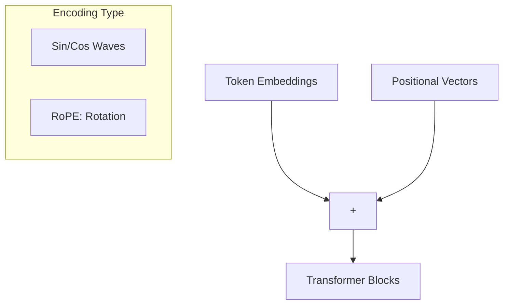

# Positional Encoding: Chaos mein Order add karna

## 1. Beginner-friendly Hinglish Explanation 🇮🇳
Bhai, Self-Attention bohot smart hai, lekin usmein ek bohot badi kami hai: Use "Line" (Sequence) ka hosh nahi rehta. 

Socho ek sentence hai "Dog bites man" aur "Man bites dog". Self-Attention ke liye dono bilkul same hain kyunki words wahi hain. Use nahi pata ki kaunsa word pehle aaya. **Positional Encoding** wahi "GPS" ya "Page Number" hai jo hum har word ke vector mein add kar dete hain taaki model ko pata chale ki word #1 kaunsa hai aur word #2 kaunsa. Bina iske, transformer sirf ek "Bag of Words" ban kar reh jayega.

---

## 2. Deep Technical Explanation
Kyunki Transformers tokens ko parallel process karte hain, unke paas order ka inherent sense nahi hai (RNNs ke opposite).
- **Absolute Positional Encodings**: Sinusoidal functions (Original Transformer) or Learned Embeddings.
- **Relative Positional Encodings**: Yeh tokens ke beech distance ko focus karte hain, absolute position ke bajaye (e.g., T5, ALIBI).
- **Rotary Positional Embeddings (RoPE)**: Ye modern gold standard hai (Llama mein use hota hai). Ye query aur key vectors ko rotate karta hai aur relative distance ko trigonometry ke through capture karta hai.

---

## 3. Mathematical Intuition
**Sinusoidal Encoding** (Original):
$$PE_{(pos, 2i)} = \sin(pos / 10000^{2i/d_{model}})$$
$$PE_{(pos, 2i+1)} = \cos(pos / 10000^{2i/d_{model}})$$
Yeh model ko relative positions ke hisaab se attend karne mein help karta hai kyunki kisi bhi fixed offset $k$ ke liye, $PE_{pos+k}$ ko $PE_{pos}$ ke linear function ke roop mein represent kiya ja sakta hai.

---

## 4. Architecture Diagrams

```mermaid
graph TD
    In[Token Embeddings] --> Add[+]
    Pos[Positional Vectors] --> Add
    Add --> Trans[Transformer Blocks]
    
    subgraph "Encoding Type"
        Sin[Sin/Cos Waves]
        Rot[RoPE: Rotation]
    end
```

---

## 5. Production-ready Examples
RoPE ko implement karna (Conceptual snippet):

```python
import torch

def apply_rotary_emb(x, cos, sin):
    # x: [batch, heads, seq_len, head_dim]
    # Split the head_dim into pairs and rotate
    x1 = x[..., 0::2]
    x2 = x[..., 1::2]
    
    # [x1, x2] rotated by theta
    # out1 = x1 * cos - x2 * sin
    # out2 = x1 * sin + x2 * cos
    return torch.stack([x1 * cos - x2 * sin, x1 * sin + x2 * cos], dim=-1).flatten(-2)

# RoPE allows the model to extrapolate to longer sequences than it was trained on.
```

---

## 6. Real-world Use Cases
- **Long Context Windows**: RoPE models ko 128k+ tokens handle karne mein madad karta hai.
- **Coding**: Coding mein characters ke strict order ko samajhna (syntax mein).

---

## 7. Failure Cases
- **Length Generalization**: Sinusoidal encodings aksar fail ho jaate hain agar inference sequence training se zyada lamba ho.
- **Catastrophic Forgetting of Order**: Bahut deep models mein, positional signal noise ke karan "wash out" ho sakta hai.

---

## 8. Debugging Guide
1. **Shuffle Test**: Agar aapka model words shuffle karne par bhi same perform karta hai, toh aapki positional encoding broken hai.
2. **Phase Analysis**: Check karo ki sinusoidal waves ke high-frequency components learn ho rahe hain ya nahi.

---

## 9. Tradeoffs
| Type | Complexity | Extrapolation |
|---|---|---|
| Sinusoidal | Low | Medium |
| Learned | Low | None |
| RoPE | Medium | Excellent |

---

## 10. Security Concerns
- **Position Hijacking**: Positional signal mein manipulation karna taaki model prompt ke beginning ko ignore kare.

---

## 11. Scaling Challenges
- **Memory**: 1M+ contexts ke liye bade positional tables store karna.

---

## 12. Cost Considerations
- **Compute**: RoPE har attention layer mein ek chota trigonometric overhead add karta hai.

---

## 13. Best Practices
- Hamesha modern 2026 architectures ke liye **RoPE** use karo.
- Extremely long sequences ke liye **ALIBI** ya **YaRN** (Yet another RoPE extension) consider karo.

---

## 14. Interview Questions
1. Transformer bina Positional Encoding ke "Permutation Invariant" kyun hai?
2. RoPE ka main advantage kya hai Sinusoidal encodings ke comparison mein?

---

## 15. Latest 2026 Patterns
- **Position-Independent Transformers**: Un architectures par research jo explicit encodings ki need nahi hai aur order ko data structure se hi learn karte hain.
- **Dynamic RoPE Scaling**: Inference ke dauran frequency base ko adjust karna taaki 10x longer contexts ko support kar sake.