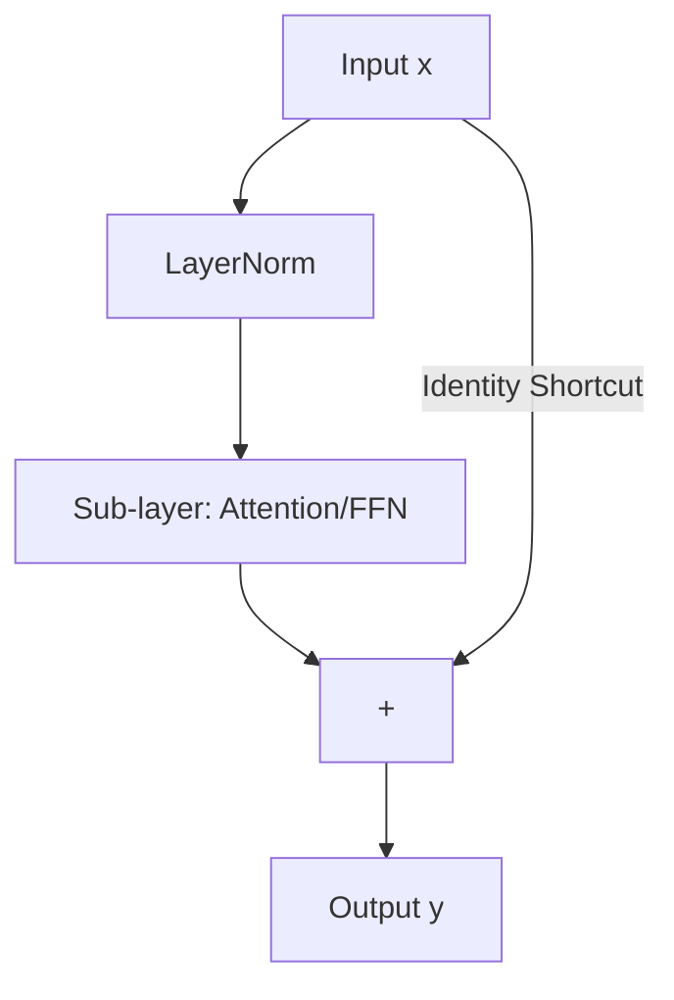

# Residual Connections & LayerNorm: The Stabilizers

## 1. Beginner-friendly Hinglish Explanation 🇮🇳
Bhai, socho tum ek 100-floor ki building bana rahe ho. Agar tum har floor ka wazan pichle floor par daalte jaoge, toh niche wala floor dab jayega. 

Transformers mein bhi 100+ layers ho sakti hain. **Residual Connections** (Skip connections) woh "Lift" hain jo information ko bina change hue upar ke floors tak pahunchati hain. Aur **LayerNorm** woh "Balance" hai jo ensure karta hai ki koi bhi vector bohot bada ya bohot chota na ho jaye. Bina inke, deep models train karna namumkin (impossible) hota kyunki signal beech mein hi dam tod deta.

---

## 2. Deep Technical Explanation
Deep networks suffer from signal degradation and gradient vanishing/explosion.
- **Residual Connections**: Introduced by ResNet, implemented as $y = F(x) + x$. It creates an "identity shortcut" that allows gradients to flow unimpeded to early layers.
- **Layer Normalization**: Normalizes the activations across the features for each training example. Unlike BatchNorm, it's independent of batch size, making it ideal for Transformers.
- **Pre-Norm vs Post-Norm**: Modern LLMs use **Pre-Norm** (applying LN before the sub-layer) because it results in much more stable training for very deep networks.

---

## 3. Mathematical Intuition
**Residual logic**:
$$\frac{\partial (F(x) + x)}{\partial x} = \frac{\partial F(x)}{\partial x} + 1$$
The "$+1$" term ensures the gradient doesn't vanish even if $F(x)$ is very small.

**LayerNorm**:
$$\hat{x} = \frac{x - \mu}{\sqrt{\sigma^2 + \epsilon}} \cdot \gamma + \beta$$
where $\mu$ and $\sigma$ are mean and variance across the feature dimension.

---

## 4. Architecture Diagrams


---

## 5. Production-ready Examples
Implementing RMSNorm (The Llama variant of LayerNorm):

```python
import torch
import torch.nn as nn

class RMSNorm(nn.Module):
    def __init__(self, dim, eps=1e-6):
        super().__init__()
        self.eps = eps
        self.weight = nn.Parameter(torch.ones(dim))

    def _norm(self, x):
        # Only uses variance, no mean subtraction
        return x * torch.rsqrt(x.pow(2).mean(-1, keepdim=True) + self.eps)

    def forward(self, x):
        return self._norm(x.float()).type_as(x) * self.weight

# RMSNorm is faster and achieves similar stability as LayerNorm.
```

---

## 6. Real-world Use Cases
- **Foundation of Deep Models**: Enabling the training of 70B+ parameter models.
- **Stability**: Prevents the "NaN" loss problem during massive distributed training.

---

## 7. Failure Cases
- **Identity Collapse**: If $F(x)$ becomes 0, the model just copies the input, learning nothing.
- **Scale Mismatch**: If $\gamma$ and $\beta$ in LN are not initialized properly, training will diverge.

---

## 8. Debugging Guide
1. **Gradient Norm Flow**: If gradients are 100x smaller in layer 1 than layer 50, your residual connections might be broken.
2. **Feature Saturation**: Check if LN is squashing all values to the same number.

---

## 9. Tradeoffs
| Metric | LayerNorm | RMSNorm |
|---|---|---|
| Speed | Normal | Fast |
| Parameters | $\gamma, \beta$ | $\gamma$ |
| Stability | High | High |

---

## 10. Security Concerns
- **Precision Poisoning**: Manipulating values to be extremely close to $\epsilon$ to trigger division by zero errors.

---

## 11. Scaling Challenges
- **Numerical Stability**: In FP16, mean/variance calculations in LN can overflow. Use BF16 or FP32 for LN.

---

## 12. Cost Considerations
- **Memory**: LN requires storing intermediate means and variances for the backward pass.

---

## 13. Best Practices
- Always use **Pre-Norm** architecture.
- Use **RMSNorm** for a small speed boost in large models.

---

## 14. Interview Questions
1. Why is LayerNorm preferred over BatchNorm in Transformers?
2. How do Residual Connections solve the Vanishing Gradient problem?

---

## 15. Latest 2026 Patterns
- **DeepNorm**: A specialized initialization and scaling for LN that allows training up to 1000 layers.
- **Normalization-Free Transformers**: Research into architectures that use clever initialization to remove LN entirely.
