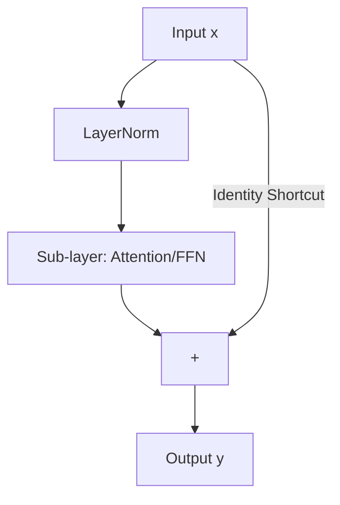

# Residual Connections & LayerNorm: The Stabilizers

---

## 1. Beginner-friendly Hinglish Explanation 🇮🇳
Bhai, socho tum ek 100-floor ki building bana rahe ho. Agar tum har floor ka wazan pichle floor par daalte jaoge, toh niche wala floor dab jayega. 

Transformers mein bhi 100+ layers ho sakti hain. **Residual Connections** (Skip connections) woh "Lift" hain jo information ko bina change hue upar ke floors tak pahunchati hain. Aur **LayerNorm** woh "Balance" hai jo ensure karta hai ki koi bhi vector bohot bada ya bohot chota na ho jaye. Bina inke, deep models train karna namumkin (impossible) hota kyunki signal beech mein hi dam tod deta.

---

## 2. Deep Technical Explanation
Deep networks signal degradation aur gradient vanishing/explosion se suffer karte hain.
- **Residual Connections**: ResNet ne introduce kiya, implement kiya gaya $y = F(x) + x$. Yeh ek 'identity shortcut' create karta hai jo gradients ko bina rukawat early layers tak flow karne deta hai.
- **Layer Normalization**: Har training example ke liye features ke across activations ko normalize karta hai. BatchNorm ke unlike, ye batch size se independent hai, jo ise Transformers ke liye ideal banata hai.
- **Pre-Norm vs Post-Norm**: Modern LLMs **Pre-Norm** use karte hain (sub-layer se pehle LN apply karna) kyunki isse bahut deep networks mein zyada stable training hoti hai.

---

## 3. Mathematical Intuition
**Residual logic**:
$$\frac{\partial (F(x) + x)}{\partial x} = \frac{\partial F(x)}{\partial x} + 1$$
The "$+1$" term ensure karta hai ki gradient vanish na kare even agar $F(x)$ bahut chhota ho.

**LayerNorm**:
$$\hat{x} = \frac{x - \mu}{\sqrt{\sigma^2 + \epsilon}} \cdot \gamma + \beta$$
jahaan $\mu$ aur $\sigma$ mean aur variance hain feature dimension ke across.

---

## 4. Architecture Diagrams

```mermaid
graph TD
    In[Input x] --> LN[LayerNorm]
    LN --> Sub[Sub-layer: Attention/FFN]
    Sub --> Add[+]
    In -- Identity Shortcut --> Add
    Add --> Out[Output y]
```

---

## 5. Production-ready Examples
RMSNorm implement karte hain (LayerNorm ka Llama variant):

```python
import torch
import torch.nn as nn

class RMSNorm(nn.Module):
    def __init__(self, dim, eps=1e-6):
        super().__init__()
        self.eps = eps
        self.weight = nn.Parameter(torch.ones(dim))

    def _norm(self, x):
        # Only uses variance, no mean subtraction
        return x * torch.rsqrt(x.pow(2).mean(-1, keepdim=True) + self.eps)

    def forward(self, x):
        return self._norm(x.float()).type_as(x) * self.weight

# RMSNorm is faster and achieves similar stability as LayerNorm.
```

---

## 6. Real-world Use Cases
- **Foundation of Deep Models**: 70B+ parameter models ko train karne mein enable karta hai.
- **Stability**: Massive distributed training ke dauran 'NaN' loss problem se prevent karta hai.

---

## 7. Failure Cases
- **Identity Collapse**: Agar $F(x)$ 0 ho jaye, toh model sirf input copy karta hai, kuch nahi seekhta.
- **Scale Mismatch**: Agar LN mein $\gamma$ aur $\beta$ sahi se initialize na hoon, toh training diverge ho jayegi.

---

## 8. Debugging Guide
1. **Gradient Norm Flow**: Agar gradients layer 1 mein layer 50 se 100x chhote hain, toh aapke residual connections broken ho sakte hain.
2. **Feature Saturation**: Check karo ki kya LN saare values ko ek hi number mein squash kar raha hai.

---

## 9. Tradeoffs
| Metric | LayerNorm | RMSNorm |
|---|---|---|
| Speed | Normal | Fast |
| Parameters | $\gamma, \beta$ | $\gamma$ |
| Stability | High | High |

---

## 10. Security Concerns
- **Precision Poisoning**: Values ko $\epsilon$ ke bahut close manipulate karke division by zero errors trigger karna.

---

## 11. Scaling Challenges
- **Numerical Stability**: FP16 mein, LN ke mean/variance calculations overflow kar sakte hain. LN ke liye BF16 ya FP32 use karo.

---

## 12. Cost Considerations
- **Memory**: LN ko backward pass ke liye intermediate means aur variances store karne padte hain.

---

## 13. Best Practices
- Hamesha **Pre-Norm** architecture use karo.
- Large models mein thoda speed boost ke liye **RMSNorm** use karo.

---

## 14. Interview Questions
1. Transformers mein LayerNorm ko BatchNorm se kyun prefer kiya jata hai?
2. Residual Connections Vanishing Gradient problem ko kaise solve karte hain?

---

## 15. Latest 2026 Patterns
- **DeepNorm**: LN ke liye ek specialized initialization aur scaling jo 1000 layers tak training allow karta hai.
- **Normalization-Free Transformers**: Architectures mein research jo clever initialization use karke LN ko completely remove karte hain.