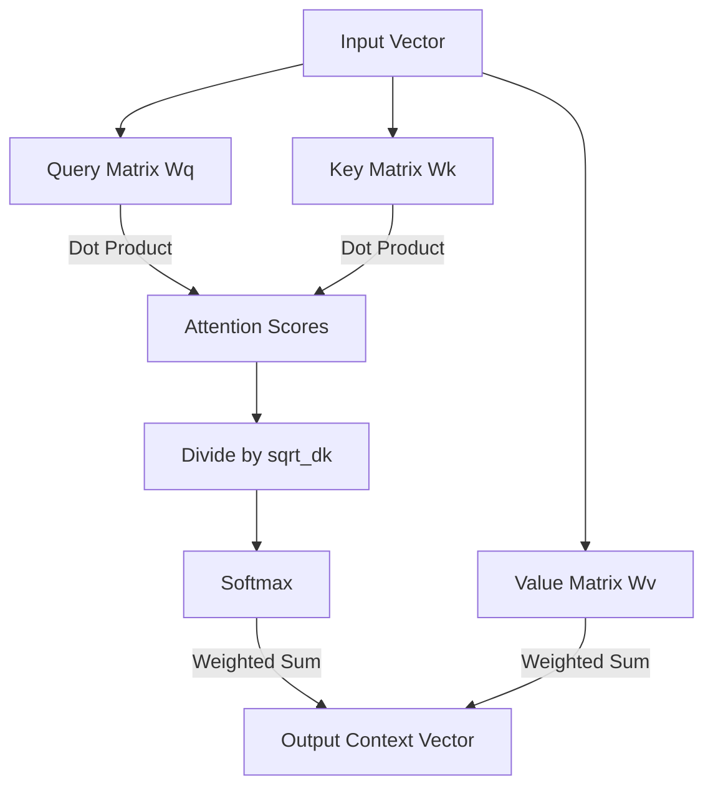

# Self-Attention: The "Look-at-Each-Other" Mechanism

## 1. Beginner-friendly Hinglish Explanation 🇮🇳
Bhai, socho tum ek party mein ho aur koi bolta hai "The animal didn't cross the street because **it** was too tired". 

Tumhe kaise pata chala ki 'it' ka matlab 'animal' hai aur 'street' nahi? Kyunki tumne 'it' ko context ke saath dekha. **Self-Attention** wahi kaam karta hai. Woh har word ko baaki saare words ke saath compare karta hai aur dekhta hai ki kis par zyada "Attention" deni chahiye. Yeh bilkul waise hi hai jaise tum kisi crowd mein apne dost ka chehra dhundte waqt baaki sabko "Ignore" kar dete ho.

---

## 2. Deep Technical Explanation
Self-Attention allows every position in a sequence to interact with every other position.
- **Queries (Q)**: "What am I looking for?"
- **Keys (K)**: "What do I contain?"
- **Values (V)**: "What information do I share if matched?"
- **Attention Score**: Calculated using the dot product of Q and K.
- **Complexity**: $O(N^2)$ where $N$ is sequence length.

---

## 3. Mathematical Intuition
The core formula:
$$\text{Attention}(Q, K, V) = \text{softmax}\left(\frac{QK^T}{\sqrt{d_k}}\right)V$$
1. **Dot Product ($QK^T$)**: Measures similarity.
2. **Scaling ($\sqrt{d_k}$)**: Prevents gradients from vanishing by keeping softmax inputs small.
3. **Softmax**: Converts scores to probabilities (summing to 1).
4. **Weighted Sum**: Mixes the Values ($V$) based on attention weights.

---

## 4. Architecture Diagrams


---

## 5. Production-ready Examples
Efficient implementation in `PyTorch`:

```python
import torch
import torch.nn.functional as F

def scaled_dot_product_attention(q, k, v, mask=None):
    d_k = q.size(-1)
    # [batch, heads, seq_len, head_dim]
    scores = torch.matmul(q, k.transpose(-2, -1)) / (d_k ** 0.5)
    
    if mask is not None:
        scores = scores.masked_fill(mask == 0, -1e9)
        
    weights = F.softmax(scores, dim=-1)
    return torch.matmul(weights, v), weights

# Usage
q = torch.randn(1, 8, 128, 64)
k = torch.randn(1, 8, 128, 64)
v = torch.randn(1, 8, 128, 64)
output, weights = scaled_dot_product_attention(q, k, v)
```

---

## 6. Real-world Use Cases
- **Core of all LLMs**: GPT, BERT, Llama.
- **Computer Vision**: Vision Transformers (ViT) attending to image patches.
- **Bioinformatics**: DNA sequence analysis.

---

## 7. Failure Cases
- **Quadratic Memory**: Becomes impossible to run for very long sequences (e.g., 100k tokens) without optimization (Flash Attention).
- **Inductive Bias**: Unlike CNNs, Attention has no "local" bias, making it data-hungry.

---

## 8. Debugging Guide
1. **Mask Check**: If the model sees the future in a Decoder, check your causal mask.
2. **Attention Map Visualization**: Heatmaps should show meaningful relationships (e.g., verbs attending to nouns).

---

## 9. Tradeoffs
| Factor | Self-Attention | Recurrence (RNN) |
|---|---|---|
| Parallelization | Full | None |
| Context Range | Infinite | Limited |
| Complexity | $O(N^2)$ | $O(N)$ |

---

## 10. Security Concerns
- **Attention Poisoning**: Manipulating specific tokens to hijack the attention of the entire sequence.

---

## 11. Scaling Challenges
- **VRAM consumption**: Storing the $N \times N$ attention matrix.

---

## 12. Cost Considerations
- **Inference Latency**: Grows significantly with sequence length due to the quadratic nature.

---

## 13. Best Practices
- Use **Multi-head** instead of single-head for richer representations.
- Always use **Flash Attention** in production.

---

## 14. Interview Questions
1. Why is the dot product divided by $\sqrt{d_k}$?
2. What happens if we remove the Softmax from the attention formula?

---

## 15. Latest 2026 Patterns
- **Linear Attention**: Approximating $O(N^2)$ to $O(N)$ using kernel tricks.
- **Sparse Attention**: Only attending to relevant tokens (e.g., BigBird, Longformer).
