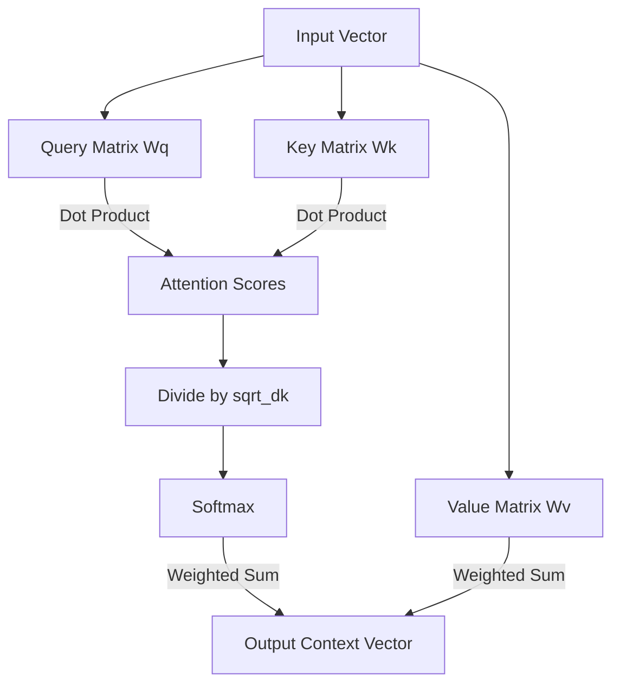

# Self-Attention: 'Ek Doosre Ko Dekhne Ka' Mechanism

## 1. Shuruati Hinglish Vyakhya 🇮🇳
Bhai, socho tum ek party mein ho aur koi bolta hai "The animal didn't cross the street because **it** was too tired". 

Tumhe kaise pata chala ki 'it' ka matlab 'animal' hai aur 'street' nahi? Kyunki tumne 'it' ko context ke saath dekha. **Self-Attention** wahi kaam karta hai. Woh har word ko baaki saare words ke saath compare karta hai aur dekhta hai ki kis par zyada "Attention" deni chahiye. Yeh bilkul waise hi hai jaise tum kisi crowd mein apne dost ka chehra dhundte waqt baaki sabko "Ignore" kar dete ho.

---

## 2. Gehri Technical Vyakhya
Self-Attention har position ko sequence mein baaki har position ke saath interact karne deta hai.
- **Queries (Q)**: "Main kya dhundh raha hoon?"
- **Keys (K)**: "Mere paas kya hai?"
- **Values (V)**: "Agar match milta hai toh main kya jaankari share karta hoon?"
- **Attention Score**: Q aur K ke dot product se calculate kiya jata hai.
- **Complexity**: $O(N^2)$ jahaan $N$ sequence length hai.

---

## 3. Ganitik Sahajbodh
Mool sutra:
$$\text{Attention}(Q, K, V) = \text{softmax}\left(\frac{QK^T}{\sqrt{d_k}}\right)V$$
1. **Dot Product ($QK^T$)**: Samanta (similarity) naapna.
2. **Scaling ($\sqrt{d_k}$)**: Softmax inputs ko chhota rakhkar gradients ko vanish hone se rokta hai.
3. **Softmax**: Scores ko probabilities mein badalta hai (jo 1 ka sum banate hain).
4. **Weighted Sum**: Attention weights ke aadhar par Values ($V$) ko mix karta hai.

---

## 4. Architecture Diagrams

```mermaid
graph TD
    Input[Input Vector] --> Q[Query Matrix Wq]
    Input --> K[Key Matrix Wk]
    Input --> V[Value Matrix Wv]
    Q -- Dot Product --> Score[Attention Scores]
    K -- Dot Product --> Score
    Score --> Scale[Divide by sqrt_dk]
    Scale --> Softmax[Softmax]
    Softmax -- Weighted Sum --> Result[Output Context Vector]
    V -- Weighted Sum --> Result
```

---

## 5. Production-ready Udaharan
`PyTorch` mein efficient implementation:

```python
import torch
import torch.nn.functional as F

def scaled_dot_product_attention(q, k, v, mask=None):
    d_k = q.size(-1)
    # [batch, heads, seq_len, head_dim]
    scores = torch.matmul(q, k.transpose(-2, -1)) / (d_k ** 0.5)
    
    if mask is not None:
        scores = scores.masked_fill(mask == 0, -1e9)
        
    weights = F.softmax(scores, dim=-1)
    return torch.matmul(weights, v), weights

# Usage
q = torch.randn(1, 8, 128, 64)
k = torch.randn(1, 8, 128, 64)
v = torch.randn(1, 8, 128, 64)
output, weights = scaled_dot_product_attention(q, k, v)
```

---

## 6. Vastavik Duniya ke Upyog ke Cases
- **Saare LLMs ka core**: GPT, BERT, Llama.
- **Computer Vision**: Vision Transformers (ViT) image patches par attend karte hain.
- **Bioinformatics**: DNA sequence analysis.

---

## 7. Viphalta ke Cases
- **Quadratic Memory**: Bahut lambi sequences ke liye (e.g., 100k tokens) bina optimization (Flash Attention) ke run karna impossible ho jata hai.
- **Inductive Bias**: CNNs ke unlike, Attention mein koi "local" bias nahi hai, jo ise data-hungry banata hai.

---

## 8. Debugging Margdarshan
1. **Mask Check**: Agar model Decoder mein future dekhta hai, toh apna causal mask check karo.
2. **Attention Map Visualization**: Heatmaps ko meaningful relationships dikhane chahiye (e.g., verbs nouns par attend kar rahe hain).

---

## 9. Samjhauta
| Faktor | Self-Attention | Recurrence (RNN) |
|---|---|---|
| Parallelization | Poora | Koi nahi |
| Context Range | Anant | Seemit |
| Complexity | $O(N^2)$ | $O(N)$ |

---

## 10. Suraksha Chintaein
- **Attention Poisoning**: Specific tokens ko manipulate karke pure sequence ka attention hijack karna.

---

## 11. Scaling Chunautiyan
- **VRAM consumption**: $N \times N$ attention matrix store karna.

---

## 12. Lagat Vichar
- **Inference Latency**: Quadratic nature ki wajah se sequence length ke saath significantly badh jata hai.

---

## 13. Shreshth Practices
- Richer representations ke liye single-head ki jagah **Multi-head** use karo.
- Production mein hamesha **Flash Attention** use karo.

---

## 14. Interview Prashn
1. Dot product ko $\sqrt{d_k}$ se kyun divide kiya jata hai?
2. Attention formula se Softmax hata denge toh kya hoga?

---

## 15. 2026 ke Latest Patterns
- **Linear Attention**: Kernel tricks ka use karke $O(N^2)$ ko $O(N)$ mein approximate karna.
- **Sparse Attention**: Sirf relevant tokens par attend karna (e.g., BigBird, Longformer).