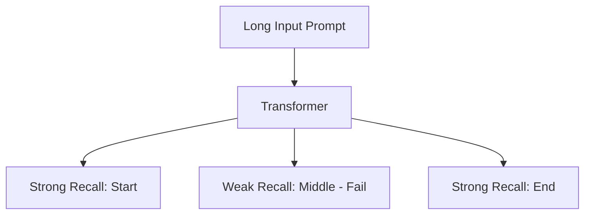

# Transformer Failure Cases: Why Models Break

## 1. Beginner-friendly Hinglish Explanation 🇮🇳
Bhai, Transformer koi "Sarvagunn Sampann" (perfect) cheez nahi hai. Iski bhi apni weaknesses hain. 

Sabse badi problem hai **Quadratic Memory**. Agar tum bohot bada document doge, toh GPU ka memory khatam ho jayega. Phir aata hai **Attention Sink**, jahan model random tokens par zyada focus karne lagta hai. Aur sabse bada dukh: **Lost in the Middle**. Agar tum prompt ke beech mein koi important information chupa doge, toh transformer use bhool jayega. In failure cases ko samajhna tumhe ek "Prompt Wrapper" se "LLM Engineer" banata hai.

---

## 2. Deep Technical Explanation
Critical failure modes in the Transformer architecture:
- **Quadratic Bottleneck**: $O(N^2)$ complexity limits context length.
- **Lost in the Middle**: Performance U-shape - models are good at remembering the start and end of a prompt, but bad at the middle.
- **Attention Sinks**: LLMs often allocate huge attention to the first token (`<s>` or whitespace) regardless of its semantic value, just to "offload" probability mass.
- **Inductive Bias Lack**: Unlike CNNs (locality) or RNNs (sequentiality), Transformers have zero bias, making them inefficient on small datasets.

---

## 3. Mathematical Intuition
The **Quadratic Cost**:
If $N=1,000$, $N^2 = 1,000,000$.
If $N=10,000$, $N^2 = 100,000,000$.
A 10x increase in length leads to a 100x increase in memory/compute. This is why we need specialized kernels or linear attention.

---

## 4. Architecture Diagrams


---

## 5. Production-ready Examples
Testing for "Lost in the Middle":

```python
def test_recall(model, context_length):
    # Place a secret key at 10%, 50%, and 90% of the context
    # Ask the model to retrieve it
    # Observe the failure at 50%
    pass

# Mitigation: Use Long-Context fine-tuned models or RAG.
```

---

## 6. Real-world Use Cases
- **Legal Review**: Missing a clause in the middle of a 50-page contract.
- **Long-form Coding**: Forgetting a function definition from 1000 lines above.

---

## 7. Failure Cases
- **Over-smoothing**: In very deep transformers, representations can become identical across layers.
- **Length Extrapolation**: A model trained on 2k tokens failing miserably on 2.1k tokens.

---

## 8. Debugging Guide
1. **Needle-in-a-Haystack**: Use this benchmark to find exactly where your model starts failing in the context window.
2. **Attention Map Entropy**: If attention is too "flat", the model isn't learning anything specific.

---

## 9. Tradeoffs
| Solution | Benefit | Drawback |
|---|---|---|
| Flash Attention | Speed/Memory | High-end GPU only |
| RAG | Accuracy | Complexity/Latency |
| Long Context | Ease of use | High Cost |

---

## 10. Security Concerns
- **Context Bombing**: Sending extremely long, repetitive prompts to exhaust GPU memory and cause Denial of Service (DoS).

---

## 11. Scaling Challenges
- **Data Quality**: At scale, bad data (noise) hurts Transformers more than other architectures because they attend to everything.

---

## 12. Cost Considerations
- **Quadratic Pricing**: Many API providers charge more for long context due to the $N^2$ compute cost.

---

## 13. Best Practices
- **Chunk your data**: Don't rely on the model's 128k context if 4k chunks + RAG works better.
- **Re-order information**: Put the most important context at the very end of the prompt (Recency bias).

---

## 14. Interview Questions
1. What is the "Lost in the Middle" phenomenon?
2. Why does Transformer memory usage grow quadratically with sequence length?

---

## 15. Latest 2026 Patterns
- **Attention Sink Mitigation**: Using "StreamingLLM" which keeps the first few tokens + recent tokens to maintain stability forever.
- **Infinite Context via SSMs**: Replacing the attention mechanism with State Space Models (Mamba) to achieve $O(N)$ scaling.
