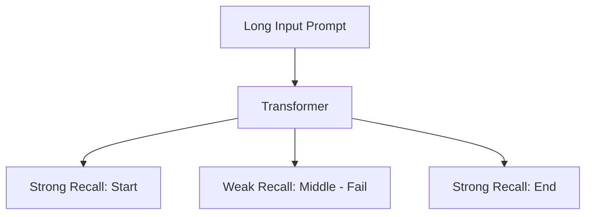

# Transformer Failure Cases: Models Kyun Break Karte Hain

## 1. Naye Seekhne Walon Ke Liye Hinglish Explanation 🇮🇳
Bhai, Transformer koi "Sarvagunn Sampann" (perfect) cheez nahi hai. Iski bhi apni weaknesses hain. 

Sabse badi problem hai **Quadratic Memory**. Agar tum bohot bada document doge, toh GPU ka memory khatam ho jayega. Phir aata hai **Attention Sink**, jahan model random tokens par zyada focus karne lagta hai. Aur sabse bada dukh: **Lost in the Middle**. Agar tum prompt ke beech mein koi important information chupa doge, toh transformer use bhool jayega. In failure cases ko samajhna tumhe ek "Prompt Wrapper" se "LLM Engineer" banata hai.

## 2. Gehraai Se Technical Explanation
Transformer architecture mein kuch critical failure modes hain:
- **Quadratic Bottleneck**: $O(N^2)$ complexity context length ko limit karti hai.
- **Lost in the Middle**: Performance U-shape hoti hai - models prompt ke start aur end ko acchi tarah yaad rakh sakte hain, lekin beech mein weak hote hain.
- **Attention Sinks**: LLMs often first token (`<s>` ya whitespace) par bahut zyada attention allocate karte hain regardless of its semantic value, sirf probability mass offload karne ke liye.
- **Inductive Bias Lack**: CNNs (locality) ya RNNs (sequentiality) ke opposite, Transformers mein zero bias hota hai, jo unhe small datasets par inefficient banata hai.

## 3. Ganitik Intuition (Mathematical Intuition)
**Quadratic Cost**:
Agar $N=1,000$ hai, toh $N^2 = 1,000,000$.
Agar $N=10,000$ hai, toh $N^2 = 100,000,000$.
Length mein 10x increase memory/compute mein 100x increase laati hai. Isliye humein specialized kernels ya linear attention ki zaroorat hoti hai.

## 4. Architecture Diagrams (Sanrachna Chitra)

```mermaid
graph TD
    In[Long Input Prompt] --> Model[Transformer]
    Model --> Start[Strong Recall: Start]
    Model --> Mid[Weak Recall: Middle - Fail]
    Model --> End[Strong Recall: End]
```

## 5. Utpadan Ke Liye Taiyar Examples (Production-ready Examples)
"Lost in the Middle" ke liye testing:

```python
def test_recall(model, context_length):
    # Place a secret key at 10%, 50%, and 90% of the context
    # Ask the model to retrieve it
    # Observe the failure at 50%
    pass

# Mitigation: Use Long-Context fine-tuned models or RAG.
```

## 6. Vastavik Duniya Ke Use Cases (Real-world Use Cases)
- **Legal Review**: 50-page contract ke beech mein koi clause miss ho jana.
- **Long-form Coding**: 1000 lines upar ka function definition bhool jana.

## 7. Asafalta Ke Mamle (Failure Cases)
- **Over-smoothing**: Bahut deep transformers mein, layers ke across representations identical ho sakti hain.
- **Length Extrapolation**: Model 2k tokens par trained hai aur 2.1k tokens par fail ho jana.

## 8. Samasya Samadhan Guide (Debugging Guide)
1. **Needle-in-a-Haystack**: Is benchmark ka use karo yeh pata lagane ke liye ki aapka model context window mein exactly kahan fail hone lagta hai.
2. **Attention Map Entropy**: Agar attention bahut "flat" hai, toh model kuch specific nahi seekh raha hai.

## 9. Samjhote (Tradeoffs)
| Solution | Benefit | Drawback |
|---|---|---|
| Flash Attention | Speed/Memory | High-end GPU only |
| RAG | Accuracy | Complexity/Latency |
| Long Context | Ease of use | High Cost |

## 10. Suraksha Sambandhi Chintayein (Security Concerns)
- **Context Bombing**: Bohot lambe, repetitive prompts bhejna jo GPU memory exhaust kare aur Denial of Service (DoS) cause kare.

## 11. Badhtey Scale Ki Chunautiyaan (Scaling Challenges)
- **Data Quality**: Bade paimaane par, bad data (noise) Transformers ko doosri architectures se zyada nuksan pahunchata hai kyunki woh sab kuch attend karte hain.

## 12. Lagan Ke Khayal (Cost Considerations)
- **Quadratic Pricing**: Kai API providers long context ke liye zyada charge karte hain kyunki $N^2$ compute cost hai.

## 13. Behatar Tarike (Best Practices)
- **Apne data ko chunk karo**: Model ke 128k context par rely mat karo agar 4k chunks + RAG better kaam karta hai.
- **Information ko re-order karo**: Sabse important context prompt ke bilkul end mein rakho (Recency bias).

## 14. Interview Ke Sawal (Interview Questions)
1. "Lost in the Middle" phenomenon kya hai?
2. Transformer memory usage sequence length ke saath quadratic kyun grow karta hai?

## 15. 2026 Ke Naik Patterns (Latest 2026 Patterns)
- **Attention Sink Mitigation**: "StreamingLLM" ka istemal jo first few tokens + recent tokens ko rakhta hai stability maintain karne ke liye hamesha.
- **SSMs ke through Infinite Context**: Attention mechanism ko State Space Models (Mamba) se replace karna $O(N)$ scaling achieve karne ke liye.