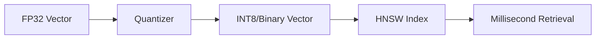

# Embedding Optimization: Speed & Precision

## 1. Beginner-friendly Hinglish Explanation 🇮🇳
Bhai, socho tumhare paas 1 crore logo ki photos hain aur tumhe ek photo match karni hai. Agar tum har photo ko 1-by-1 dekhoge, toh barso lag jayenge. 

**Embedding Optimization** wahi "Jugad" hai jo is process ko super-fast banata hai. Hum vectors ko chota kar dete hain (Quantization), unhe group mein baant dete hain (Indexing), aur unhe search karne ka tarika badal dete hain. Isse jo kaam 1 ghante mein hona chahiye, woh 1 millisecond mein ho jata hai. Ek asli AI engineer wahi hai jo sirf embeddings banaye nahi, balki unhe "Production scale" par optimize bhi kare.

---

## 2. Deep Technical Explanation
Optimization in embedding systems happens at three levels:
- **Quantization**: Compressing 32-bit floats (FP32) into 8-bit integers (INT8) or even binary (1-bit).
- **Dimensionality Reduction**: Using PCA or Matryoshka learning to reduce vector size (e.g., 1536 $\to$ 256).
- **Advanced Indexing**: Using HNSW (Hierarchical Navigable Small World) which builds a multi-layered graph for $O(\log N)$ search.

---

## 3. Mathematical Intuition
**Product Quantization (PQ)**:
Divide a vector into $m$ sub-vectors. For each sub-vector, use a small codebook.
$V = [v_1, v_2, ..., v_m] \to [c_1, c_2, ..., c_m]$
This reduces memory from $D \times 32$ bits to $m \times \log(\text{codebook\_size})$ bits. A $1024D$ vector can be compressed by 50x-100x.

---

## 4. Architecture Diagrams


---

## 5. Production-ready Examples
Using `USearch` (Modern, faster alternative to FAISS):

```python
from usearch.index import Index
import numpy as np

# Create an index for 128D vectors
index = Index(ndim=128, metric='cos', dtype='f16') # Using Half-precision (F16)

# Add vectors
vectors = np.random.randn(10000, 128).astype(np.float16)
index.add(np.arange(10000), vectors)

# Search
query = np.random.randn(128).astype(np.float16)
matches = index.search(query, 10)
print(f"Top Match ID: {matches[0].key}")
```

---

## 6. Real-world Use Cases
- **Billion-scale Search**: Building search engines like Spotify or Pinterest.
- **On-device AI**: Running vector search on a mobile phone with limited RAM.

---

## 7. Failure Cases
- **Precision Loss**: Compressing too much (e.g., Binary) might make "Apple" and "Orange" look the same.
- **Index Corruption**: Graphs like HNSW can become "Fragmented" if documents are deleted frequently.

---

## 8. Debugging Guide
1. **Recall-at-10**: Compare optimized search results with "Brute Force" search. If recall < 0.9, your optimization is too aggressive.
2. **Memory Profiling**: Use `mprof` to see if your vector index is leaking memory.

---

## 9. Tradeoffs
| Method | Memory Saving | Accuracy Loss |
|---|---|---|
| F16 | 2x | Negligible |
| INT8 | 4x | Low |
| Binary | 32x | High |

---

## 10. Security Concerns
- **Reconstruction Attacks**: If an attacker gets the quantized codebook, they can partially reconstruct the semantic meaning of your vectors.

---

## 11. Scaling Challenges
- **GPU Acceleration**: Moving the entire vector index to GPU VRAM for ultra-high throughput search.

---

## 12. Cost Considerations
- **Cold Storage**: Keeping rarely searched vectors on disk (S3) and only loading "Hot" vectors in RAM.

---

## 13. Best Practices
- Use **Matryoshka Embeddings** if you need flexible vector sizes.
- Use **HNSW** for low latency and **IVF-PQ** for massive scale (Billions).

---

## 14. Interview Questions
1. How does Product Quantization reduce memory usage?
2. What is the difference between HNSW and Flat indexing?

---

## 15. Latest 2026 Patterns
- **Late Interaction Compression**: Compressing ColBERT style multi-vector representations into a single optimized blob.
- **Dynamic Quantization**: Changing the compression level based on the "importance" of the document.
