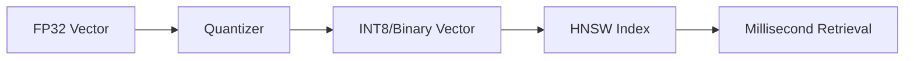

# Embedding Optimization: Speed aur Precision

## 1. Beginner-friendly Hinglish Explanation 🇮🇳
Bhai, socho tumhare paas 1 crore logo ki photos hain aur tumhe ek photo match karni hai. Agar tum har photo ko 1-by-1 dekhoge, toh barso lag jayenge. 

**Embedding Optimization** wahi "Jugad" hai jo is process ko super-fast banata hai. Hum vectors ko chota kar dete hain (Quantization), unhe group mein baant dete hain (Indexing), aur unhe search karne ka tarika badal dete hain. Isse jo kaam 1 ghante mein hona chahiye, woh 1 millisecond mein ho jata hai. Ek asli AI engineer wahi hai jo sirf embeddings banaye nahi, balki unhe "Production scale" par optimize bhi kare.

---

## 2. Deep Technical Explanation
Embedding systems mein optimization teen levels par hota hai:
- **Quantization**: 32-bit floats (FP32) ko 8-bit integers (INT8) ya binary (1-bit) mein compress karna.
- **Dimensionality Reduction**: PCA ya Matryoshka learning use karke vector size reduce karna (e.g., 1536 $\to$ 256).
- **Advanced Indexing**: HNSW (Hierarchical Navigable Small World) use karna jo multi-layered graph banata hai $O(\log N)$ search ke liye.

---

## 3. Mathematical Intuition
**Product Quantization (PQ)**:
Ek vector ko $m$ sub-vectors mein divide karo. Har sub-vector ke liye ek chhota codebook use karo.
$V = [v_1, v_2, ..., v_m] \to [c_1, c_2, ..., c_m]$
Isse memory $D \times 32$ bits se $m \times \log(\text{codebook\_size})$ bits reduce hoti hai. Ek $1024D$ vector 50x-100x compress ho sakta hai.

---

## 4. Architecture Diagrams

```mermaid
graph LR
    V[FP32 Vector] --> Q[Quantizer]
    Q --> INT8[INT8/Binary Vector]
    INT8 --> Index[HNSW Index]
    Index --> Fast[Millisecond Retrieval]
```

---

## 5. Production-ready Examples
`USearch` (Modern, FAISS ka faster alternative) use karte hain:

```python
from usearch.index import Index
import numpy as np

# 128D vectors ke liye index banayein
index = Index(ndim=128, metric='cos', dtype='f16') # Half-precision (F16) ka use karte hue

# Vectors add karein
vectors = np.random.randn(10000, 128).astype(np.float16)
index.add(np.arange(10000), vectors)

# Search karein
query = np.random.randn(128).astype(np.float16)
matches = index.search(query, 10)
print(f"Top Match ID: {matches[0].key}")
```

---

## 6. Real-world Use Cases
- **Billion-scale Search**: Spotify ya Pinterest jaisi search engines banana.
- **On-device AI**: Limited RAM waale mobile phone par vector search chhana.

---

## 7. Failure Cases
- **Precision Loss**: Zyada compress karne se (e.g., Binary) "Apple" aur "Orange" ek jaisi lag sakti hain.
- **Index Corruption**: HNSW jaise graphs "Fragmented" ho sakte hain agar documents baar-baar delete ho.

---

## 8. Debugging Guide
1. **Recall-at-10**: Optimized search results ko "Brute Force" search se compare karo. Agar recall < 0.9 hai, toh aapka optimization bahut aggressive hai.
2. **Memory Profiling**: `mprof` use karo ki vector index memory leak toh nahi kar raha.

---

## 9. Tradeoffs
| Method | Memory Bachat | Accuracy Hani |
|---|---|---|
| F16 | 2x | Na ke barabar |
| INT8 | 4x | Kam |
| Binary | 32x | Zyada |

---

## 10. Security Concerns
- **Reconstruction Attacks**: Agar attacker ke paas quantized codebook aa jaye, toh woh aapke vectors ka semantic meaning partially reconstruct kar sakte hain.

---

## 11. Scaling Challenges
- **GPU Acceleration**: Poora vector index GPU VRAM mein move karna ultra-high throughput search ke liye.

---

## 12. Cost Considerations
- **Cold Storage**: Rarely search hone wale vectors ko disk (S3) par rakhna aur sirf "Hot" vectors ko RAM mein load karna.

---

## 13. Best Practices
- Agar aapko flexible vector sizes chahiye toh **Matryoshka Embeddings** use karo.
- **HNSW** low latency ke liye aur **IVF-PQ** massive scale (Billions) ke liye use karo.

---

## 14. Interview Questions
1. Product Quantization memory usage kaise reduce karta hai?
2. HNSW aur Flat indexing mein kya difference hai?

---

## 15. Latest 2026 Patterns
- **Late Interaction Compression**: ColBERT style multi-vector representations ko ek single optimized blob mein compress karna.
- **Dynamic Quantization**: Document ki "importance" ke basis par compression level badalna.