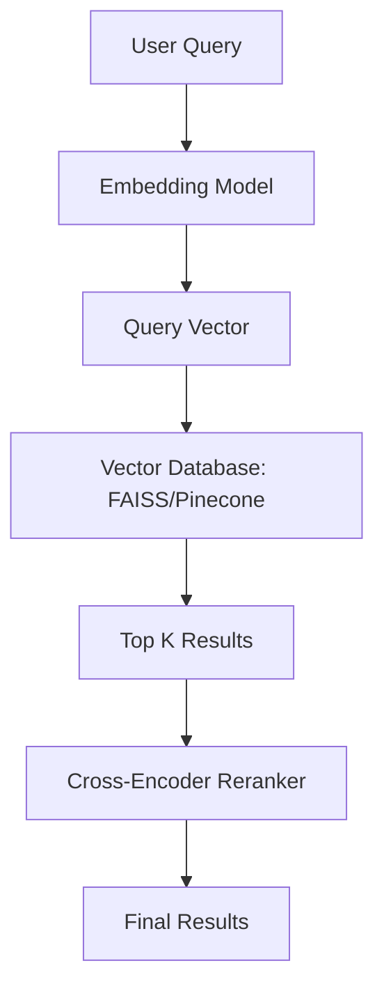

# Semantic Search: Beyond Keyword Matching

## 1. Beginner-friendly Hinglish Explanation 🇮🇳
Bhai, puraani search (Keyword search) bilkul "Tote" (Parrot) ki tarah thi. Agar tumne search kiya "Pila phal", toh woh sirf wahi dikhayega jahan "Pila" aur "Phal" likha hai. 

**Semantic Search** smart hai. Use pata hai ki "Pila phal" ka matlab "Banana" ya "Mango" bhi ho sakta hai. Yeh "Words" ko nahi, "Meaning" ko search karta hai. Yeh vectors ka use karke context samajhta hai. Yeh bilkul waise hi hai jaise tum kisi library mein ja kar bolo "Mujhe dard bhari kahaniyan chahiye" aur librarian tumhe "Sad stories" ki shelf par le jaye, bhale hi un books ke naam mein "Dard" word na ho.

---

## 2. Deep Technical Explanation
Semantic search maps queries and documents into the same vector space to find matches based on distance rather than character overlap.
- **Bi-Encoders**: Encode query and document separately. Fast but less accurate. Used for initial retrieval.
- **Cross-Encoders**: Encode query and document together. Very accurate but slow. Used for re-ranking.
- **ANN (Approximate Nearest Neighbor)**: Algorithms like HNSW used to search billions of vectors in milliseconds.

---

## 3. Mathematical Intuition
The search problem: Find document $d$ that maximizes:
$$\text{sim}(q, d) = \frac{E(q) \cdot E(d)}{\|E(q)\| \|E(d)\|}$$
Where $E$ is the embedding function.
For large scale, we use **HNSW (Hierarchical Navigable Small World)** graphs which reduce search time from $O(N)$ to $O(\log N)$.

---

## 4. Architecture Diagrams


---

## 5. Production-ready Examples
Using `SentenceTransformers` and `FAISS`:

```python
from sentence_transformers import SentenceTransformer
import faiss
import numpy as np

model = SentenceTransformer('all-MiniLM-L6-v2')
documents = ["AI is the future", "I love pizza", "The weather is nice"]

# 1. Create Embeddings
doc_embeddings = model.encode(documents)

# 2. Build FAISS Index
index = faiss.IndexFlatL2(384) # 384 is dim of MiniLM
index.add(doc_embeddings.astype('float32'))

# 3. Search
query = "Tell me about technology"
query_vec = model.encode([query])
D, I = index.search(query_vec.astype('float32'), k=1)

print(f"Result: {documents[I[0][0]]}")
```

---

## 6. Real-world Use Cases
- **E-commerce**: Finding products by description/intent.
- **Customer Support**: Automated FAQ matching.
- **RAG Systems**: The "Retrieval" part of RAG.

---

## 7. Failure Cases
- **Keyword Blindness**: Sometimes you *actually* want an exact word (e.g., a part number), but semantic search gives you a "similar" part that is wrong.
- **Domain Shift**: A general-purpose search model failing on highly technical medical or legal terms.

---

## 8. Debugging Guide
1. **Precision@K**: Measure how many of the Top-K results are actually relevant.
2. **Recall**: Ensure you aren't missing important documents that should have been found.

---

## 9. Tradeoffs
| Feature | Keyword (BM25) | Semantic (Embeddings) |
|---|---|---|
| Speed | Extremely Fast | Fast |
| Understanding | Zero | High |
| Technical Terms | Excellent | Poor |

---

## 10. Security Concerns
- **Prompt Leakage via Retrieval**: If an attacker can craft a query that retrieves sensitive "Context" chunks into the LLM prompt.

---

## 11. Scaling Challenges
- **Indexing Latency**: Adding millions of new documents to a vector index can take hours/days if not optimized.

---

## 12. Cost Considerations
- **Hosting**: Managed vector DBs (Pinecone) can be expensive compared to simple SQL DBs.

---

## 13. Best Practices
- Use **Hybrid Search**: Combine BM25 (Keyword) + Embeddings (Semantic) for the best of both worlds.
- Always use a **Re-ranker** for the top 5-10 results to improve precision.

---

## 14. Interview Questions
1. What is the difference between a Bi-Encoder and a Cross-Encoder?
2. Why is Hybrid Search better than pure Semantic Search?

---

## 15. Latest 2026 Patterns
- **ColBERT**: Late interaction models that store multiple vectors per document for extreme precision.
- **Neural Hashing**: Compressing vectors into 64-bit hashes for 100x faster search.
