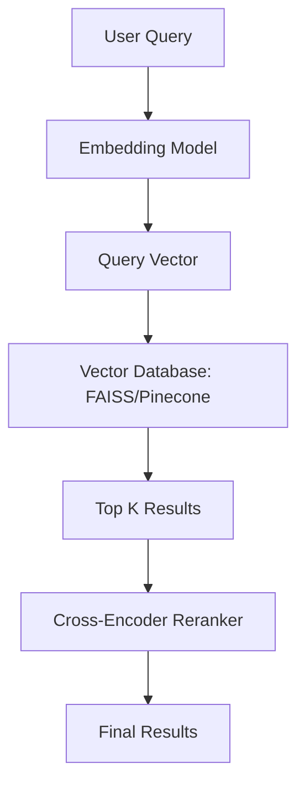

# Semantic Search: Keyword Matching se Aage

## 1. Beginner-friendly Hinglish Explanation 🇮🇳
Bhai, puraani search (Keyword search) bilkul "Tote" (Parrot) ki tarah thi. Agar tumne search kiya "Pila phal", toh woh sirf wahi dikhayega jahan "Pila" aur "Phal" likha hai.

**Semantic Search** smart hai. Use pata hai ki "Pila phal" ka matlab "Banana" ya "Mango" bhi ho sakta hai. Yeh "Words" ko nahi, "Meaning" ko search karta hai. Yeh vectors ka use karke context samajhta hai. Yeh bilkul waise hi hai jaise tum kisi library mein ja kar bolo "Mujhe dard bhari kahaniyan chahiye" aur librarian tumhe "Sad stories" ki shelf par le jaye, bhale hi un books ke naam mein "Dard" word na ho.

---

## 2. Gehri Technical Explanation
Semantic search queries aur documents ko ek hi vector space mein map karta hai taaki distance ke basis par matches mile, character overlap ke bajay.
- **Bi-Encoders**: Query aur document ko alag-alag encode karte hain. Fast hain but kam accurate. Initial retrieval ke liye use hote hain.
- **Cross-Encoders**: Query aur document ko ek saath encode karte hain. Bahut accurate hain but slow hain. Re-ranking ke liye use hote hain.
- **ANN (Approximate Nearest Neighbor)**: HNSW jaise algorithms jo billions vectors ko milliseconds mein search karne ke liye use hote hain.

---

## 3. Ganitik Samajh
The search problem: Document $d$ dhoondho jo maximize kare:
$$\text{sim}(q, d) = \frac{E(q) \cdot E(d)}{\|E(q)\| \|E(d)\|}$$
Jahan $E$ embedding function hai.
Bade scale ke liye, hum **HNSW (Hierarchical Navigable Small World)** graphs use karte hain jo search time $O(N)$ se $O(\log N)$ tak reduce kar dete hain.

---

## 4. Architecture Diagrams

```mermaid
graph TD
    Query[User Query] --> Emb[Embedding Model]
    Emb --> Vector[Query Vector]
    Vector --> DB[Vector Database: FAISS/Pinecone]
    DB --> TopK[Top K Results]
    TopK --> Rerank[Cross-Encoder Reranker]
    Rerank --> Final[Final Results]
```

---

## 5. Production-ready Examples
Using `SentenceTransformers` and `FAISS`:

```python
from sentence_transformers import SentenceTransformer
import faiss
import numpy as np

model = SentenceTransformer('all-MiniLM-L6-v2')
documents = ["AI is the future", "I love pizza", "The weather is nice"]

# 1. Create Embeddings
doc_embeddings = model.encode(documents)

# 2. Build FAISS Index
index = faiss.IndexFlatL2(384) # 384 is dim of MiniLM
index.add(doc_embeddings.astype('float32'))

# 3. Search
query = "Tell me about technology"
query_vec = model.encode([query])
D, I = index.search(query_vec.astype('float32'), k=1)

print(f"Result: {documents[I[0][0]]}")
```

---

## 6. Real-world Use Cases
- **E-commerce**: Description/intent ke through products dhoondhna.
- **Customer Support**: Automated FAQ matching.
- **RAG Systems**: RAG ka "Retrieval" part.

---

## 7. Failure Cases
- **Keyword Blindness**: Kabhi kabhi aapko exact word chahiye (jaise part number), lekin semantic search aapko "similar" part de deta hai jo galat hota hai.
- **Domain Shift**: General-purpose search model ka highly technical medical ya legal terms mein fail hona.

---

## 8. Debugging Guide
1. **Precision@K**: Top-K results mein se kitne actually relevant hain, yah measure karna.
2. **Recall**: Yeh ensure karna ki aap important documents ko miss na kar rahe hain jo milne chahiye.

---

## 9. Tradeoffs
| Feature (Visheshता) | Keyword (BM25) | Semantic (Embeddings) |
|---|---|---|
| Speed (Gati) | Bahut Tez | Tez |
| Understanding (Samajh) | Zero | Uncha |
| Technical Terms (Takniki Shabd) | Utkrisht | Kharab |

---

## 10. Security Concerns
- **Prompt Leakage via Retrieval**: Agar attacker aisa query bana sake jo sensitive "Context" chunks ko LLM prompt mein retrieve kar le.

---

## 11. Scaling Challenges
- **Indexing Latency**: Lakhon naye documents ko vector index mein add karne mein hours/days lag sakte hain agar optimized na ho.

---

## 12. Cost Considerations
- **Hosting**: Managed vector DBs (Pinecone) expensive ho sakte hain simple SQL DBs ke comparison mein.

---

## 13. Best Practices
- **Hybrid Search** ka upyog karein: BM25 (Keyword) + Embeddings (Semantic) dono ka faida uthane ke liye.
- Hamesha top 5-10 results ke liye **Re-ranker** ka istemal karein taaki precision sudhar jaaye.

---

## 14. Interview Questions
1. Bi-Encoder aur Cross-Encoder mein kya antar hai?
2. Hybrid Search pure Semantic Search se behtar kyun hai?

---

## 15. 2026 ke Naye Patterns
- **ColBERT**: Late interaction models jo extreme precision ke liye per document multiple vectors store karte hain.
- **Neural Hashing**: Vectors ko 64-bit hashes mein compress karna jo search ko 100x tez banata hai.