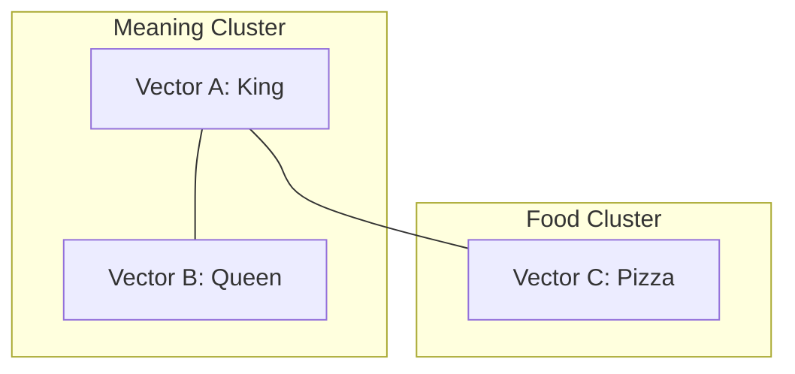

# Vector Spaces: The Universe of Meaning

## 1. Beginner-friendly Hinglish Explanation 🇮🇳
Bhai, socho pura language ek "Space" hai, bilkul humare universe ki tarah. Har word ek "Tara" (Star) hai. 

**Vector Space** woh 3D (ya actually 1536D) map hai jahan words ki location unke matlab (meaning) par depend karti hai. Agar do stars (words) paas hain, toh unka matlab similar hai. Agar woh door hain, toh woh unrelated hain. Jab hum "Semantic Search" karte hain, toh hum bas is universe mein "travel" karke sabse nazdeek wala star dhundte hain. Yeh math ki duniya ka sabse khoobsurat hissa hai.

---

## 2. Deep Technical Explanation
A vector space in NLP is typically a high-dimensional Euclidean space $\mathbb{R}^d$.
- **Dimensions**: Range from 384 (small models) to 4096+ (large models).
- **Metric**: How distance is measured. Most common is **Cosine Similarity**.
- **Clustering**: Words with similar semantic properties form clusters (e.g., all fruits are in one corner, all tech companies in another).
- **Linear Algebra**: The movement in this space (e.g., King - Man + Woman) corresponds to semantic shifts.

---

## 3. Mathematical Intuition
**Cosine Similarity**:
$$\cos(\theta) = \frac{A \cdot B}{\|A\| \|B\|}$$
This measures the angle between two vectors. If $\cos(\theta) = 1$, they point in the exact same direction (identical meaning). If $0$, they are orthogonal (unrelated).

**Euclidean Distance (L2)**:
$$d(A, B) = \sqrt{\sum (A_i - B_i)^2}$$
Measures the straight-line distance. Used less in NLP because it's sensitive to the magnitude (length) of vectors.

---

## 4. Architecture Diagrams


---

## 5. Production-ready Examples
Visualizing vector spaces with `scikit-learn`:

```python
import numpy as np
from sklearn.manifold import TSNE
import matplotlib.pyplot as plt

# Dummy vectors for 1000 words (dim=1536)
vectors = np.random.rand(1000, 1536)

# Reduce to 2D for plotting
tsne = TSNE(n_components=2, perplexity=30)
reduced_vectors = tsne.fit_transform(vectors)

plt.scatter(reduced_vectors[:, 0], reduced_vectors[:, 1])
plt.show()
```

---

## 6. Real-world Use Cases
- **Recommendation Engines**: Matching user vectors with item vectors.
- **Anomaly Detection**: Finding inputs that fall into "Empty Space" (outliers).

---

## 7. Failure Cases
- **Hubness Problem**: In very high dimensions, some vectors become "hubs" that are close to almost everyone, breaking similarity searches.
- **Dimensionality Curse**: As dimensions increase, the difference between the nearest and farthest point vanishes.

---

## 8. Debugging Guide
1. **Dimension Check**: Ensure your query and database vectors have the exact same dimensionality.
2. **Norm Normalization**: Always L2-normalize vectors before using Cosine Similarity for speed.

---

## 9. Tradeoffs
| Feature | 384-dim (Small) | 4096-dim (Large) |
|---|---|---|
| Precision | Low | High |
| Search Speed | Very Fast | Slow |
| Memory | Low | High |

---

## 10. Security Concerns
- **Vector Inversion**: Attacking the vector space to reconstruct the original text (De-anonymization).

---

## 11. Scaling Challenges
- **Indexing**: Searching through 1 Billion vectors in a 1536D space requires specialized indexing like HNSW or IVF.

---

## 12. Cost Considerations
- **Storage**: Vectors are "Heavy". 1 Million 1536D vectors in Float32 take ~6GB of VRAM.

---

## 13. Best Practices
- Use **L2 Normalization** to turn Cosine Similarity into a simple Dot Product (much faster).
- Use **PCA** to reduce dimensions if you are hitting memory limits.

---

## 14. Interview Questions
1. Why is Cosine Similarity preferred over Euclidean Distance for text embeddings?
2. What is the "Curse of Dimensionality"?

---

## 15. Latest 2026 Patterns
- **Matryoshka Embeddings**: Learning embeddings that are useful even if you truncate them (e.g., using only the first 64 dimensions of a 1024D vector).
- **Binary Embeddings**: Storing only 0s and 1s to reduce storage by 32x.
