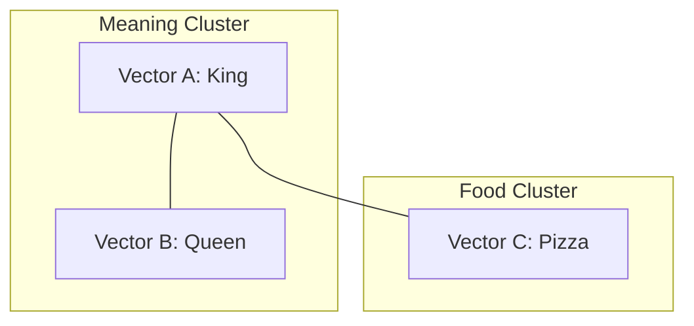

# Vector Spaces: Meaning ka Universe

## 1. Shuruaat-friendly Hinglish Samjhaaiye 🇮🇳
Bhai, socho pura language ek "Space" hai, bilkul humare universe ki tarah. Har word ek "Tara" (Star) hai. 

**Vector Space** woh 3D (ya actually 1536D) map hai jahan words ki location unke matlab (meaning) par depend karti hai. Agar do stars (words) paas hain, toh unka matlab similar hai. Agar woh door hain, toh woh unrelated hain. Jab hum "Semantic Search" karte hain, toh hum bas is universe mein "travel" karke sabse nazdeek wala star dhundte hain. Yeh math ki duniya ka sabse khoobsurat hissa hai.

---

## 2. Deep Technical Samjhaaiye
NLP mein vector space typically ek high-dimensional Euclidean space $\mathbb{R}^d$ hota hai.
- **Dimensions**: 384 (chhote models) se lekar 4096+ (bade models) tak hota hai.
- **Metric**: Distance kaise measure kiya jata hai. Sabse common **Cosine Similarity** hai.
- **Clustering**: Similar semantic properties wale words clusters form karte hain (jaise, saare fruits ek corner mein, saari tech companies dusre corner mein).
- **Linear Algebra**: Is space mein movement (jaise King - Man + Woman) semantic shifts ke hisaab se hota hai.

---

## 3. Mathematical Samjhaaiye
**Cosine Similarity**:
$$\cos(\theta) = \frac{A \cdot B}{\|A\| \|B\|}$$
Yeh do vectors ke beech ka angle measure karta hai. Agar $\cos(\theta) = 1$ hai, toh woh exact same direction mein point karte hain (identical meaning). Agar $0$ hai, toh woh orthogonal hain (unrelated).

**Euclidean Distance (L2)**:
$$d(A, B) = \sqrt{\sum (A_i - B_i)^2}$$
Seedhi line ki doori measure karta hai. NLP mein kam use hota hai kyunki yeh magnitude (length) ke liye sensitive hai.

---

## 4. Architecture Diagrams

```mermaid
graph TD
    V1[Vector A: King] --- V2[Vector B: Queen]
    V1 --- V3[Vector C: Pizza]
    subgraph "Meaning Cluster"
        V1
        V2
    end
    subgraph "Food Cluster"
        V3
    end
```

---

## 5. Production-ready Examples
Vector spaces ko `scikit-learn` ke saath visualize karna:

```python
import numpy as np
from sklearn.manifold import TSNE
import matplotlib.pyplot as plt

# Dummy vectors for 1000 words (dim=1536)
vectors = np.random.rand(1000, 1536)

# Reduce to 2D for plotting
tsne = TSNE(n_components=2, perplexity=30)
reduced_vectors = tsne.fit_transform(vectors)

plt.scatter(reduced_vectors[:, 0], reduced_vectors[:, 1])
plt.show()
```

---

## 6. Real-world Use Cases (Vastavik Duniya ke Upyog)
- **Recommendation Engines**: User vectors ko item vectors ke saath match karna.
- **Anomaly Detection**: Aise inputs dhundhna jo "Empty Space" mein aate hain (outliers).

---

## 7. Failure Cases (Asafalta ke Mamle)
- **Hubness Problem**: Bahut high dimensions mein, kuch vectors "hubs" ban jaate hain jo almost har kisi ke close hote hain, similarity searches ko break karte hain.
- **Dimensionality Curse**: Jaisi dimensions badhti hain, nearest aur farthest point ke beech ka difference vanish ho jaata hai.

---

## 8. Debugging Guide (Samasya Samadhan Guide)
1. **Dimension Check**: Yeh pakka karein ki aapke query aur database vectors ki dimensionality exactly same hai.
2. **Norm Normalization**: Cosine Similarity use karne se pehle hamesha L2-normalize karein vectors ko, speed ke liye.

---

## 9. Tradeoffs (Samjhauta)
| Feature | 384-dim (Chhota) | 4096-dim (Bada) |
|---|---|---|
| Precision | Kam | Zyada |
| Search Speed | Bahut Tez | Dheema |
| Memory | Kam | Zyada |

---

## 10. Security Concerns (Suraksha Chintayein)
- **Vector Inversion**: Vector space par attack karke original text ko reconstruct karna (De-anonymization).

---

## 11. Scaling Challenges (Vistar ki Chunautiyaan)
- **Indexing**: 1536D space mein 1 Billion vectors ke beech search karne ke liye specialized indexing chahiye jaise HNSW ya IVF.

---

## 12. Cost Considerations (Lagat ke Vichar)
- **Storage**: Vectors "Heavy" hote hain. Float32 mein 1 Million 1536D vectors ~6GB VRAM lete hain.

---

## 13. Best Practices (Sarvottam Tareeke)
- **L2 Normalization** ka upyog karein Cosine Similarity ko simple Dot Product mein badalne ke liye (bahut tez ho jaata hai).
- **PCA** use karein dimensions kam karne ke liye agar aap memory limits tak pahunch rahe hain.

---

## 14. Interview Questions (Interview ke Sawaal)
1. Cosine Similarity ko Euclidean Distance se behtar kyun mana jaata hai text embeddings ke liye?
2. "Curse of Dimensionality" kya hai?

---

## 15. Latest 2026 Patterns (2026 ke Naye Patterns)
- **Matryoshka Embeddings**: Aise embeddings seekhna jo upyogi hote hain chahe aap unhe truncate karein (jaise, 1024D vector ke sirf pehle 64 dimensions ka upyog karna).
- **Binary Embeddings**: Sirf 0s aur 1s store karna, storage ko 32x kam karne ke liye.