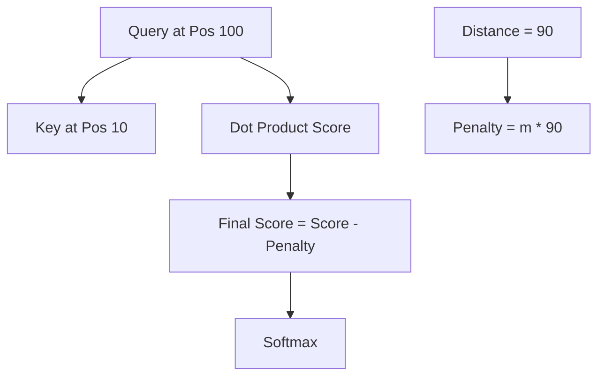

# 📏 ALiBi and Extrapolation: Infinity and Beyond
> **Objective:** Master the ALiBi (Attention with Linear Biases) architecture and positional extrapolation techniques that allow LLMs to handle sequence lengths longer than their training window without any retraining | **Language:** Hinglish | **Standard:** 2026 Expert Framework

---

## 🧭 1. Beginner-Friendly Hinglish Explanation
ALiBi (Attention with Linear Biases) ka matlab hai "Duri (Distance) ke hisaab se importance kam karna".

- **The Problem:** Transformers ko kaise batayein ki "Paas wala word zyada important hai aur door wala kam"?
- **The Solution:** ALiBi. 
  - Hum har word ke Attention Score mein se ek "Penalty" minus kar dete hain. 
  - Jitna door word hoga, utni badi penalty hogi.
- **Intuition:** Ye ek "Awaz" jaisa hai. Jab koi aapke paas bolta hai, toh aapko saaf sunai deta hai. Jaise-jaise wo door jata hai, awaz dheere hoti jati hai. 

---

## 🧠 2. Deep Technical Explanation
ALiBi removes positional embeddings entirely and modifies the **Attention Matrix**:

1. **The Bias:** A linear bias is added to the attention score (before Softmax).
2. **Formula:** $A_{ij} = q_i \cdot k_j - m \cdot |i - j|$
3. **Slope ($m$):** Each attention head has a different slope $m$. This allows some heads to look very far back and others to focus only on immediate neighbors.
4. **Extrapolation:** Because the bias is just a linear function of distance, the model can handle any distance (e.g., 1 million tokens) even if it was only trained on 2k tokens. It never "sees" a new position; it only sees "distances".

---

## 📐 3. Mathematical Intuition
The attention score $s$ for query $i$ and key $j$:
$$s_{ij} = \frac{q_i k_j^T}{\sqrt{d}} - m \cdot (i - j)$$
For $n$ heads, the slopes $m$ are chosen as a geometric progression (e.g., $1/2^1, 1/2^2, \dots, 1/2^n$).
This ensures that the model has a "Multi-resolution" view of the past.

---

## 🏗️ 4. Architecture Diagrams


---

## 💻 5. Production-Ready Examples
The ALiBi bias calculation (Simplified):
```python
def get_alibi_bias(seq_len, num_heads):
    # Calculate slopes for each head
    slopes = torch.tensor(get_slopes(num_heads))
    # Create distance matrix [1, num_heads, 1, seq_len]
    distances = torch.arange(seq_len).view(1, 1, 1, seq_len)
    # Final bias: -slopes * distances
    return -slopes.view(1, num_heads, 1, 1) * distances
```

---

## 🌍 6. Real-World Use Cases
- **MPT (MosaicML Pretrained Transformer):** Famous for using ALiBi to support 64k+ context windows out of the box.
- **Real-time Transcription:** Processing long audio streams where the model needs to maintain "Relative context" without knowing the absolute start time.

---

## ❌ 7. Failure Cases
- **Order Insensitivity:** Because ALiBi focuses purely on distance, it might struggle with tasks that require knowing *exactly* where a word is in a fixed structure (e.g., "The 5th word in the 3rd sentence").
- **Slope Saturation:** If $m$ is too high, the model becomes too "Short-sighted" and ignores everything beyond 10 tokens.

---

## 🛠️ 8. Debugging Guide
| Problem | Reason | Solution |
| :--- | :--- | :--- |
| **Model ignores distant context** | Slopes are too steep | Re-distribute the **head slopes** to allow more "Long-range" heads. |
| **Quadratic memory issue** | standard attention | ALiBi doesn't solve $O(n^2)$, use it with **FlashAttention** for efficiency. |

---

## ⚖️ 9. Tradeoffs
- **ALiBi (Perfect extrapolation / Zero params / Order-weak)** vs **RoPE (Great extrapolation / Learnable frequencies / Order-strong).**

---

## 🛡️ 10. Security Concerns
- **Bias Manipulation:** An attacker can insert "Filler tokens" to push an important instruction so far back that the ALiBi penalty makes the model ignore it entirely.

---

## 📈 11. Scaling Challenges
- **The "Lost in the Middle" problem is worse in ALiBi** because the linear penalty naturally favors the very end of the sequence.

---

## 💰 12. Cost Considerations
- ALiBi saves memory during training (no positional embeddings to store/train) and is theoretically "Infinite" in scale for free.

漫
---

## 📝 14. Interview Questions
1. "How does ALiBi differ from learned positional embeddings?"
2. "Why do we use different 'Slopes' for different attention heads in ALiBi?"
3. "Can ALiBi handle sequence lengths $10x$ longer than its training length? Why?"

---

## 🚀 15. Latest 2026 LLM Engineering Patterns
- **ALiBi-RoPE Hybrid:** Using RoPE for short-range precision and ALiBi-style biases for long-range stability.
- **Dynamic ALiBi:** Models that "Adjust" their slopes based on the complexity of the prompt.
漫
漫
