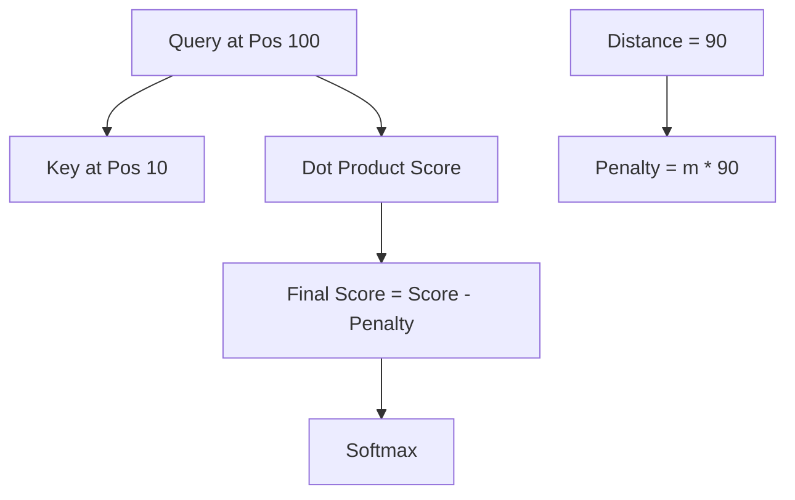

# 📏 ALiBi aur Extrapolation: Infinity aur Beyond
> **Objective:** ALiBi (Attention with Linear Biases) architecture aur positional extrapolation techniques ko master karna jisse LLMs bina kisi retraining ke apne training window se zyada lambi sequence lengths handle kar sakte hain | **Language:** Hinglish | **Standard:** 2026 Expert Framework

---

## 🧭 1. Beginner-Friendly Hinglish Samajh
ALiBi (Attention with Linear Biases) ka matlab hai "Duri (Distance) ke hisaab se importance kam karna".

- **The Problem:** Transformers ko kaise batayein ki "Paas wala word zyada important hai aur door wala kam"?
- **The Solution:** ALiBi. 
  - Hum har word ke Attention Score mein se ek "Penalty" minus kar dete hain. 
  - Jitna door word hoga, utni badi penalty hogi.
- **Intuition:** Ye ek "Awaz" jaisa hai. Jab koi aapke paas bolta hai, toh aapko saaf sunai deta hai. Jaise-jaise wo door jata hai, awaz dheere hoti jati hai. 

---

## 🧠 2. Gehri Technical Samajh
ALiBi positional embeddings ko puri tarah hata deta hai aur **Attention Matrix** ko modify karta hai:

1. **Bias:** Attention score (Softmax se pehle) mein ek linear bias add kiya jata hai.
2. **Formula:** $A_{ij} = q_i \cdot k_j - m \cdot |i - j|$
3. **Slope ($m$):** Har attention head ka ek alag slope $m$ hota hai. Isse kuch heads bahut door tak dekh sakte hain aur kuch sirf immediate neighbors par focus karte hain.
4. **Extrapolation:** Kyunki bias sirf distance ka ek linear function hai, model kisi bhi distance ko handle kar sakta hai (e.g., 1 million tokens) chahe wo sirf 2k tokens par hi trained kyun na ho. Ye kabhi bhi koi "naya" position nahi dekhta; sirf "distances" dekhta hai.

---

## 📐 3. Ganitiya Samajh
Attention score $s$ jo query $i$ aur key $j$ ke liye hai:
$$s_{ij} = \frac{q_i k_j^T}{\sqrt{d}} - m \cdot (i - j)$$
$n$ heads ke liye, slopes $m$ ko geometric progression ke roop mein chuna jata hai (e.g., $1/2^1, 1/2^2, \dots, 1/2^n$).
Isse model ko past ka ek "Multi-resolution" view milta hai.

---

## 🏗️ 4. Architecture Diagrams

```mermaid
graph TD
    Query[Query at Pos 100] --> Key[Key at Pos 10]
    Dist[Distance = 90]
    Query --> Score[Dot Product Score]
    Dist --> Penalty[Penalty = m * 90]
    Score --> Sub[Final Score = Score - Penalty]
    Sub --> Softmax[Softmax]
```

---

## 💻 5. Production Ke Liye Tayar Examples
ALiBi bias calculation (Simplified):
```python
def get_alibi_bias(seq_len, num_heads):
    # Calculate slopes for each head
    slopes = torch.tensor(get_slopes(num_heads))
    # Create distance matrix [1, num_heads, 1, seq_len]
    distances = torch.arange(seq_len).view(1, 1, 1, seq_len)
    # Final bias: -slopes * distances
    return -slopes.view(1, num_heads, 1, 1) * distances
```

---

## 🌍 6. Real-World Ke Upyog
- **MPT (MosaicML Pretrained Transformer):** ALiBi istemal karne ke liye famous hai jo out of the box 64k+ context windows support karta hai.
- **Real-time Transcription:** Lambe audio streams process karna jahan model ko "Relative context" maintain karna hota hai bina absolute start time jaane.

---

## ❌ 7. Asafalta Ke Mamle
- **Order Insensitivity:** Kyunki ALiBi sirf distance par dhyan deta hai, isse un tasks mein problem ho sakti hai jahan exact word position janana zaroori hai (e.g., "The 5th word in the 3rd sentence").
- **Slope Saturation:** Agar $m$ bahut zyada hai, toh model "Short-sighted" ho jata hai aur 10 tokens ke aage kuch bhi ignore karta hai.

---

## 🛠️ 8. Debugging Guide
| Problem | Reason | Solution |
| :--- | :--- | :--- |
| **Model door ke context ko ignore karta hai** | Slopes bahut steep hain | **Head slopes** ko redistribute karke zyada "Long-range" heads allow karein. |
| **Quadratic memory issue** | standard attention | ALiBi $O(n^2)$ solve nahi karta, isliye efficiency ke liye **FlashAttention** ke saath use karein. |

---

## ⚖️ 9. Tradeoffs
- **ALiBi (Perfect extrapolation / Zero params / Order-weak)** vs **RoPE (Great extrapolation / Learnable frequencies / Order-strong).**

---

## 🛡️ 10. Security Concerns
- **Bias Manipulation:** Attacker "Filler tokens" insert kar sakta hai jisse important instruction itna peechhe chala jaye ki ALiBi penalty ki vajah se model use ignore kar de.

---

## 📈 11. Scaling Challenges
- **ALiBi mein "Lost in the Middle" ki samasya aur bhi badi hai** kyunki linear penalty naturally sequence ke bilkul aakhir ko favor karti hai.

---

## 💰 12. Cost Considerations
- ALiBi training ke dauran memory bachata hai (koi positional embeddings store/train nahi karni padti) aur theoretically "Infinite" in scale for free hai.

漫
---

## 📝 14. Interview Questions
1. "ALiBi, learned positional embeddings se kaise alag hai?"
2. "ALiBi mein alag attention heads ke liye alag 'Slopes' kyun use karte hain?"
3. "Kya ALiBi sequence lengths ko apne training length se $10x$ zyada lamba handle kar sakta hai? Kyun?"

---

## 🚀 15. 2026 Ke Sabse Naye LLM Engineering Patterns
- **ALiBi-RoPE Hybrid:** RoPE short-range precision ke liye hota hai aur ALiBi-style biases long-range stability ke liye.
- **Dynamic ALiBi:** Aise models jo prompt ki complexity ke hisaab se apne slopes ko "Adjust" karte hain.
漫
漫