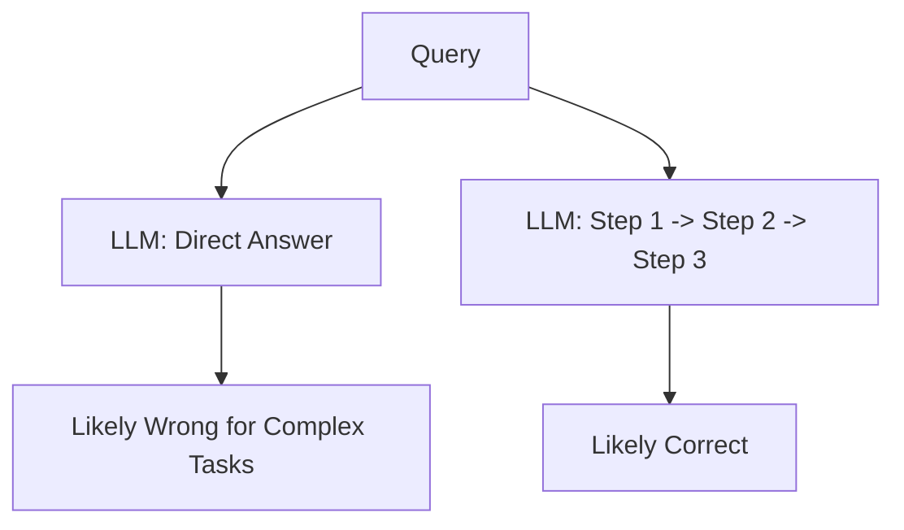

# Chain of Thought (CoT): Teaching LLMs to Think

## 1. Beginner-friendly Hinglish Explanation 🇮🇳
Bhai, socho tum kisi bacche se poochte ho: "Agar 5 apple hain aur 2 kha liye, phir 3 aur laye, toh kitne bache?". Agar woh baccha seedha "6" bol de bina soche, toh galti hone ke chances hain. Par agar woh bole "Pehle 5 the, 2 gaye toh 3 bache, phir 3 aaye toh 6 ho gaye", toh woh zyada accurate hoga.

**Chain of Thought (CoT)** wahi "Step-by-Step" sochne ka tarika hai. Hum LLM ko bolte hain ki seedha answer mat do, pehle pura reasoning process likho. Isse model complex problems (math, logic) bohot achhe se solve kar leta hai. Yeh bilkul "Rough work" karne jaisa hai exam mein.

---

## 2. Deep Technical Explanation
Chain of Thought (CoT) is a prompting technique that encourages the model to generate intermediate reasoning steps before the final answer.
- **Few-shot CoT**: Providing a few examples of (Input, Reasoning, Output).
- **Zero-shot CoT**: Simply adding the magic phrase **"Let's think step by step"** to the prompt.
- **Why it works**: It allocates more "Computation Tokens" to the problem and allows the model to attend to its own previous reasoning steps.

---

## 3. Mathematical Intuition
In standard prompting, the model predicts $P(\text{Answer} | \text{Query})$.
In CoT, the model predicts $P(\text{Rationale}, \text{Answer} | \text{Query})$.
The rationale acts as a "latent variable" that makes the path to the correct answer more probable in the high-dimensional space.
$$P(A|Q) = \sum_{R} P(A|R, Q) P(R|Q)$$
By generating $R$, the model explicitly samples from the distribution of logical steps.

---

## 4. Architecture Diagrams


---

## 5. Production-ready Examples
Implementation in a system prompt:

```python
import openai

def get_reasoning_response(user_query):
    system_prompt = """You are a logical assistant. 
    Always think through the problem step-by-step. 
    State your reasoning clearly before giving the final answer."""
    
    response = openai.ChatCompletion.create(
        model="gpt-4o",
        messages=[
            {"role": "system", "content": system_prompt},
            {"role": "user", "content": user_query}
        ]
    )
    return response.choices[0].message.content

# Input: "Is 1729 a special number?"
# Output: "1. 1729 is the Ramanujan number... 2. It is the smallest... 3. Therefore, yes."
```

---

## 6. Real-world Use Cases
- **Math Problem Solving**: Solving multi-step equations.
- **Coding**: Explaining the logic before writing the function.
- **Legal Analysis**: Breaking down a contract clause.

---

## 7. Failure Cases
- **Logical Hallucination**: The model's "steps" are perfectly logical but based on a false fact.
- **Incorrect Conclusion**: The steps are correct, but the final answer is a "typo".

---

## 8. Debugging Guide
1. **Trace Analysis**: Read the reasoning steps. If step 2 is wrong, the model never had a chance.
2. **Temperature Check**: Lower temperature (0.0 - 0.2) is better for CoT to maintain logical consistency.

---

## 9. Tradeoffs
| Feature | Direct Prompt | CoT Prompt |
|---|---|---|
| Speed | Fast | Slow (more tokens) |
| Cost | Low | Higher |
| Accuracy | Low (for logic) | High (for logic) |

---

## 10. Security Concerns
- **Reasoning Leakage**: If your reasoning contains proprietary logic, the model might show it to the user.

---

## 11. Scaling Challenges
- **Token Limits**: Very long reasoning chains can hit the model's max output token limit.

---

## 12. Cost Considerations
- **Output Token Costs**: CoT can double or triple the number of output tokens, increasing costs linearly.

---

## 13. Best Practices
- Use **Zero-shot CoT** for quick testing.
- Use **Few-shot CoT** for specialized domains (Medical/Legal).
- Combine with **Self-Consistency** (sampling multiple paths and taking the majority).

---

## 14. Interview Questions
1. Why does CoT improve performance on mathematical tasks?
2. What is "Self-Consistency" in the context of CoT?

---

## 15. Latest 2026 Patterns
- **Active Reasoning (o1 Style)**: Models that perform "Hidden" CoT (thinking before speaking) and use Reinforcement Learning to optimize the reasoning path.
- **Reasoning Distillation**: Training smaller models on the reasoning chains of larger models.
