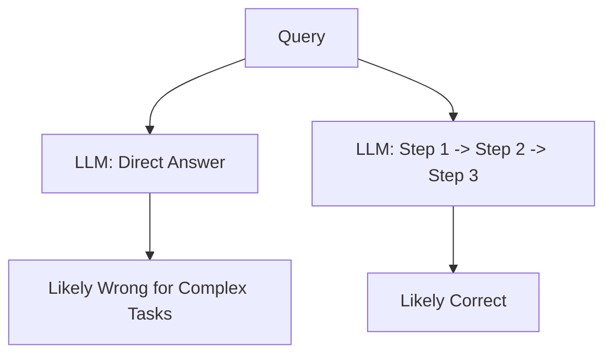

# Chain of Thought (CoT): LLMs ko Sochne Sikhana

## 1. Shuruaat ke liye Hinglish Samjhaaiye 🇮🇳
Bhai, socho tum kisi bacche se poochte ho: "Agar 5 apple hain aur 2 kha liye, phir 3 aur laye, toh kitne bache?". Agar woh baccha seedha "6" bol de bina soche, toh galti hone ke chances hain. Par agar woh bole "Pehle 5 the, 2 gaye toh 3 bache, phir 3 aaye toh 6 ho gaye", toh woh zyada accurate hoga.

**Chain of Thought (CoT)** wahi "Step-by-Step" sochne ka tarika hai. Hum LLM ko bolte hain ki seedha answer mat do, pehle pura reasoning process likho. Isse model complex problems (math, logic) bohot achhe se solve kar leta hai. Yeh bilkul "Rough work" karne jaisa hai exam mein.

---

## 2. Gehra Technical Explanation
Chain of Thought (CoT) ek prompting technique hai jo model ko final answer dene se pehle intermediate reasoning steps generate karne ke liye encourage karti hai.
- **Few-shot CoT**: (Input, Reasoning, Output) ke kuch examples provide karna.
- **Zero-shot CoT**: Prompt mein magic phrase **"Let's think step by step"** add karna.
- **Yeh kaam kyun karta hai**: Yeh problem ko zyada "Computation Tokens" allocate karta hai aur model ko apne previous reasoning steps pe attend karne deta hai.

---

## 3. Mathematical Samajh
Standard prompting mein, model $P(\text{Answer} | \text{Query})$ predict karta hai.
CoT mein, model $P(\text{Rationale}, \text{Answer} | \text{Query})$ predict karta hai.
Rationale ek "latent variable" ki tarah kaam karta hai jo high-dimensional space mein correct answer ka path zyada probable banata hai.
$$P(A|Q) = \sum_{R} P(A|R, Q) P(R|Q)$$
$R$ generate karke, model explicitly logical steps ki distribution se sample leta hai.

---

## 4. Architecture Diagrams

```mermaid
graph TD
    Q[Query] --> Standard[LLM: Direct Answer]
    Q --> CoT[LLM: Step 1 -> Step 2 -> Step 3]
    Standard --> Wrong[Likely Wrong for Complex Tasks]
    CoT --> Right[Likely Correct]
```

---

## 5. Production-ready Examples
System prompt mein implementation:

```python
import openai

def get_reasoning_response(user_query):
    system_prompt = """You are a logical assistant. 
    Always think through the problem step-by-step. 
    State your reasoning clearly before giving the final answer."""
    
    response = openai.ChatCompletion.create(
        model="gpt-4o",
        messages=[
            {"role": "system", "content": system_prompt},
            {"role": "user", "content": user_query}
        ]
    )
    return response.choices[0].message.content

# Input: "Is 1729 a special number?"
# Output: "1. 1729 is the Ramanujan number... 2. It is the smallest... 3. Therefore, yes."
```

---

## 6. Vastavik Duniya mein Upyog
- **Math Problem Solving**: Multi-step equations solve karna.
- **Coding**: Function likhne se pehle logic explain karna.
- **Legal Analysis**: Contract clause ko todna (analyze karna).

---

## 7. Viphata ke Cases
- **Logical Hallucination**: Model ke "steps" perfectly logical hote hain lekin false fact par based hote hain.
- **Incorrect Conclusion**: Steps correct hain, lekin final answer mein "typo" hai.

---

## 8. Debugging Guide
1. **Trace Analysis**: Reasoning steps padho. Agar step 2 galat hai, toh model ke paas chance hi nahi tha.
2. **Temperature Check**: CoT ke liye logical consistency banaye rakhne ke liye lower temperature (0.0 - 0.2) behtar hai.

---

## 9. Samjhauta (Tradeoffs)
| Feature | Direct Prompt | CoT Prompt |
|---|---|---|
| Speed (Gati) | Tez | Dheema (zyada tokens) |
| Cost (Lागत) | Kam | Zyada |
| Accuracy (Shuddhata) | Kam (logic ke liye) | Zyada (logic ke liye) |

---

## 10. Suraksha Sambandhi Chintayein
- **Reasoning Leakage**: Agar aapka reasoning proprietary logic contain karta hai, toh model use user ko dikha sakta hai.

---

## 11. Scaling Ki Chunauti
- **Token Limits**: Bahut lambi reasoning chains model ke max output token limit ko hit kar sakti hain.

---

## 12. Lागat Sambandhi Vichar
- **Output Token Costs**: CoT output tokens ki sankhya ko double ya triple kar sakta hai, jisse cost linearly badh jaati hai.

---

## 13. Shreshth Padhate (Best Practices)
- Quick testing ke liye **Zero-shot CoT** ka upyog karein.
- Vishesh domains (Medical/Legal) ke liye **Few-shot CoT** ka upyog karein.
- **Self-Consistency** ke saath jodiye (multiple paths se sample lekar majority lena).

---

## 14. Interview Prashn
1. CoT mathematical tasks par performance kyun sudharta hai?
2. CoT ke context mein "Self-Consistency" kya hai?

---

## 15. Naye 2026 Patterns
- **Active Reasoning (o1 Style)**: Models jo "Hidden" CoT perform karte hain (bolne se pehle sochna) aur Reinforcement Learning ka upyog reasoning path optimize karne ke liye karte hain.
- **Reasoning Distillation**: Chhote models ko bade models ke reasoning chains par train karna.