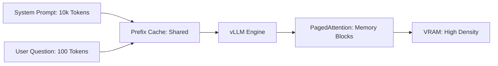

# 🪟 Context Window Management: Handling the Flow
> **Objective:** Master the engineering techniques used to efficiently manage LLM context—from sliding windows and token eviction to paged attention and prefix caching | **Language:** Hinglish | **Standard:** 2026 Expert Framework

---

## 🧭 1. Beginner-Friendly Hinglish Explanation
Context Window Management ka matlab hai "Limited memory mein bade data ko handle karna".

- **The Problem:** Model ki memory (Context window) ek glass jaisi hai. Agar aap dher saara paani (Tokens) daloge, toh glass bhar jayega.
- **The Solution:** Management techniques. 
  - **Sliding Window:** Naye tokens aate hain, purane tokens "Baahar" nikal jate hain.
  - **Caching:** Jo info kaam ki hai, use save kar lo takki baar-baar paise na kharch hon.
- **Intuition:** Ye ek "News Ticker" jaisa hai. Sirf latest news dikhti hai, purani news screen se baahar chali jati hai takki jagah bani rahe.

---

## 🧠 2. Deep Technical Explanation
Managing the context window is primarily a **KV Cache Management** problem:

1. **Sliding Window Attention (Mistral):** A token only attends to the last $W$ tokens. Memory cost is fixed at $O(W)$ instead of $O(N)$.
2. **StreamingLLM (Attention Sinks):** Keeping the first 4 tokens (The "Sinks") and the last 1000 tokens. This prevents the model's logic from crashing when the window "Slides".
3. **Prefix Caching:** If 100 users are asking questions about the same 100k-word document, we store the KV cache for that document in RAM and "Attach" it to every request.
4. **PagedAttention (vLLM):** Managing the KV cache as non-contiguous blocks to eliminate memory fragmentation.

---

## 📐 3. Mathematical Intuition
**Memory Utilization Efficiency ($E$):**
In standard batching, if max context is $C$ and average context is $A$:
$$E = \frac{A}{C}$$
If $C=128k$ and $A=4k$, efficiency is only $3\%$.
**PagedAttention** brings $E$ close to **$95\%$** by dynamically allocating memory only when needed.

---

## 🏗️ 4. Architecture Diagrams


---

## 💻 5. Production-Ready Examples
Setting up **Prompt Caching** in 2026:
```python
# API-side caching (e.g., Anthropic/OpenAI pattern)
response = client.messages.create(
    model="claude-3-5-sonnet",
    max_tokens=1024,
    messages=[
        {
            "role": "user",
            "content": [
                {
                    "type": "text",
                    "text": "Extremely long document...",
                    "cache_control": {"type": "ephemeral"} # Cache this!
                },
                {"type": "text", "text": "Who is the protagonist?"}
            ]
        }
    ]
)
# Next query with the same long text will be 90% cheaper and faster.
```

---

## 🌍 6. Real-World Use Cases
- **Long-running Agents:** Keeping the history of a 24-hour coding session without the model forgetting the initial goal.
- **Multi-user Chat:** Sharing a "Project Wiki" across 50 teammates in a single chat room.

---

## ❌ 7. Failure Cases
- **Attention Sink Loss:** If you don't keep the first few tokens (The Sinks), the Softmax values for the rest of the sequence explode, making the model output gibberish.
- **Cache Eviction Policy:** Accidentally deleting the "System Prompt" from the cache to make room for a "User Joke".

---

## 🛠️ 8. Debugging Guide
| Problem | Reason | Solution |
| :--- | :--- | :--- |
| **Model loses track of instructions** | Window slid too far | Increase **Window Size** or use **Pinned Context** for instructions. |
| **CUDA Out of Memory** | Fragmentation | Switch to **PagedAttention** or lower the batch size. |

---

## ⚖️ 9. Tradeoffs
- **Sliding Window (Fixed memory / Fast / Forgets deep history).**
- **Full Context (Perfect memory / High cost / Slow).**

---

## 🛡️ 10. Security Concerns
- **Cache Side-Channel:** One user might be able to detect if another user has already "Cached" a specific document by measuring the response time (Fast = Already Cached).

---

## 📈 11. Scaling Challenges
- **The "Context Wall":** Managing 10M tokens for 1000 users requires **Terabytes of VRAM**. **Fix: Multi-host KV Cache distribution.**

---

## 💰 12. Cost Considerations
- Caching saves $90\%$ of costs for "Static" context (like docs), but "Dynamic" context (like chat history) is harder to cache effectively.

漫
---

## 📝 14. Interview Questions
1. "What is an 'Attention Sink' and why is it important for sliding window models?"
2. "How does Prefix Caching reduce inference costs?"
3. "Explain the difference between 'Contiguous' and 'Paged' KV caches."

---

## 🚀 15. Latest 2026 LLM Engineering Patterns
- **Context Offloading:** Moving the "Inactive" parts of a long context window to the CPU or SSD in real-time.
- **Adaptive Context:** The model "Decides" which parts of its history are important and "Compresses" the rest into a few summary tokens.
漫
漫
