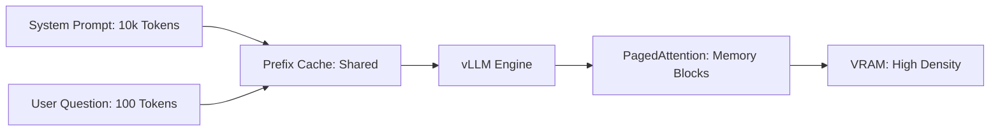

# 🪟 Context Window Management: Flow ko Handle Karna
> **Objective:** LLM context ko efficiently manage karne ke engineering techniques master karna—sliding windows aur token eviction se lekar paged attention aur prefix caching tak | **Language:** Hinglish | **Standard:** 2026 Expert Framework

---

## 🧭 1. Beginner-Friendly Hinglish Explanation
Context Window Management ka matlab hai "Limited memory mein bade data ko handle karna".

- **The Problem:** Model ki memory (Context window) ek glass jaisi hai. Agar aap dher saara paani (Tokens) daloge, toh glass bhar jayega.
- **The Solution:** Management techniques. 
  - **Sliding Window:** Naye tokens aate hain, purane tokens "Baahar" nikal jate hain.
  - **Caching:** Jo info kaam ki hai, use save kar lo takki baar-baar paise na kharch hon.
- **Intuition:** Ye ek "News Ticker" jaisa hai. Sirf latest news dikhti hai, purani news screen se baahar chali jati hai takki jagah bani rahe.

---

## 🧠 2. Deep Technical Explanation
Context window ko manage karna primarily ek **KV Cache Management** problem hai:

1. **Sliding Window Attention (Mistral):** Ek token sirf last $W$ tokens ko attend karta hai. Memory cost $O(W)$ par fixed hoti hai balke $O(N)$ nahi.
2. **StreamingLLM (Attention Sinks):** Pehle 4 tokens (The "Sinks") aur last 1000 tokens ko keep karna. Ye model ke logic ko crash hone se rokta hai jab window "Slide" karti hai.
3. **Prefix Caching:** Agar 100 users same 100k-word document ke baare mein questions pooch rahe hain, toh hum us document ka KV cache RAM mein store karte hain aur har request ke saath "Attach" karte hain.
4. **PagedAttention (vLLM):** KV cache ko non-contiguous blocks ke roop mein manage karna memory fragmentation ko khatam karne ke liye.

---

## 📐 3. Mathematical Intuition
**Memory Utilization Efficiency ($E$):**
Standard batching mein, agar max context $C$ hai aur average context $A$ hai:
$$E = \frac{A}{C}$$
Agar $C=128k$ aur $A=4k$, toh efficiency sirf $3\%$ hoti hai.
**PagedAttention** $E$ ko **$95\%$** ke kareeb laata hai dynamically memory allocate karke sirf jab zaroorat hoti hai.

---

## 🏗️ 4. Architecture Diagrams

```mermaid
graph LR
    User1[System Prompt: 10k Tokens] --> Cache[Prefix Cache: Shared]
    User2[User Question: 100 Tokens] --> Cache
    Cache --> Engine[vLLM Engine]
    Engine --> Paged[PagedAttention: Memory Blocks]
    Paged --> GPU[VRAM: High Density]
```

---

## 💻 5. Production-Ready Examples
2026 mein **Prompt Caching** set up karna:
```python
# API-side caching (e.g., Anthropic/OpenAI pattern)
response = client.messages.create(
    model="claude-3-5-sonnet",
    max_tokens=1024,
    messages=[
        {
            "role": "user",
            "content": [
                {
                    "type": "text",
                    "text": "Extremely long document...",
                    "cache_control": {"type": "ephemeral"} # Cache this!
                },
                {"type": "text", "text": "Who is the protagonist?"}
            ]
        }
    ]
)
# Next query with the same long text will be 90% cheaper and faster.
```

---

## 🌍 6. Real-World Use Cases
- **Long-running Agents:** 24-hour coding session ka history keep karna bina model ko initial goal bhoolna.
- **Multi-user Chat:** Ek "Project Wiki" ko 50 teammates ke beech ek chat room mein share karna.

---

## ❌ 7. Failure Cases
- **Attention Sink Loss:** Agar aap pehle kuch tokens (The Sinks) nahi rakhte, toh baaki sequence ke Softmax values explode ho jate hain, jisse model output gibberish ho jata hai.
- **Cache Eviction Policy:** Galti se cache mein se "System Prompt" delete karna "User Joke" ke liye jagah banane ke liye.

---

## 🛠️ 8. Debugging Guide
| Problem | Reason | Solution |
| :--- | :--- | :--- |
| **Model loses track of instructions** | Window slid too far | **Window Size** badhayein ya instructions ke liye **Pinned Context** use karein. |
| **CUDA Out of Memory** | Fragmentation | **PagedAttention** par switch karein ya batch size kam karein. |

---

## ⚖️ 9. Tradeoffs
- **Sliding Window (Fixed memory / Fast / Deep history bhool jata hai).**
- **Full Context (Perfect memory / High cost / Slow).**

---

## 🛡️ 10. Security Concerns
- **Cache Side-Channel:** Ek user detect kar sakta hai ki kisi aur user ne already ek specific document "Cache" kiya hai response time measure karke (Fast = Already Cached).

---

## 📈 11. Scaling Challenges
- **The "Context Wall":** 1000 users ke liye 10M tokens manage karna **Terabytes of VRAM** require karta hai. **Fix: Multi-host KV Cache distribution.**

---

## 💰 12. Cost Considerations
- Caching "Static" context (jaise docs) ke $90\%$ costs save karta hai, lekin "Dynamic" context (jaise chat history) ko effectively cache karna mushkil hai.

漫
---

## 📝 14. Interview Questions
1. "What is an 'Attention Sink' and why is it important for sliding window models?" 
2. "How does Prefix Caching reduce inference costs?" 
3. "Explain the difference between 'Contiguous' and 'Paged' KV caches." 

---

## 🚀 15. Latest 2026 LLM Engineering Patterns
- **Context Offloading:** Long context window ke "Inactive" parts ko real-time mein CPU ya SSD par move karna.
- **Adaptive Context:** Model "Decides" karta hai ki uske history ke kaun se parts important hain aur baaki ko kuch summary tokens mein "Compresses" karta hai.
漫
漫