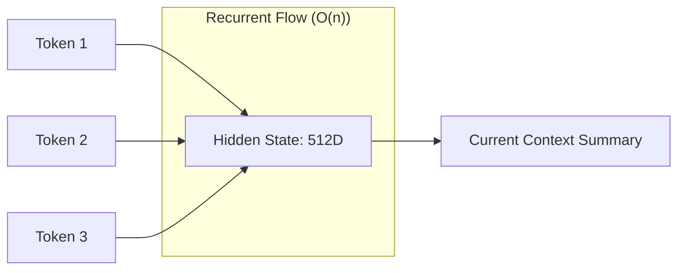

# ♾️ Infinite Context Techniques: SSMs and Beyond
> **Objective:** Master the architectures and techniques that break the $O(n^2)$ attention barrier, focusing on State Space Models (Mamba), Linear Attention, and Recurrent Transformers | **Language:** Hinglish | **Standard:** 2026 Expert Framework

---

## 🧭 1. Beginner-Friendly Hinglish Explanation
Infinite Context ka matlab hai ek aisi memory jo kabhi bharti nahi.

- **The Problem:** Standard LLMs (Transformers) jaise-jaise tokens badhte hain, slow hote jate hain. 10 Million tokens par wo bilkul ruk jayenge.
- **The Solution:** SSMs (State Space Models) like **Mamba**. 
  - Ye pura data save nahi karte. 
  - Ye har token ke baad apni "State" (Internal summary) ko update karte hain. 
- **Intuition:** Ye ek "Radio" jaisa hai. Radio ko farak nahi padta ki gaana 1 minute se chal raha hai ya 1 ghante se, wo bas current signal catch karta hai aur aage badhta hai.

---

## 🧠 2. Deep Technical Explanation
Infinite context architectures replace global attention with **Recurrent** or **Selective** mechanisms:

1. **Linear Attention:** Modifying the attention math to be $O(n)$ by changing the order of matrix multiplication. 
2. **State Space Models (SSMs):** Using differential equations to model sequence data. **Mamba** uses "Selective Scan" to decide what to remember and what to forget at each step.
3. **Mamba-2:** A 2026 evolution that combines the best of SSMs and Transformers, providing $O(n)$ scaling with Transformer-like reasoning quality.
4. **Recurrent Memory Transformers (RMT):** Passing a "Memory Token" from one segment to the next, allowing context to flow across millions of tokens without full attention.

---

## 📐 3. Mathematical Intuition
**Standard Attention:** Complexity is $N^2$.
**SSM (Mamba):** Complexity is $N \times D$ (where $D$ is the constant state size).
The hidden state $h_t$ is updated as:
$$h_t = A h_{t-1} + B x_t$$
$$y_t = C h_t$$
Because $A, B, C$ are constant-sized matrices, the memory needed for 1 token is exactly the same as for 1,000,000 tokens.

---

## 🏗️ 4. Architecture Diagrams


---

## 💻 5. Production-Ready Examples
Using **Mamba** in 2026:
```python
from mamba_ssm import Mamba

# Initialize a Mamba block
model = Mamba(
    d_model=768, 
    d_state=16, 
    d_conv=4, 
    expand=2
)

# Unlike Transformers, Mamba's speed won't drop as sequence grows.
# Perfect for streaming logs or real-time sensor data.
```

---

## 🌍 6. Real-World Use Cases
- **Genomic Sequencing:** Analyzing DNA sequences with billions of base pairs in a single pass.
- **Long-form Video:** Processing every frame of a 24-hour video stream without "Windowing".
- **Log Analysis:** Monitoring a server's entire lifetime of logs to find patterns that span weeks.

---

## ❌ 7. Failure Cases
- **The "State Bottleneck":** If the hidden state is only 512D, it eventually "Forgets" details. You can't fit 1 million names in a small state vector without losing precision.
- **Reasoning Gaps:** SSMs are currently slightly worse than Transformers at complex "Logic" tasks (like coding) because they can't "Look back" at the exact tokens.

---

## 🛠️ 8. Debugging Guide
| Problem | Reason | Solution |
| :--- | :--- | :--- |
| **Model forgets specific facts** | State size is too small | Increase **d_state** or use a **Hybrid Transformer-SSM** architecture. |
| **Training is unstable** | Recurrent gradients exploding | Use **Normalization layers** after every state update. |

---

## ⚖️ 9. Tradeoffs
- **SSMs/Mamba (Infinite Context / $O(n)$ speed / Lower reasoning).**
- **Transformers (Limited Context / $O(n^2)$ speed / Higher reasoning).**

---

## 🛡️ 10. Security Concerns
- **State Poisoning:** Crafting a sequence of millions of "Innocent" tokens that slowly "Poisons" the hidden state to produce a malicious output at the end.

---

## 📈 11. Scaling Challenges
- **The Reasoning-Efficiency Frontier:** Finding the perfect balance between "Global Attention" (for logic) and "Recurrence" (for speed).

---

## 💰 12. Cost Considerations
- SSMs are extremely cheap for long context because you don't need to store a massive KV Cache. Memory cost is constant.

漫
---

## 📝 14. Interview Questions
1. "How does Mamba achieve $O(n)$ scaling?"
2. "What is 'Selective Scan' in the context of SSMs?"
3. "Can a pure SSM replace a Transformer for coding tasks? Why or why not?"

---

## 🚀 15. Latest 2026 LLM Engineering Patterns
- **Jamba:** A hybrid model from AI21 that layers Transformer blocks (for logic) and Mamba blocks (for long-range efficiency).
- **Mamba-2-Hybrid:** The 2026 industry standard for large-scale long-context modeling.
漫
漫
