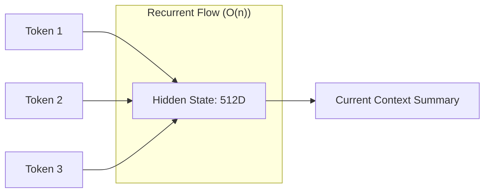

# ♾️ Infinite Context Techniques: SSMs aur Beyond
> **Objective:** Master karo architectures aur techniques jo $O(n^2)$ attention barrier ko todte hain, focus karo State Space Models (Mamba), Linear Attention, aur Recurrent Transformers par | **Language:** Hinglish | **Standard:** 2026 Expert Framework

---

## 🧭 1. Beginner-Friendly Hinglish Explanation
Infinite Context ka matlab hai ek aisi memory jo kabhi bharti nahi.

- **The Problem:** Standard LLMs (Transformers) jaise-jaise tokens badhte hain, slow hote jate hain. 10 Million tokens par wo bilkul ruk jayenge.
- **The Solution:** SSMs (State Space Models) like **Mamba**. 
  - Ye pura data save nahi karte. 
  - Ye har token ke baad apni "State" (Internal summary) ko update karte hain.
- **Intuition:** Ye ek "Radio" jaisa hai. Radio ko farak nahi padta ki gaana 1 minute se chal raha hai ya 1 ghante se, wo bas current signal catch karta hai aur aage badhta hai.

---

## 🧠 2. Gehra Technical Explanation
Infinite context architectures global attention ko replace karte hain **Recurrent** ya **Selective** mechanisms se:

1. **Linear Attention:** Attention math ko modify karke $O(n)$ banate hain matrix multiplication ka order change karke.
2. **State Space Models (SSMs):** Differential equations use karke sequence data model karte hain. **Mamba** uses "Selective Scan" decide karne ke liye ki har step par kya yaad rakhna aur kya bhoolna.
3. **Mamba-2:** 2026 ka evolution jo combine karta hai SSMs aur Transformers dono ki best qualities, provide karta hai $O(n)$ scaling Transformer-like reasoning quality ke saath.
4. **Recurrent Memory Transformers (RMT):** Ek segment se agle segment tak "Memory Token" pass karna, context ko flow karne deta hai millions of tokens across bina full attention ke.

---

## 📐 3. Mathematical Samjh
**Standard Attention:** Complexity $N^2$ hoti hai.
**SSM (Mamba):** Complexity $N \times D$ hai (jahan $D$ constant state size hai).
Hidden state $h_t$ update hota hai is prakar:
$$h_t = A h_{t-1} + B x_t$$
$$y_t = C h_t$$
Kyunki $A, B, C$ constant-sized matrices hain, to 1 token ke liye jo memory chahiye wahi 1,000,000 tokens ke liye bhi chahiye.

---

## 🏗️ 4. Architecture Diagrams

```mermaid
graph LR
    Token1[Token 1] --> State[Hidden State: 512D]
    Token2[Token 2] --> State
    Token3[Token 3] --> State
    State --> Output[Current Context Summary]
    subgraph "Recurrent Flow (O(n))"
    State
    end
```

---

## 💻 5. Production-Ready Examples
2026 mein **Mamba** ka istemal:
```python
from mamba_ssm import Mamba

# Mamba block initialize karo
model = Mamba(
    d_model=768, 
    d_state=16, 
    d_conv=4, 
    expand=2
)

# Transformers ke vipareet, Mamba ki speed nahi girti jaise sequence badhta hai.
# Streaming logs ya real-time sensor data ke liye perfect.
```

---

## 🌍 6. Real-World Use Cases
- **Genomic Sequencing:** DNA sequences analyze karna billion base pairs ke saath ek hi pass mein.
- **Long-form Video:** Har frame ko process karna 24-hour video stream ka bina "Windowing" ke.
- **Log Analysis:** Server ke poore jeevan kaal ke logs monitor karna patterns dhundhne ke liye jo weeks tak chalein.

---

## ❌ 7. Failure Cases
- **The "State Bottleneck":** Agar hidden state sirf 512D hai, to eventually details "Forget" ho jate hain. 1 million names ko ek chhote state vector mein fit nahi kar sakte precision khoye bina.
- **Reasoning Gaps:** SSMs currently Transformers se kuch behtar nahi hain complex "Logic" tasks (jaise coding) mein kyunki wo exact tokens par "Look back" nahi kar sakte.

---

## 🛠️ 8. Debugging Guide
| Problem | Reason | Solution |
| :--- | :--- | :--- |
| **Model specific facts bhool jata hai** | **State size bohot chhota hai** | **d_state** badhayein ya **Hybrid Transformer-SSM** architecture use karein. |
| **Training unstable hai** | **Recurrent gradients explode ho rahe hain** | State update ke baad **Normalization layers** use karein. |

---

## ⚖️ 9. Tradeoffs
- **SSMs/Mamba (Infinite Context / $O(n)$ speed / Kam reasoning).**
- **Transformers (Limited Context / $O(n^2)$ speed / Zyada reasoning).**

---

## 🛡️ 10. Security Concerns
- **State Poisoning:** Millions of "Innocent" tokens ki ek sequence banana jo slowly hidden state ko "Poison" kare aur end par malicious output produce kare.

---

## 📈 11. Scaling Challenges
- **The Reasoning-Efficiency Frontier:** "Global Attention" (logic ke liye) aur "Recurrence" (speed ke liye) ke beech perfect balance dhundhna.

---

## 💰 12. Cost Considerations
- SSMs long context ke liye bahut saste hain kyunki aapko massive KV Cache store nahi karna padta. Memory cost constant hai.

漫
---

## 📝 14. Interview Questions
1. "Mamba $O(n)$ scaling kaise achieve karta hai?"
2. "'Selective Scan' kya hai SSMs ke context mein?"
3. "Kya ek pure SSM Transformer ko badal sakta hai coding tasks ke liye? Kyun ya kyun nahi?"

---

## 🚀 15. Latest 2026 LLM Engineering Patterns
- **Jamba:** AI21 ka ek hybrid model jo Transformer blocks (logic ke liye) aur Mamba blocks (long-range efficiency ke liye) ko layer karta hai.
- **Mamba-2-Hybrid:** 2026 ka industry standard large-scale long-context modeling ke liye.
漫
漫