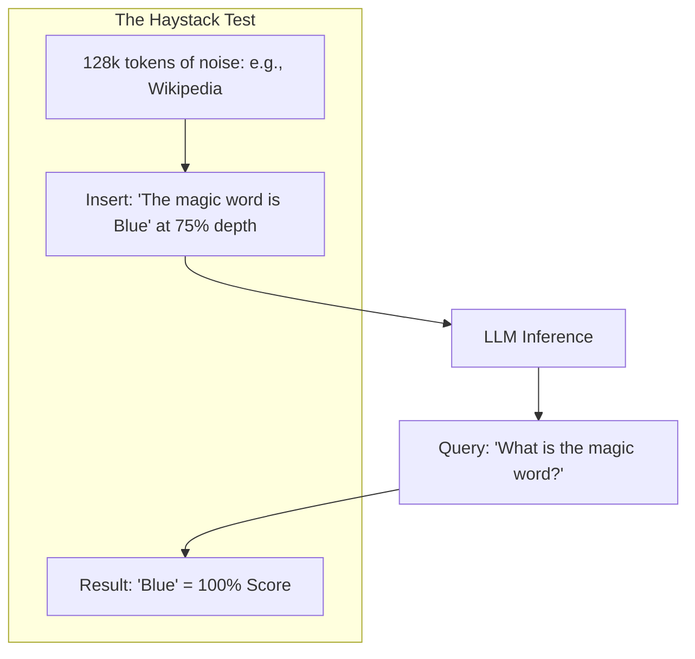

# 📊 Long Context Evaluation: Testing the Limits
> **Objective:** Master the specialized benchmarks and testing methodologies used to verify if an LLM can truly utilize its entire context window—from Needle-in-a-Haystack to RULER and LongBench | **Language:** Hinglish | **Standard:** 2026 Expert Framework

---

## 🧭 1. Beginner-Friendly Hinglish Explanation
Long Context Evaluation ka matlab hai "Check karna ki kya model sach mein sab yaad rakhta hai?".

- **The Problem:** Companies claim karti hain "1 Million Context Window", par ho sakta hai model sirf pehle 100 pages hi dhang se padh raha ho.
- **The Solution:** Benchmarking. 
  - **Needle-in-a-Haystack:** Ek bohot bade document ke beech mein ek "Sui" (Secret info) chhupana aur model se wo dhoondne ko bolna.
  - **RULER:** Model ko bohot saari complicated tasks dena jo alag-alag positions par hain.
- **Intuition:** Ye ek "Exams" jaisa hai jahan hum check karte hain ki student ne puri book padhi hai ya sirf shuruat ke 2 chapters.

---

## 🧠 2. Deep Technical Explanation
Evaluating long context is harder than standard NLP because you must verify **Retrieval AND Reasoning**:

1. **Needle-in-a-Haystack (NIAH):** Placing a fact like "The secret code is 1234" at 10% depth, 50% depth, and 90% depth of a 128k context. If the model misses it, it has "Recall failure".
2. **RULER (Retrieval & Reasoning):** A more advanced benchmark that tests multi-hop reasoning over long distances (e.g., "Find the person's age from page 1 and their name from page 500").
3. **LongBench:** A comprehensive suite of tasks including summarization, single-doc QA, and multi-doc QA.
4. **Perplexity over Distance:** Measuring how the model's prediction accuracy drops as the "Key information" gets further away.

---

## 📐 3. Mathematical Intuition
**Effective Context Length ($N_{eff}$):**
It is the point where the model's perplexity is no longer better than its performance on a shorter window. 
If a model has a 128k window but its perplexity at 64k is the same as at 128k, its **$N_{eff}$ is 64k**.

---

## 🏗️ 4. Architecture Diagrams

---

## 💻 5. Production-Ready Examples
Visualizing a **Needle-in-a-Haystack** result (The "Heatmap" pattern):
- **Y-axis:** Sequence Length (2k, 4k, 8k, ... 128k).
- **X-axis:** Needle Depth (0%, 25%, 50%, 75%, 100%).
- **Colors:** Green (Success), Red (Failure).
A "Perfect" model should be all green. Most models show red in the middle ("Lost in the Middle").

---

## 🌍 6. Real-World Use Cases
- **Auditing Models:** Before buying a \$50,000/year enterprise license, a company runs NIAH to see if the model can actually handle their massive legal files.
- **Model Training:** Researchers use RULER to check if their new "RoPE Scaling" actually worked or just made the model dumber.

---

## ❌ 7. Failure Cases
- **Copy-Paste Hack:** Some models learn to just "Copy" the most unusual looking sentence in the context, passing NIAH but failing real-world reasoning.
- **Instruction Bias:** The model might find the needle but "Forget" to follow the output formatting (e.g., JSON) because the long context overwhelmed its instruction-following layer.

---

## 🛠️ 8. Debugging Guide
| Problem | Reason | Solution |
| :--- | :--- | :--- |
| **Model fails at 50% depth** | 'Lost in the Middle' bias | Use **ALiBi** or fine-tune on **long-form data**. |
| **Model fails only at 128k** | VRAM precision errors | Switch to **BF16** or **FP32** for the RoPE calculation. |

---

## ⚖️ 9. Tradeoffs
- **Synthetic Tests (Fast / Easy / Good for recall)** vs **Real-world Benchmarks (Slow / Hard / Good for logic).**

---

## 🛡️ 10. Security Concerns
- **Benchmark Contamination:** If the "Haystack" data (e.g., Wikipedia) is in the model's training set, the model might "Predict" the content instead of "Retrieving" it, leading to fake high scores.

---

## 📈 11. Scaling Challenges
- **Cost of Testing:** Running a 1M token benchmark 100 times to get a stable score can cost thousands of dollars in API fees.

---

## 💰 12. Cost Considerations
- Use a smaller model (like Llama-3 8B) to "Draft" the haystacks and evaluate the results of the larger model to save on human-labeling costs.

漫
---

## 📝 14. Interview Questions
1. "What does a Needle-in-a-Haystack test prove about an LLM?"
2. "Explain the 'Lost in the Middle' phenomenon."
3. "Why is Perplexity not enough to evaluate long-context models?"

---

## 🚀 15. Latest 2026 LLM Engineering Patterns
- **RULER (2026 Edition):** The current gold standard for evaluating models beyond 1M tokens.
- **Automated Stress-Testing:** A system that automatically identifies the "Weak points" in a model's context window and generates targeted tests for those depths.
漫
漫
