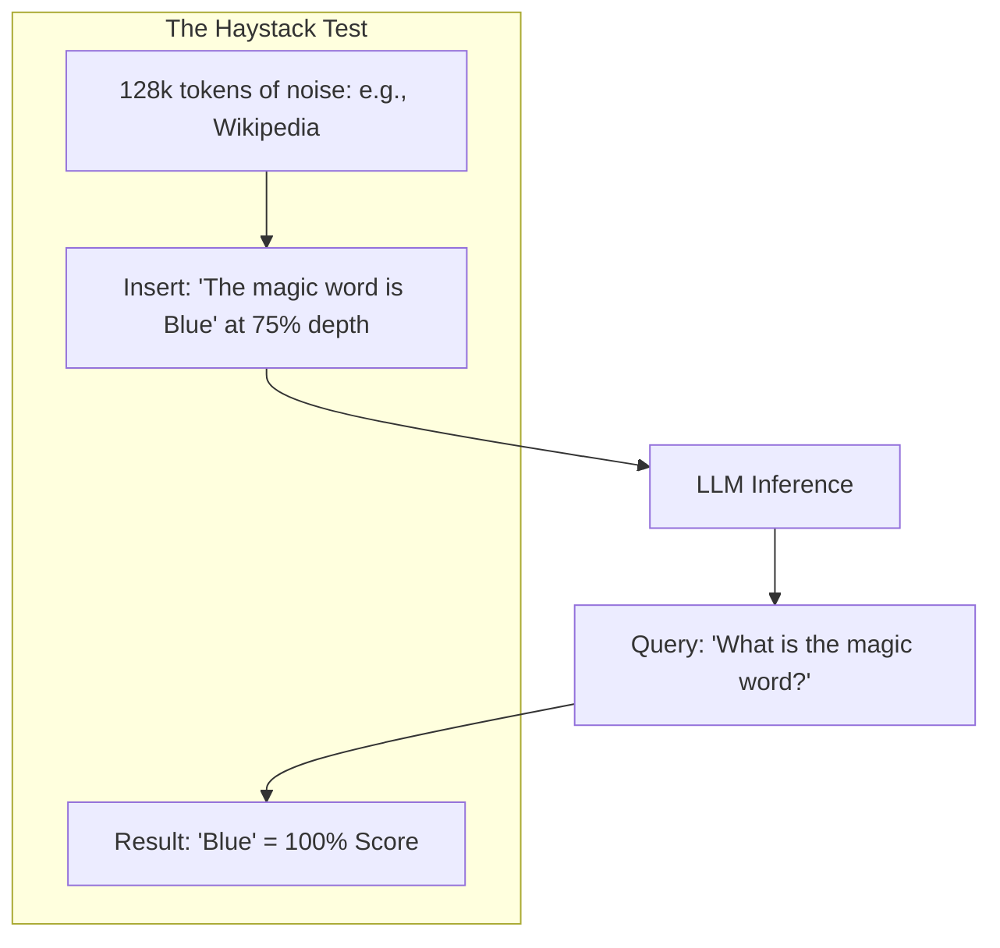

# 📊 Long Context Evaluation: Limits ko Test Karna
> **Objective:** Specialized benchmarks aur testing methodologies ko master karna jo verify karte hain ki kya LLM apne entire context window ko truly utilize kar sakta hai—from Needle-in-a-Haystack to RULER and LongBench | **Language:** Hinglish | **Standard:** 2026 Expert Framework

---

## 🧭 1. Shuruati Hinglish Explanation
Long Context Evaluation ka matlab hai "Check karna ki kya model sach mein sab yaad rakhta hai?".

- **The Problem:** Companies claim karti hain "1 Million Context Window", par ho sakta hai model sirf pehle 100 pages hi dhang se padh raha ho.
- **The Solution:** Benchmarking. 
  - **Needle-in-a-Haystack:** Ek bohot bade document ke beech mein ek "Sui" (Secret info) chhupana aur model se wo dhoondne ko bolna.
  - **RULER:** Model ko bohot saari complicated tasks dena jo alag-alag positions par hain.
- **Intuition:** Ye ek "Exams" jaisa hai jahan hum check karte hain ki student ne puri book padhi hai ya sirf shuruat ke 2 chapters.

---

## 🧠 2. Gehri Technical Samjhaayein
Long context evaluate karna standard NLP se zyada mushkil hai kyunki aapko **Retrieval aur Reasoning** dono verify karne hote hain:

1. **Needle-in-a-Haystack (NIAH):** Ek fact ko jaise "The secret code is 1234" ko 128k context ke 10% depth, 50% depth, aur 90% depth par rakhna. Agar model use miss karta hai, toh usme "Recall failure" hota hai.
2. **RULER (Retrieval & Reasoning):** Ek zyada advanced benchmark jo long distances par multi-hop reasoning test karta hai (e.g., "Page 1 se person ki age aur page 500 se unka naam dhoondho").
3. **LongBench:** Tasks ka ek comprehensive suite jisme summarization, single-doc QA, aur multi-doc QA shamil hain.
4. **Perplexity over Distance:** Measure karna ki model ki prediction accuracy kaise drop hoti hai jab "Key information" door hoti jaati hai.

---

## 📐 3. Ganitiya Intuition
**Effective Context Length ($N_{eff}$):** Yeh woh point hai jahan model ki perplexity ab shorter window par uske performance se better nahi hoti. Agar model ke paas 128k window hai lekin 64k aur 128k par perplexity same hai, toh uska **$N_{eff}$ 64k hai**.

---

## 🏗️ 4. Architecture Diagrams

```mermaid
graph TD
    Input[128k tokens of noise: e.g., Wikipedia] --> Insert[Insert: 'The magic word is Blue' at 75% depth]
    Insert --> Model[LLM Inference]
    Model --> Query[Query: 'What is the magic word?']
    Query --> Result[Result: 'Blue' = 100% Score]
    subgraph "The Haystack Test"
    Input
    Insert
    Result
    end
```

---

## 💻 5. Production-Ready Examples
Visualizing a **Needle-in-a-Haystack** result (The "Heatmap" pattern):
- **Y-axis:** Sequence Length (2k, 4k, 8k, ... 128k).
- **X-axis:** Needle Depth (0%, 25%, 50%, 75%, 100%).
- **Colors:** Green (Success), Red (Failure).
Ek "Perfect" model poori tarah green hona chahiye. Zyadatar models beech mein red dikhate hain ("Lost in the Middle").

---

## 🌍 6. Real-World Use Cases
- **Auditing Models:** $50,000/year ke enterprise license khareedne se pehle, company NIAH run karti hai ye dekhne ke liye ki kya model unke massive legal files ko handle kar sakta hai.
- **Model Training:** Researchers RULER use karte hain ye check karne ke liye ki unka naya "RoPE Scaling" actually kaam kiya ya sirf model ko bekar kiya.

---

## ❌ 7. Failure Cases
- **Copy-Paste Hack:** Kuch models context mein sabse unusual looking sentence ko bas "Copy" karna seekh jaate hain, jisse wo NIAH pass kar lete hain lekin real-world reasoning mein fail ho jaate hain.
- **Instruction Bias:** Ho sakta hai model needle to dhundh le lekin output formatting (e.g., JSON) follow karna "Bhool" jaaye kyunki long context ne uski instruction-following layer ko overwhelm kar diya.

---

## 🛠️ 8. Debugging Guide
| Problem | Reason | Solution |
| :--- | :--- | :--- |
| **Model 50% depth par fail hota hai** | 'Lost in the Middle' bias | **ALiBi** use karein ya **long-form data** par fine-tune karein. |
| **Model sirf 128k par fail hota hai** | VRAM precision errors | RoPE calculation ke liye **BF16** ya **FP32** par switch karein. |

---

## ⚖️ 9. Tradeoffs
- **Synthetic Tests (Tez / Aasan / Recall ke liye achha)** vs **Real-world Benchmarks (Dheema / Mushkil / Logic ke liye achha).**

---

## 🛡️ 10. Security Concerns
- **Benchmark Contamination:** Agar "Haystack" data (e.g., Wikipedia) model ke training set mein hai, toh model content ko "Retrieve" karne ki bajay "Predict" kar sakta hai, jisse fake high scores milte hain.

---

## 📈 11. Scaling Challenges
- **Testing ka Cost:** Stable score pane ke liye 1M token benchmark ko 100 baar run karna API fees mein hazaron dollar kharch kar sakta hai.

---

## 💰 12. Cost Considerations
- Ek chhota model (jaise Llama-3 8B) use karein haystacks ko "Draft" karne ke liye aur bade model ke results evaluate karne ke liye, taki human-labeling costs bachen.

漫
---

## 📝 14. Interview Questions
1. "Needle-in-a-Haystack test LLM ke baare mein kya prove karta hai?"
2. "'Lost in the Middle' phenomenon ko samjhaiye."
3. "Perplexity long-context models evaluate karne ke liye kyun kaafi nahi hai?"

---

## 🚀 15. Latest 2026 LLM Engineering Patterns
- **RULER (2026 Edition):** Models ko 1M tokens se aage evaluate karne ke liye current gold standard.
- **Automated Stress-Testing:** Ek system jo automatically model's context window mein "Weak points" identify karta hai aur un depths ke liye targeted tests generate karta hai.
漫
漫