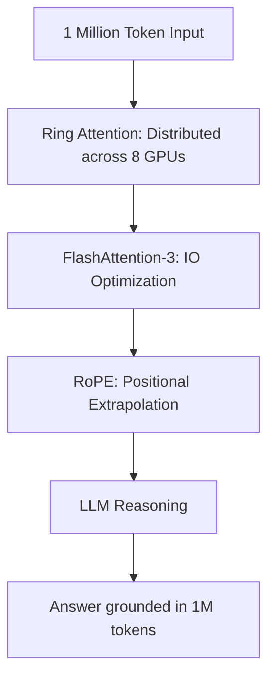

# 📜 Long Context LLMs: The Million-Token Era
> **Objective:** Master the principles and architectural innovations that enable LLMs to process massive context windows—from 128k to 10M tokens—enabling deep analysis of entire books, codebases, and video streams | **Language:** Hinglish | **Standard:** 2026 Expert Framework

---

## 🧭 1. Beginner-Friendly Hinglish Explanation
Long Context ka matlab hai LLM ki "Short-term Memory" ko badhana.

- **The Problem:** Purane models sirf 2-4 pages ka data ek sath "Yaad" rakh sakte the. Agar aapne badi book di, toh wo shuruat ki baatein bhool jate the.
- **The Solution:** Long Context Architectures. 
  - Naye models (like Gemini 1.5 ya Llama-3.1) 1 Million se 10 Million tokens tak handle kar sakte hain.
  - Iska matlab aap puri library ka data ek hi prompt mein daal sakte ho.
- **Intuition:** Ye ek "Dabba" (Memory) jaisa hai. Pehle dabba chota tha, ab humne dabba itna bada kar diya hai ki usme pura shehar sama jaye.

---

## 🧠 2. Deep Technical Explanation
Handling long context requires solving the **Quadratic Complexity** of Self-Attention:

1. **The $O(n^2)$ Problem:** Standard attention becomes too slow and memory-heavy as sequence length $n$ increases.
2. **FlashAttention-3:** Optimizing memory IO to speed up attention calculation by $10x$ on H100 GPUs.
3. **Linear Attention & State Space Models (SSMs):** Using architectures like **Mamba** that have $O(n)$ complexity, allowing for theoretically infinite context.
4. **Ring Attention:** Splitting the context across multiple GPUs so that no single GPU runs out of memory.
5. **Context Window vs. Effective Context:** Just because a model accepts 1M tokens doesn't mean it can *reason* over all of them.

---

## 📐 3. Mathematical Intuition
Standard Self-Attention complexity:
$$\text{Attention}(Q, K, V) = \text{softmax}\left(\frac{QK^T}{\sqrt{d_k}}\right)V$$
The $QK^T$ matrix has a size of $N \times N$.
- For $N=1,000$, size is $1M$ elements.
- For $N=100,000$, size is $10B$ elements.
- For $N=1,000,000$, size is $1T$ elements!
This is why we need **Sparse Attention** or **SSMs** to scale beyond 128k.

---

## 🏗️ 4. Architecture Diagrams


---

## 💻 5. Production-Ready Examples
How to handle long context in 2026:
```python
# The 'Infinite-Context' prompt pattern
response = model.generate(
    prompt="Here is a 500-page medical history. Summarize the major risks.",
    context_window=1024000, # 1 Million tokens
    use_kv_cache_offloading=True # Move old tokens to RAM to save VRAM
)
```

---

## 🌍 6. Real-World Use Cases
- **Legal Analysis:** Comparing 10 different versions of a contract to find subtle changes.
- **Full-Stack Coding:** Giving the model the *entire* codebase (1000+ files) so it can refactor a core API without breaking anything.
- **Movie Understanding:** Uploading a 2-hour video and asking "Who was the person in the red hat in the first 5 minutes?".

---

## ❌ 7. Failure Cases
- **Lost in the Middle:** The model remembers the start and end of the 1M tokens but forgets what happened in the middle.
- **Retrieval Drift:** The model retrieves the wrong "Fact" from its massive context window because two facts look similar.
- **Huge Latency:** Even with FlashAttention, 1M tokens take minutes to process during the "Prefill" stage.

---

## 🛠️ 8. Debugging Guide
| Problem | Reason | Solution |
| :--- | :--- | :--- |
| **Model is slow to start** | Prefill bottleneck | Use **Chunked Prefill** or **Prefix Caching**. |
| **Model hallucinates** | Context is too noisy | Use **Needle-in-a-Haystack** tests to verify retrieval quality. |

---

## ⚖️ 9. Tradeoffs
- **Long Context (Deep reasoning / High Latency / High VRAM)** vs **RAG (Fast / Cheap / Less deep reasoning).**

---

## 🛡️ 10. Security Concerns
- **Context Injection:** Hiding a malicious command in the middle of a 1000-page document that the model will "Find" and follow during its reasoning process.

---

## 📈 11. Scaling Challenges
- **VRAM Fragmentation:** Managing the KV Cache for 1M tokens is the biggest engineering challenge. **Fix: Use PagedAttention.**

---

## 💰 12. Cost Considerations
- One 1M-token prompt can cost \$10 - \$50. In 2026, **Prompt Caching** is mandatory to reduce this cost by $90\%$ for repeated queries.

---

## ✅ 13. Best Practices
- **Use Prompt Caching.** If the first 500k tokens are always the same, don't pay for them twice.
- **Decompose tasks.** Don't ask the model to "Summarize everything" in one go. Ask it to "Summarize Part A", then "Part B".
- **Monitor the Needle-in-a-Haystack score.**

漫
---

## 📝 14. Interview Questions
1. "Why is standard self-attention $O(n^2)$?"
2. "How does FlashAttention-3 improve on previous versions?"
3. "What is the difference between RAG and Long Context LLMs?"

---

## 🚀 15. Latest 2026 LLM Engineering Patterns
- **Contextual KV Compression:** The model automatically deletes "unimportant" words from its 1M token memory to save VRAM.
- **Hierarchical Long Context:** A small model summarizes the 1M tokens into 10k tokens for the large model to process.
漫
漫
