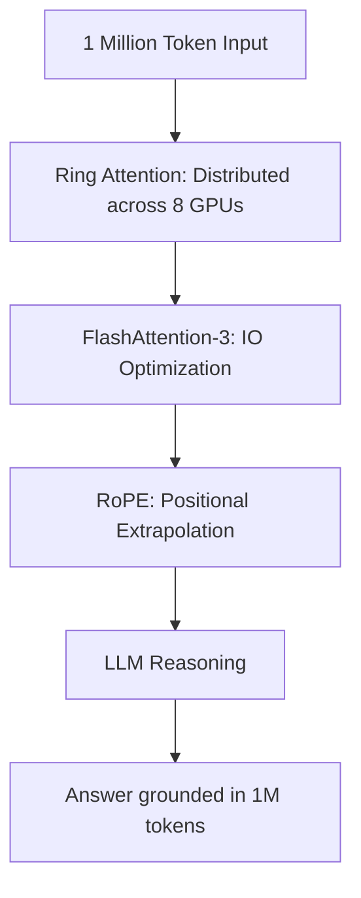

# 📜 Long Context LLMs: Million-Token ka Era
> **Objective:** Un principles aur architectural innovations ko master karo jo LLMs ko massive context windows process karne ki capability dete hain—128k se 10M tokens tak—jisse poori books, codebases, aur video streams ka deep analysis possible hota hai | **Language:** Hinglish | **Standard:** 2026 Expert Framework

---

## 🧭 1. Beginner-Friendly Hinglish Explanation
Long Context ka matlab hai LLM ki "Short-term Memory" ko badhana.

- **The Problem:** Purane models sirf 2-4 pages ka data ek sath "Yaad" rakh sakte the. Agar aapne badi book di, toh wo shuruat ki baatein bhool jate the.
- **The Solution:** Long Context Architectures. 
  - Naye models (like Gemini 1.5 ya Llama-3.1) 1 Million se 10 Million tokens tak handle kar sakte hain.
  - Iska matlab aap puri library ka data ek hi prompt mein daal sakte ho.
- **Intuition:** Ye ek "Dabba" (Memory) jaisa hai. Pehle dabba chota tha, ab humne dabba itna bada kar diya hai ki usme pura shehar sama jaye.

---

## 🧠 2. Gehra Technical Explanation
Long context handle karne ke liye **Quadratic Complexity** of Self-Attention ko solve karna padta hai:

1. **The $O(n^2)$ Problem:** Standard attention bahut slow aur memory-heavy ho jata hai jab sequence length $n$ badhta hai.
2. **FlashAttention-3:** Memory IO optimize karke attention calculation ko $10x$ tak speed up karta hai H100 GPUs par.
3. **Linear Attention & State Space Models (SSMs):** Architectures like **Mamba** use karte hain jinki $O(n)$ complexity hoti hai, jo theoretically infinite context allow karta hai.
4. **Ring Attention:** Context ko multiple GPUs mein split karna taake koi ek GPU memory se bahar na ho.
5. **Context Window vs. Effective Context:** Sirf model 1M tokens accept karta hai iska matlab ye nahi ki wo un sab par *reason* kar sakta hai.

---

## 📐 3. Ganitik Intuition
Standard Self-Attention complexity:
$$\text{Attention}(Q, K, V) = \text{softmax}\left(\frac{QK^T}{\sqrt{d_k}}\right)V$$
The $QK^T$ matrix ka size $N \times N$ hota hai.
- For $N=1,000$, size $1M$ elements hota hai.
- For $N=100,000$, size $10B$ elements hota hai.
- For $N=1,000,000$, size $1T$ elements hota hai!
Isliye hamein 128k se aage scale karne ke liye **Sparse Attention** ya **SSMs** ki zaroorat padti hai.

---

## 🏗️ 4. Architecture ke Diagrams

```mermaid
graph TD
    User[1 Million Token Input] --> Ring[Ring Attention: Distributed across 8 GPUs]
    Ring --> Flash[FlashAttention-3: IO Optimization]
    Flash --> RoPE[RoPE: Positional Extrapolation]
    RoPE --> LLM[LLM Reasoning]
    LLM --> Output[Answer grounded in 1M tokens]
```

---

## 💻 5. Production ke Liye Tayar Examples
2026 mein long context kaise handle karein:
```python
# The 'Infinite-Context' prompt pattern
response = model.generate(
    prompt="Here is a 500-page medical history. Summarize the major risks.",
    context_window=1024000, # 1 Million tokens
    use_kv_cache_offloading=True # Move old tokens to RAM to save VRAM
)
```

---

## 🌍 6. Duniya mein Use Cases
- **Legal Analysis:** Contract ke 10 different versions compare karke subtle changes find karna.
- **Full-Stack Coding:** Model ko *poora* codebase (1000+ files) dena taaki wo bina kuchh break kiye core API refactor kar sake.
- **Movie Understanding:** 2-hour video upload karke poochna "First 5 minutes mein lal hat wala kaun tha?".

---

## ❌ 7. Failure ke Cases
- **Lost in the Middle:** Model 1M tokens ka start aur end to yaad rakhta hai lekin beech mein kya hua bhool jata hai.
- **Retrieval Drift:** Model apne massive context window se galat "Fact" retrieve kar leta hai kyunki do facts similar lagte hain.
- **Huge Latency:** FlashAttention ke saath bhi, "Prefill" stage mein 1M tokens process karne mein minutes lagte hain.

---

## 🛠️ 8. Debugging ke liye Guide
| Samasya | Karan | Samadhan |
| :--- | :--- | :--- |
| **Model slow start hota hai** | Prefill bottleneck | Use **Chunked Prefill** ya **Prefix Caching**. |
| **Model hallucinate karta hai** | Context bahut noisy hai | Use **Needle-in-a-Haystack** tests retrieval quality verify karne ke liye. |

---

## ⚖️ 9. Tradeoffs
- **Long Context (Gehra reasoning / High Latency / High VRAM)** vs **RAG (Fast / Sasta / Kam gehra reasoning).**

---

## 🛡️ 10. Security se Judi Chintayen
- **Context Injection:** 1000-page document ke beech mein ek malicious command chhupa dena jise model apne reasoning process ke dauran "Find" karega aur follow karega.

---

## 📈 11. Scaling ke Challenges
- **VRAM Fragmentation:** 1M tokens ke liye KV Cache manage karna sabse bada engineering challenge hai. **Fix: PagedAttention use karein.**

---

## 💰 12. Cost ke Vichaar
- Ek 1M-token prompt ka cost \$10 - \$50 ho sakta hai. 2026 mein, **Prompt Caching** mandatory hai jisse repeated queries ke liye cost $90\%$ tak reduce ho jati hai.

---

## ✅ 13. Sabse Achhi Practices
- **Prompt Caching** use karein. Agar first 500k tokens hamesha same hain, to unke liye do baar na payein.
- Tasks ko decompose karein. Model se ek baar mein "Sab summarize karo" na kahein. Use "Part A summarize karo", phir "Part B" kahein.
- **Needle-in-a-Haystack** score monitor karein.
漫
---

## 📝 14. Interview ke Sawaal
1. "Standard self-attention $O(n^2)$ kyun hai?"
2. "FlashAttention-3 previous versions se kaise behtar hai?"
3. "RAG aur Long Context LLMs mein kya antar hai?"

---

## 🚀 15. 2026 ke Latest LLM Engineering Patterns
- **Contextual KV Compression:** Model automatically apne 1M token memory se "unimportant" words delete karta hai VRAM bachane ke liye.
- **Hierarchical Long Context:** Ek chhota model 1M tokens ko summarize karke 10k tokens mein badal deta hai jise bada model process karta hai.
漫
漫