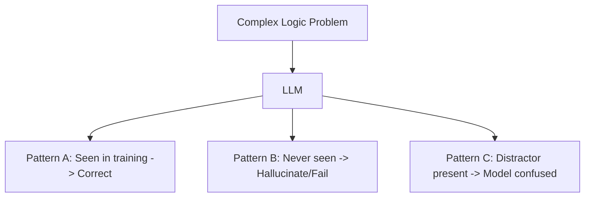

# Reasoning Limitations: The "Stochastic Parrot" Wall

## 1. Beginner-friendly Hinglish Explanation 🇮🇳
Bhai, LLM koi "Albert Einstein" nahi hai. Woh logic sirf "Act" karta hai, use sach mein samajh nahi aata. 

Ek bohot bada limitation hai **"Logical Fragility"**. Agar tum ek simple question ko thoda sa ghuma kar poochoge, toh model fail ho jayega. Use "Common Sense" ki kami hoti hai (Jaise: "Agar main 3 kapde dhoop mein 3 ghante mein sukhata hoon, toh 30 kapde kitne ghante mein sukhenge?"). Model aksar answers "ratta maar" (memorize) kar leta hai aur naye scenarios mein "Dabba gul" (fails) ho jata hai. Ek engineer ke liye yeh janna zaroori hai ki model kahan "Ghutne tek dega".

---

## 2. Deep Technical Explanation
Reasoning in current LLMs is bounded by several factors:
- **Planning Fallacy**: Models are bad at long-horizon planning without external tools (Tree of Thoughts).
- **Symbolic Manipulation**: Struggles with rigorous math or formal logic where a single character change alters the whole meaning.
- **Sensitivity to Formatting**: Changing "Answer with A, B, C" to "Answer with 1, 2, 3" can change the model's accuracy.
- **Memorization vs. Reasoning**: Many "reasoning" successes are actually just the model recalling a similar problem from its training data (Data contamination).

---

## 3. Mathematical Intuition
LLMs minimize **Next Token Entropy**. There is no explicit objective for **Logical Consistency**.
If a logical path $\pi$ has a low probability in the training set, the model will gravitate towards a higher-probability (but incorrect) path $\pi'$.
$$P(\text{Common Answer} | Q) > P(\text{Logical Answer} | Q)$$
This is why models often give "popular" wrong answers (e.g., common misconceptions).

---

## 4. Architecture Diagrams


---

## 5. Production-ready Examples
Testing for "Reverse Reasoning" (A common failure):

```python
# Question: "Who is Tom Cruise's mother?" (Model knows)
# Question: "Who is Mary Lee Pfeiffer's son?" (Model might fail)

def test_reverse_reasoning(llm):
    # Models are often 'Directional'. 
    # They can go from A -> B but not B -> A easily.
    pass
```

---

## 6. Real-world Use Cases
- **Fraud Detection**: Models might miss a creative fraud pattern because they've never "seen" it before.
- **Scientific Innovation**: Models struggle to propose truly "Novel" ideas that go against common literature.

---

## 7. Failure Cases
- **The "Mirror" Test**: Asking the model to solve a problem it just solved but with one minor variable changed.
- **Circular Logic**: The model starts a proof and ends up assuming the conclusion.

---

## 8. Debugging Guide
1. **Distractor Analysis**: Add irrelevant information to the prompt. If the model's answer changes, its reasoning is fragile.
2. **Step-by-step audit**: If CoT is correct but the final answer is wrong, the model has "Calculation failure".

---

## 9. Tradeoffs
| Factor | Human Reasoning | LLM Reasoning |
|---|---|---|
| Speed | Slow | Fast |
| Reliability | High | Variable |
| Scalability | Low | Infinite |

---

## 10. Security Concerns
- **Logic Bombs**: Inputs designed to make the model's reasoning loop infinitely or consume massive compute (Denial of Service).

---

## 11. Scaling Challenges
- **System 2 overhead**: Making every query a "Reasoning" query makes the system unusable for simple tasks.

---

## 12. Cost Considerations
- **Reasoning vs. Accuracy**: Is a 5% accuracy boost worth a 500% increase in token cost?

---

## 13. Best Practices
- **Verify with Python**: If the problem is math or logic, let the LLM write and run a Python script (Code Interpreter) instead of "thinking" it.
- **Sanity Checks**: Always have a fast, non-LLM "Sanity checker" for critical logic.

---

## 14. Interview Questions
1. Why do LLMs struggle with "Out-of-Distribution" reasoning?
2. What is the "Reversal Curse" in Large Language Models?

---

## 15. Latest 2026 Patterns
- **Neuro-Symbolic AI**: Combining LLMs with formal logic solvers (like Z3 or Prolog) to get 100% accurate reasoning.
- **Test-Time Compute Scaling**: Using massive search (Tree of Thoughts) to overcome the "Parrot" wall.
