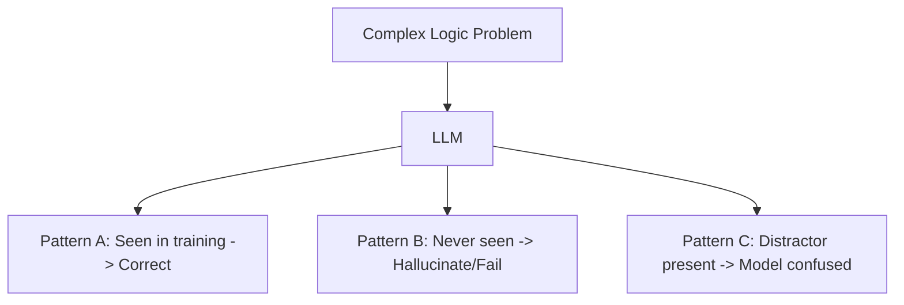

# Reasoning Limitations: The "Stochastic Parrot" Wall

## 1. Beginner-friendly Hinglish Explanation (Shuruati logo ke liye Hinglish mein) 🇮🇳
Bhai, LLM koi "Albert Einstein" nahi hai. Woh logic sirf "Act" karta hai, use sach mein samajh nahi aata.

Ek bohot bada limitation hai **"Logical Fragility"**. Agar tum ek simple question ko thoda sa ghuma kar poochoge, toh model fail ho jayega. Use "Common Sense" ki kami hoti hai (Jaise: "Agar main 3 kapde dhoop mein 3 ghante mein sukhata hoon, toh 30 kapde kitne ghante mein sukhenge?"). Model aksar answers "ratta maar" (memorize) kar leta hai aur naye scenarios mein "Dabba gul" (fails) ho jata hai. Ek engineer ke liye yeh janna zaroori hai ki model kahan "Ghutne tek dega".

---

## 2. Deep Technical Explanation (Gehri Technical Samjhaaiye)
Current LLMs mein reasoning kuch factors ki wajah se bounded (limited) hai:
- **Planning Fallacy**: Models long-horizon planning mein bure hote hain agar unke paas external tools nahi hain (jaise Tree of Thoughts).
- **Symbolic Manipulation**: Rigorous math ya formal logic mein struggle karta hai jaha ek character badalne se poora meaning badal jaata hai.
- **Sensitivity to Formatting**: "Answer with A, B, C" ko "Answer with 1, 2, 3" mein badalne se model ki accuracy change ho sakti hai.
- **Memorization vs. Reasoning**: Bohat si "reasoning" successes asli mein model ka training data se similar problem yaad karna (recall) hota hai. Isse Data contamination kehte hain.

---

## 3. Mathematical Intuition (Ganitik Sahajbodh)
LLMs **Next Token Entropy** ko minimize karte hain. Unke paas **Logical Consistency** ke liye koi explicit objective nahi hota.
Agar koi logical path $\pi$ training set mein low probability rakhta hai, toh model zyada probability wale (lekin galat) path $\pi'$ ki taraf gravitate karega.
$$P(\text{Common Answer} | Q) > P(\text{Logical Answer} | Q)$$
Yahi wajah hai ki models aksar "popular" wrong answers dete hain (jaise common misconceptions).

---

## 4. Architecture Diagrams (Architecture ke Diagram)

```mermaid
graph TD
    Problem[Complex Logic Problem] --> LLM[LLM]
    LLM --> P1[Pattern A: Seen in training -> Correct]
    LLM --> P2[Pattern B: Never seen -> Hallucinate/Fail]
    LLM --> P3[Pattern C: Distractor present -> Model confused]
```

---

## 5. Production-ready Examples (Production ke liye taiyar Examples)
Testing "Reverse Reasoning" ke liye (Common failure):

```python
# Sawaal: "Tom Cruise ki maa kaun hain?" (Model jaanta hai)
# Sawaal: "Mary Lee Pfeiffer ka beta kaun hai?" (Model fail ho sakta hai)

def test_reverse_reasoning(llm):
    # Models aksar 'Directional' hote hain.
    # Yeh A -> B toh kar sakte hain lekin B -> A aaram se nahi kar paate.
    pass
```

---

## 6. Real-world Use Cases (Asli Duniya ke Use Cases)
- **Fraud Detection**: Models kisi creative fraud pattern ko miss kar sakte hain kyunki unhone woh pattern pehle kabhi "seen" nahi kiya hota.
- **Scientific Innovation**: Models common literature ke opposite truly "Novel" ideas propose karne mein struggle karte hain.

---

## 7. Failure Cases (Failure ke Mamle)
- **The "Mirror" Test**: Model se wahi problem solve karne ke liye kahna jo usne abhi solve ki thi, lekin usme ek minor variable change kar diya ho.
- **Circular Logic**: Model proof start karta hai aur conclusion ko assume karke end kar deta hai.

---

## 8. Debugging Guide (Debugging ka Guide)
1. **Distractor Analysis**: Prompt mein kuch irrelevant information daal do. Agar model ka answer badalta hai, toh uska reasoning fragile (kamzor) hai.
2. **Step-by-step audit**: Agar CoT (Chain of Thought) sahi hai lekin final answer galat hai, toh model mein "Calculation failure" hai.

---

## 9. Tradeoffs (Samjhauta)
| Factor (Karak) | Human Reasoning (Insani Reasoning) | LLM Reasoning (LLM Reasoning) |
|---|---|---|
| Speed (Raftaar) | Slow (Dheema) | Fast (Tez) |
| Reliability (Vishwasniyata) | High (Uchch) | Variable (Badalta) |
| Scalability (Vistaar) | Low (Kam) | Infinite (Anant) |

---

## 10. Security Concerns (Security ki Chintaen)
- **Logic Bombs**: Aise inputs jo model ke reasoning ko infinitely loop karwane ya massive compute consume karne ke liye design kiye gaye hain (Denial of Service).

---

## 11. Scaling Challenges (Scaling ke Challenges)
- **System 2 overhead**: Har query ko "Reasoning" query banana system ko simple tasks ke liye unusable (bekaar) bana deta hai.

---

## 12. Cost Considerations (Kharcha ke Considerations)
- **Reasoning vs. Accuracy**: Kya 5% accuracy boost 500% token cost increase ke worth it hai?

---

## 13. Best Practices (Sabse Achchi Practices)
- **Verify with Python**: Agar problem math ya logic ka hai, toh LLM ko "sochne" ke bajaye Python script likhne aur run karne do (Code Interpreter).
- **Sanity Checks**: Critical logic ke liye hamesha ek fast, non-LLM "Sanity checker" rakho.

---

## 14. Interview Questions (Interview ke Sawaal)
1. LLMs "Out-of-Distribution" reasoning mein struggle kyun karte hain?
2. Large Language Models mein "Reversal Curse" kya hota hai?

---

## 15. Latest 2026 Patterns (2026 ke Latest Trends)
- **Neuro-Symbolic AI**: LLMs ko formal logic solvers (jaise Z3 ya Prolog) ke saath combine karna taaki 100% accurate reasoning mille.
- **Test-Time Compute Scaling**: "Parrot" wall ko overcome karne ke liye massive search (Tree of Thoughts) ka use karna.