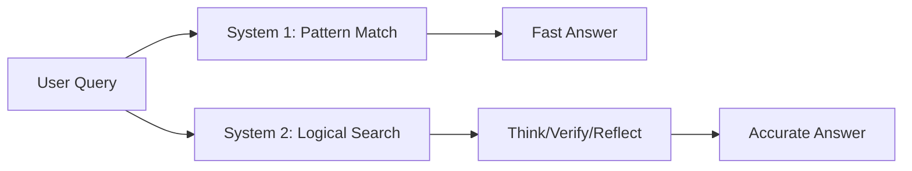

# Reasoning in LLMs: System 1 vs System 2

## 1. Beginner-friendly Hinglish Explanation 🇮🇳
Bhai, insaani dimaag do tarah se kaam karta hai (Daniel Kahneman ki theory ke mutabik). Ek hota hai **System 1**: "Fast aur Intuitive" (Jaise 2+2=4 bolna). Dusra hota hai **System 2**: "Slow aur Deliberate" (Jaise 17*24 solve karna). 

Puraane LLMs sirf "System 1" the—woh bas agla word guess kar rahe the. Par naye models (jaise OpenAI o1) "System 2" ki taraf badh rahe hain. Woh bolne se pehle "Sochte" hain. Is module mein hum samjhenge ki ek model ke andar "Reasoning" ka matlab kya hai aur woh insaani logic se kitna alag hai.

---

## 2. Deep Technical Explanation
Reasoning in LLMs is often debated: is it true logic or sophisticated pattern matching?
- **Deductive Reasoning**: Drawing specific conclusions from general premises.
- **Inductive Reasoning**: Making broad generalizations from specific observations.
- **Abductive Reasoning**: Finding the most likely explanation for a set of facts.
- **Computation via Thinking Tokens**: Modern reasoning models use a hidden scratchpad (CoT) to simulate System 2 thinking.

---

## 3. Mathematical Intuition
Reasoning can be viewed as finding the most likely logical proof path $\pi$ in a graph of possible steps:
$$\pi^* = \arg \max_{\pi} \sum_{i=1}^{|\pi|} \log P(\text{step}_i | \text{step}_{<i}, \text{query})$$
Models trained with **Reinforcement Learning (RL)** learn to reward paths that lead to the correct final answer, effectively "pruning" illogical reasoning steps.

---

## 4. Architecture Diagrams


---

## 5. Production-ready Examples
Benchmarking reasoning using **GSM8K** (Grade School Math) style datasets:

```python
# Reasoning models often output a 'thought' block
response = {
    "thought": "The user wants the sum of prime numbers between 1 and 10. Primes are 2, 3, 5, 7. Sum is 2+3+5+7=17.",
    "answer": "17"
}

# Production Tip: If using o1-style models, handle the hidden thought blocks carefully.
```

---

## 6. Real-world Use Cases
- **Scientific Discovery**: Hypothesizing new chemical reactions.
- **Bug Fixing**: Reasonably deducing the cause of a crash from a stack trace.
- **Strategic Planning**: Business strategy based on market data.

---

## 7. Failure Cases
- **Reasoning Sidetracks**: The model starts thinking about something unrelated.
- **Logical Loops**: Getting stuck in a "circular" argument.
- **Over-thinking**: Thinking for 30 seconds to answer "What is 2+2?".

---

## 8. Debugging Guide
1. **Consistency Check**: Ask the same reasoning question 5 times. If you get 5 different "thoughts", the model isn't stable.
2. **Step-by-Step verification**: Verify each step of the thought process independently.

---

## 9. Tradeoffs
| Feature | Pattern Matching | Logical Reasoning |
|---|---|---|
| Speed | < 1s | 10s - 60s |
| Consistency | Low | High |
| GPU Usage | Low | High (sustained compute) |

---

## 10. Security Concerns
- **Reasoning Manipulation**: Forcing the model's System 2 to "justify" a malicious or biased conclusion through a series of logical-sounding but flawed steps.

---

## 11. Scaling Challenges
- **Inference Compute**: Reasoning models require GPUs to run for much longer per query, creating massive server load.

---

## 12. Cost Considerations
- **Price per Reason**: Instead of "Price per token", companies are starting to think about "Price per logical step".

---

## 13. Best Practices
- Use **Large models** for reasoning and **Small models** for chatty tasks.
- Enable **Stream thinking** so users don't think the app has crashed while the model is "thinking".

---

## 14. Interview Questions
1. What is the difference between System 1 and System 2 in LLMs?
2. How does Reinforcement Learning from Human Feedback (RLHF) affect a model's reasoning?

---

## 15. Latest 2026 Patterns
- **Process Reward Models (PRM)**: Rewarding the model for *each correct step* of reasoning, not just the final answer.
- **Inference-Time Scaling**: Letting the model think longer for harder questions (test-time compute).
