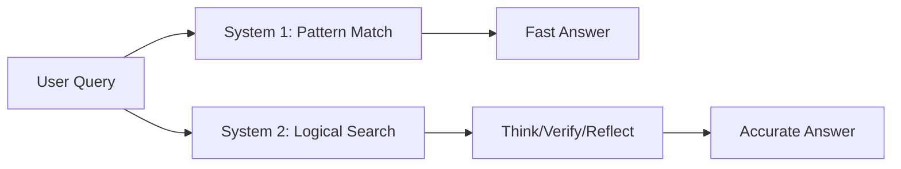

# LLMs me Reasoning: System 1 vs System 2

## 1. Beginner-friendly Hinglish Explanation 🇮🇳
Bhai, insaani dimaag do tarah se kaam karta hai (Daniel Kahneman ki theory ke mutabik). Ek hota hai **System 1**: "Fast aur Intuitive" (Jaise 2+2=4 bolna). Dusra hota hai **System 2**: "Slow aur Deliberate" (Jaise 17*24 solve karna). 

Puraane LLMs sirf "System 1" the—woh bas agla word guess kar rahe the. Par naye models (jaise OpenAI o1) "System 2" ki taraf badh rahe hain. Woh bolne se pehle "Sochte" hain. Is module mein hum samjhenge ki ek model ke andar "Reasoning" ka matlab kya hai aur woh insaani logic se kitna alag hai.

---

## 2. Deep Technical Explanation
Reasoning in LLMs is often debated: is it true logic or sophisticated pattern matching?
- **Deductive Reasoning**: General premises se specific conclusions nikalna.
- **Inductive Reasoning**: Specific observations se broad generalizations banana.
- **Abductive Reasoning**: Kuch facts ke liye sabse likely explanation dhundhna.
- **Computation via Thinking Tokens**: Modern reasoning models ek hidden scratchpad (CoT) use karte hain System 2 thinking ko simulate karne ke liye.

---

## 3. Mathematical Intuition
Reasoning ko aise dekh sakte hain: ek graph of possible steps mein sabse likely logical proof path $\pi$ dhundhna:
$$\pi^* = \arg \max_{\pi} \sum_{i=1}^{|\pi|} \log P(\text{step}_i | \text{step}_{<i}, \text{query})$$
**Reinforcement Learning (RL)** se trained models aise paths ko reward karna seekhte hain jo correct final answer tak le jaate hain, effectively illogical reasoning steps ko "prune" karte hain.

---

## 4. Architecture Diagrams

```mermaid
graph LR
    Input[User Query] --> S1[System 1: Pattern Match]
    Input --> S2[System 2: Logical Search]
    S1 --> Fast[Fast Answer]
    S2 --> Think[Think/Verify/Reflect]
    Think --> Slow[Accurate Answer]
```

---

## 5. Production-ready Examples
Reasoning ko benchmark karne ke liye **GSM8K** (Grade School Math) style datasets use hote hain:

```python
# Reasoning models aksar ek 'thought' block output karte hain
response = {
    "thought": "The user wants the sum of prime numbers between 1 and 10. Primes are 2, 3, 5, 7. Sum is 2+3+5+7=17.",
    "answer": "17"
}

# Production Tip: Agar o1-style models use kar rahe ho, toh hidden thought blocks ko carefully handle karo.
```

---

## 6. Real-world Use Cases
- **Scientific Discovery**: Naye chemical reactions hypothesize karna.
- **Bug Fixing**: Stack trace se crash ki wajah reasonably deduce karna.
- **Strategic Planning**: Market data ke basis par business strategy banana.

---

## 7. Failure Cases
- **Reasoning Sidetracks**: Model kuch unrelated cheez ke baare mein sochne lagta hai.
- **Logical Loops**: Ek "circular" argument mein phasna.
- **Over-thinking**: "What is 2+2?" jaisa sawaal jawab dene mein 30 seconds sochna.

---

## 8. Debugging Guide
1. **Consistency Check**: Ek hi reasoning question 5 baar pucho. Agar 5 alag "thoughts" aate hain, toh model stable nahi hai.
2. **Step-by-Step verification**: Thought process ke har step ko alag se verify karo.

---

## 9. Tradeoffs
| Feature | Pattern Matching | Logical Reasoning |
|---|---|---|
| Speed | < 1s | 10s - 60s |
| Consistency | Low | High |
| GPU Usage | Low | High (sustained compute) |

---

## 10. Security Concerns
- **Reasoning Manipulation**: Model ke System 2 ko force karna ki woh ek malicious ya biased conclusion ko "justify" kare kuch logical-sounding lekin flawed steps ke through.

---

## 11. Scaling Challenges
- **Inference Compute**: Reasoning models ko GPUs ki zaroorat hoti hai ki woh har query ke liye zyada der tak chalein, jisse massive server load create hota hai.

---

## 12. Cost Considerations
- **Price per Reason**: "Price per token" ki jagah, companies ab "Price per logical step" ke baare mein soch rahi hain.

---

## 13. Best Practices
- Reasoning ke liye **Large models** aur chatty tasks ke liye **Small models** use karo.
- **Stream thinking** enable karo taake users ko na lage ki app crash ho gayi jab model "thinking" kar raha hai.

---

## 14. Interview Questions
1. LLMs mein System 1 aur System 2 mein kya fark hai?
2. Reinforcement Learning from Human Feedback (RLHF) model ki reasoning ko kaise affect karta hai?

---

## 15. Latest 2026 Patterns
- **Process Reward Models (PRM)**: Model ko *har ek sahi reasoning step* ke liye reward dena, sirf final answer ke liye nahi.
- **Inference-Time Scaling**: Model ko mushkil sawaalon ke liye zyada der tak sochne dena (test-time compute).