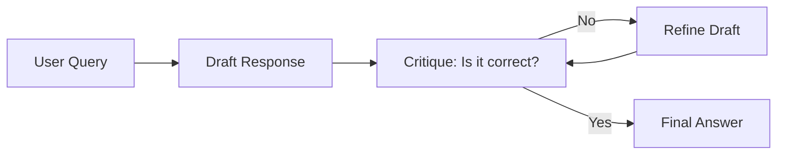

# Reflection & Self-Correction: The LLM's Inner Critic

## 1. Beginner-friendly Hinglish Explanation 🇮🇳
Bhai, insaan se galti hoti hai, par ek "Smart Insaan" woh hai jo apni galti khud pakad le. 

**Reflection** wahi feature hai. Hum LLM ko bolte hain: "Pehle tum answer likho, phir use khud check karo ki kya ismein koi galti hai, aur agar hai toh use sudharo". Yeh bilkul waise hi hai jaise tum exam mein answer sheet submit karne se pehle "Re-check" karte ho. Isse model ki accuracy bohot badh jati hai kyunki woh apni hi "Hallucinations" ko pehchan leta hai.

---

## 2. Deep Technical Explanation
Self-correction (or Reflexion) is a multi-step inference pattern.
- **Drafting**: The model generates an initial response.
- **Critique**: The model (or a second model) analyzes the draft for errors, bias, or logic gaps.
- **Refinement**: The model rewrites the response based on the critique.
- **Self-Consistency**: Generating multiple versions and letting the model pick the most robust one.

---

## 3. Mathematical Intuition
Self-correction can be seen as an iterative optimization in the token space.
Given a draft $y_0$, the model performs:
$$y_{i+1} = \text{LLM}(\text{Draft } y_i, \text{Feedback } f(y_i))$$
where $f(y_i)$ is the critique. The hope is that $P(\text{Correct} | y_{i+1}) > P(\text{Correct} | y_i)$.

---

## 4. Architecture Diagrams


---

## 5. Production-ready Examples
Implementing a simple Reflection loop:

```python
def generate_with_reflection(prompt):
    # Step 1: Draft
    draft = llm.call(f"Write code for: {prompt}")
    
    # Step 2: Critique
    critique = llm.call(f"Review this code for bugs: {draft}. Only list issues.")
    
    # Step 3: Refine
    final = llm.call(f"Fix the draft based on these issues: {critique}. Original draft: {draft}")
    
    return final
```

---

## 6. Real-world Use Cases
- **Code Generation**: Running a "linter" in the model's head to fix syntax errors.
- **Fact Checking**: Asking the model to "Double check those dates" before presenting them.
- **Tone Adjustment**: "Is this email too aggressive? Rewrite if so."

---

## 7. Failure Cases
- **Over-correction**: The model changes a perfectly correct answer to a wrong one because it's "too eager" to find mistakes.
- **Infinite Loops**: The model keeps finding "tiny" issues and never finishes.

---

## 8. Debugging Guide
1. **Trace the Critiques**: If the critique is "This is perfect" but the code is broken, your critique prompt is too weak.
2. **Temperature Control**: Use higher temperature for the "Draft" (creativity) and lower temperature for the "Critique" (factuality).

---

## 9. Tradeoffs
| Metric | Single Pass | Reflection Loop |
|---|---|---|
| Latency | < 2s | 6s - 15s |
| Cost | 1x | 3x - 5x |
| Quality | Standard | Expert |

---

## 10. Security Concerns
- **Critique Hijacking**: Tricking the critique step into "Approving" malicious code by making it look like a bug fix.

---

## 11. Scaling Challenges
- **Token Efficiency**: Every loop consumes hundreds of tokens. Using a smaller model for the critique can save money.

---

## 12. Cost Considerations
- **Early Exit**: If the first critique says "It's perfect", stop the loop immediately to save tokens.

---

## 13. Best Practices
- **Multi-agent Reflection**: Use Model A to write and Model B to critique (Avoids "confirmation bias").
- **External Verification**: Instead of just reflecting, let the model "Search the Web" or "Run Code" to verify facts.

---

## 14. Interview Questions
1. Why does a model sometimes fail to see its own mistakes in a single pass?
2. What is "Reflexion" in the context of AI agents?

---

## 15. Latest 2026 Patterns
- **Self-Play Fine-Tuning (SPIN)**: Training the model to improve itself by playing against a previous version of itself.
- **Intrinsic Evaluation**: Models with built-in "Self-reward" mechanisms that decide which tokens are "good" during generation.
