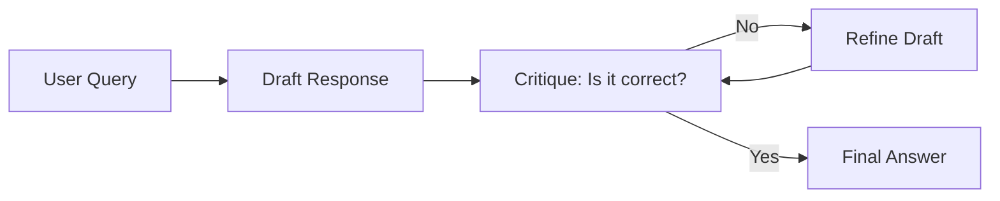

# Reflection & Self-Correction: LLM ka Inner Critic

## 1. Shuruwat ke liye Hinglish Explanation 🇮🇳
Bhai, insaan se galti hoti hai, par ek "Smart Insaan" woh hai jo apni galti khud pakad le. 

**Reflection** wahi feature hai. Hum LLM ko bolte hain: "Pehle tum answer likho, phir use khud check karo ki kya ismein koi galti hai, aur agar hai toh use sudharo". Yeh bilkul waise hi hai jaise tum exam mein answer sheet submit karne se pehle "Re-check" karte ho. Isse model ki accuracy bohot badh jati hai kyunki woh apni hi "Hallucinations" ko pehchan leta hai.

---

## 2. Gehra Technical Explanation
Self-correction (ya Reflexion) ek multi-step inference pattern hai.
- **Drafting**: Model initial response generate karta hai.
- **Critique**: Model (ya doosra model) draft mein errors, bias, ya logic gaps ke liye analyze karta hai.
- **Refinement**: Model critique ke basis par response ko rewrite karta hai.
- **Self-Consistency**: Multiple versions generate karna aur model ko sabse robust version pick kar dena.

---

## 3. Mathematical Samajh
Self-correction ko token space mein iterative optimization ki tarah dekha ja sakta hai.
Ek draft $y_0$ diya gaye, model performs:
$$y_{i+1} = \text{LLM}(\text{Draft } y_i, \text{Feedback } f(y_i))$$
yahan $f(y_i)$ critique hai. Umeed hai ki $P(\text{Correct} | y_{i+1}) > P(\text{Correct} | y_i)$.

---

## 4. Architecture Diagrams

```mermaid
graph LR
    User[User Query] --> Draft[Draft Response]
    Draft --> Critique[Critique: Is it correct?]
    Critique -- No --> Refine[Refine Draft]
    Refine --> Critique
    Critique -- Yes --> Final[Final Answer]
```

---

## 5. Production-ready Udaharan
Ek simple Reflection loop implement karna:

```python
def generate_with_reflection(prompt):
    # Step 1: Draft
    draft = llm.call(f"Write code for: {prompt}")
    
    # Step 2: Critique
    critique = llm.call(f"Review this code for bugs: {draft}. Only list issues.")
    
    # Step 3: Refine
    final = llm.call(f"Fix the draft based on these issues: {critique}. Original draft: {draft}")
    
    return final
```

---

## 6. Real-world Use Cases (Asli Duniya ke Upyog)
- **Code Generation**: Model ke dimaag mein "linter" chala ke syntax errors fix karna.
- **Fact Checking**: Model se kehna ki "Double check those dates" present karne se pehle.
- **Tone Adjustment**: "Is this email too aggressive? Rewrite if so."

---

## 7. Failure ke Mamle
- **Over-correction**: Model ek bilkul sahi answer ko galat kar deta hai kyunki woh mistakes dhundhne mein "too eager" hota hai.
- **Infinite Loops**: Model chhoti-chhoti issues dhundhta rehta hai kabhi khatam nahi karta.

---

## 8. Debugging Guide
1. **Trace the Critiques**: Agar critique kahe "This is perfect" lekin code broken hai, to aapka critique prompt kaamzor hai.
2. **Temperature Control**: "Draft" ke liye higher temperature use karo (creativity ke liye) aur "Critique" ke liye lower temperature (factuality ke liye).

---

## 9. Tradeoffs (Samjhotey)
| Metric | Single Pass | Reflection Loop |
|---|---|---|
| Latency | < 2s | 6s - 15s |
| Cost | 1x | 3x - 5x |
| Quality | Standard | Expert |

---

## 10. Security Concerns (Security ke Mamle)
- **Critique Hijacking**: Critique step ko trick karke malicious code ko "Approve" karwana, usey bug fix ki tarah dikha ke.

---

## 11. Scaling Challenges (Scaling ki Chunautiyaan)
- **Token Efficiency**: Har loop hazaron tokens kha jata hai. Critique ke liye chhota model use karne se paise bach sakte hain.

---

## 12. Cost Considerations (Cost ke Vichaar)
- **Early Exit**: Agar pehla critique kahe "It's perfect", to loop turant roko, tokens bachane ke liye.

---

## 13. Best Practices
- **Multi-agent Reflection**: Model A ko likhne do aur Model B ko critique karne do (isse "confirmation bias" bachta hai).
- **External Verification**: Sirf reflect karne ke bajaye, model ko "Search the Web" ya "Run Code" karne do facts verify karne ke liye.

---

## 14. Interview ke Sawal
1. Model ek single pass mein apni mistakes kyun nahi dekh pata kabhi kabhi?
2. AI agents ke context mein "Reflexion" kya hota hai?

---

## 15. 2026 ke Latest Patterns
- **Self-Play Fine-Tuning (SPIN)**: Model ko khud ko improve karne ke liye train karna, apne hi purane version ke against khel kar.
- **Intrinsic Evaluation**: Models with built-in "Self-reward" mechanisms jo generation ke dauran decide karte hain ki kaun se tokens "good" hain.