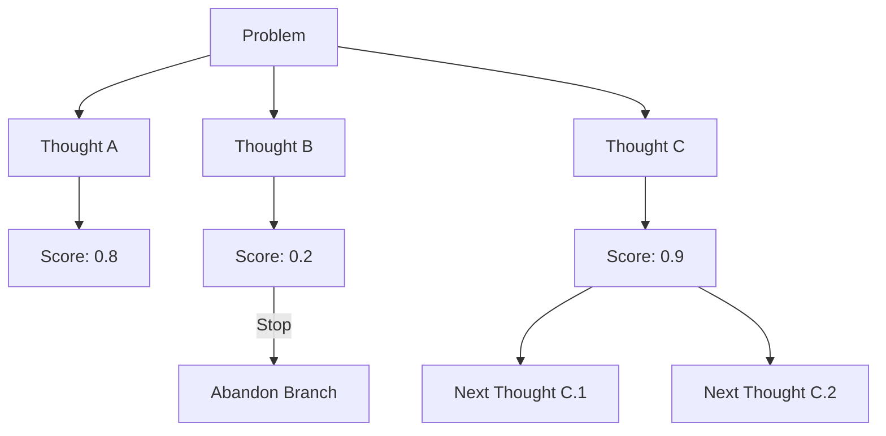

# Tree of Thoughts (ToT): Deliberate Problem Solving

## 1. Beginner-friendly Hinglish Explanation 🇮🇳
Bhai, Chain of Thought (CoT) sirf ek seedhi line mein sochta hai. Par kuch problems aisi hoti hain jahan tumhe multiple raaste (options) check karne padte hain aur agar ek raasta galat lage, toh wapas aakar dusra try karna padta hai. 

**Tree of Thoughts (ToT)** wahi "Planning" ka tarika hai. Model ek problem ke liye 3-4 alag ideas generate karta hai, phir khud hi unhe judge karta hai ki kaunsa idea best hai, aur phir sirf best idea ko aage badhata hai. Yeh bilkul waise hi hai jaise tum Chess khelte waqt "Agar main yeh karun toh woh yeh karega" wale multiple scenarios sochte ho. Yeh system LLMs ko "Brilliant Architects" bana deta hai.

---

## 2. Deep Technical Explanation
Tree of Thoughts (ToT) is a framework that allows LLMs to perform deliberate decision-making by considering multiple reasoning paths.
- **Thought Generation**: Generating several "thought" candidates at each step.
- **Thought Evaluation**: Scoring each thought (e.g., Sure, Likely, Impossible).
- **Search Algorithms**: Using Breadth-First Search (BFS) or Depth-First Search (DFS) to navigate the tree of reasoning.
- **Backtracking**: Abandoning a branch if the evaluation score is low and trying a different branch.

---

## 3. Mathematical Intuition
ToT models the reasoning process as a state-space search. Each state $s = [x, z_{1...i}]$ consists of the input $x$ and the chain of thoughts $z$.
The goal is to find a path that maximizes the probability of success $P(\text{Success} | z)$.
Unlike CoT which is a greedy search (1 path), ToT explores the "frontier" of the reasoning tree.

---

## 4. Architecture Diagrams


---

## 5. Production-ready Examples
Implementing a simplified ToT controller:

```python
def generate_thoughts(prompt, n=3):
    # Call LLM to generate 'n' possible next steps
    pass

def evaluate_thoughts(thoughts):
    # Call LLM to score each thought out of 10
    pass

def tree_of_thoughts_search(initial_prompt):
    frontier = [initial_prompt]
    for depth in range(3): # Search depth
        new_thoughts = []
        for state in frontier:
            candidates = generate_thoughts(state)
            scores = evaluate_thoughts(candidates)
            # Keep top-performing branch
            best_idx = scores.index(max(scores))
            new_thoughts.append(candidates[best_idx])
        frontier = new_thoughts
    return frontier[0]
```

---

## 6. Real-world Use Cases
- **Creative Writing**: Exploring different plot twists and choosing the most consistent one.
- **Software Architecture**: Designing a system with multiple components and evaluating trade-offs.
- **Complex Puzzles**: Solving Sudoku or logic grids where trial and error is needed.

---

## 7. Failure Cases
- **Over-Analysis**: The model gets stuck in a loop of evaluating bad ideas.
- **High Latency**: Exploring multiple paths can take 10-20x longer than a single response.

---

## 8. Debugging Guide
1. **Log the Tree**: Save the entire reasoning tree to a JSON file to see where the model made a "Wrong Turn".
2. **Evaluation Bias**: Sometimes the "Evaluator" LLM is too nice and gives 10/10 to everything. Use stricter criteria.

---

## 9. Tradeoffs
| Metric | Chain of Thought | Tree of Thoughts |
|---|---|---|
| Latency | Medium | Very High |
| Complexity | Low | High |
| Problem Class | Linear Logic | Search/Planning |

---

## 10. Security Concerns
- **State Injection**: If the state tracking is exposed, an attacker can force the model into a "Bad" branch of the tree.

---

## 11. Scaling Challenges
- **Compute Cost**: ToT is extremely expensive as it requires dozens of LLM calls for a single user query.

---

## 12. Cost Considerations
- **Parallel Processing**: Running multiple thoughts in parallel on different GPUs to save time (but not money).

---

## 13. Best Practices
- Only use ToT for **High-Stakes** problems where accuracy is 100x more important than speed.
- Use a **smaller, cheaper model** for generation and a **large, smart model** for evaluation.

---

## 14. Interview Questions
1. How does ToT differ from standard Monte Carlo Tree Search (MCTS)?
2. What are the main bottlenecks in implementing ToT in production?

---

## 15. Latest 2026 Patterns
- **Reinforced ToT**: Training models directly on successful tree-search paths so they learn to "internalize" the tree and do it faster in a single pass.
- **Graph of Thoughts (GoT)**: Allowing reasoning paths to merge and loop, creating a non-linear graph.
