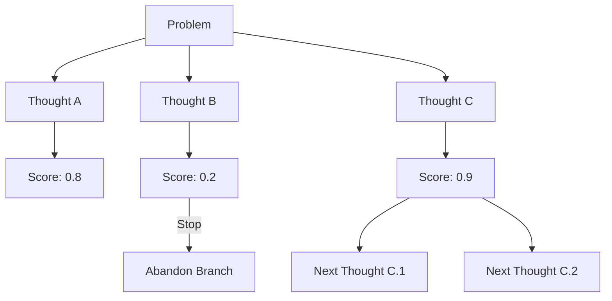

# Tree of Thoughts (ToT): Soch Samajh Kar Problem Solving

## 1. Shuruwat ke liye Hinglish Samjhai 🇮🇳

Bhai, Chain of Thought (CoT) sirf ek seedhi line mein sochta hai. Par kuch problems aisi hoti hain jahan tumhe multiple raaste (options) check karne padte hain aur agar ek raasta galat lage, toh wapas aakar dusra try karna padta hai.

**Tree of Thoughts (ToT)** wahi "Planning" ka tarika hai. Model ek problem ke liye 3-4 alag ideas generate karta hai, phir khud hi unhe judge karta hai ki kaunsa idea best hai, aur phir sirf best idea ko aage badhata hai. Yeh bilkul waise hi hai jaise tum Chess khelte waqt "Agar main yeh karun toh woh yeh karega" wale multiple scenarios sochte ho. Yeh system LLMs ko "Brilliant Architects" bana deta hai.

---

## 2. Gehri Technical Samjhai

- **Thought Generation**: Har step pe kai "thought" candidates generate karna.
- **Thought Evaluation**: Har thought ko score dena (e.g., Sure, Likely, Impossible).
- **Search Algorithms**: Reasoning tree navigate karne ke liye Breadth-First Search (BFS) ya Depth-First Search (DFS) ka use karna.
- **Backtracking**: Agar evaluation score low hai toh branch ko abandon karna aur dusri branch try karna.

---

## 3. Ganitiya Samajh

ToT reasoning process ko state-space search ki tarah model karta hai. Har state $s = [x, z_{1...i}]$ mein input $x$ aur thoughts $z$ ki chain hoti hai. Goal hai ek aisa path find karna jo success ki probability $P(\text{Success} | z)$ ko maximize kare. CoT ke opposite jo greedy search hai (1 path), ToT reasoning tree ke "frontier" ko explore karta hai.

---

## 4. Architecture Diagrams


```mermaid
graph TD
    Root[Problem] --> T1[Thought A]
    Root --> T2[Thought B]
    Root --> T3[Thought C]
    T1 --> Score1[Score: 0.8]
    T2 --> Score2[Score: 0.2]
    T3 --> Score3[Score: 0.9]
    Score3 --> T3_1[Next Thought C.1]
    Score3 --> T3_2[Next Thought C.2]
    Score2 -- Stop --> Abandon[Abandon Branch]
```

---

## 5. Production-ready Udaharan

Ek simplified ToT controller implement karte hain:

```python
def generate_thoughts(prompt, n=3):
    # Call LLM to generate 'n' possible next steps
    pass

def evaluate_thoughts(thoughts):
    # Call LLM to score each thought out of 10
    pass

def tree_of_thoughts_search(initial_prompt):
    frontier = [initial_prompt]
    for depth in range(3): # Search depth
        new_thoughts = []
        for state in frontier:
            candidates = generate_thoughts(state)
            scores = evaluate_thoughts(candidates)
            # Keep top-performing branch
            best_idx = scores.index(max(scores))
            new_thoughts.append(candidates[best_idx])
        frontier = new_thoughts
    return frontier[0]
```

---

## 6. Asli Duniya ke Use Cases

- **Creative Writing**: Alag-alag plot twists explore karna aur sabse consistent wala choose karna.
- **Software Architecture**: Multiple components ke saath system design karna aur trade-offs evaluate karna.
- **Complex Puzzles**: Sudoku ya logic grids solve karna jahan trial and error ki zaroorat hai.

---

## 7. Asafalta ke Mamle

- **Over-Analysis**: Model bure ideas ko evaluate karte karte loop mein phas jaata hai.
- **High Latency**: Multiple paths explore karne mein ek single response se 10-20x zyada time lag sakta hai.

---

## 8. Debugging Margdarshan

1. **Log the Tree**: Poora reasoning tree JSON file mein save karo taake pata chale ki model ne "Wrong Turn" kahan liya.
2. **Evaluation Bias**: Kabhi kabhi "Evaluator" LLM bahut nice hota hai aur har cheez ko 10/10 de deta hai. Stricter criteria use karo.

---

## 9. Tradeoffs

| Metric | Chain of Thought | Tree of Thoughts |
|---|---|---|
| Latency | Medium | Very High |
| Complexity | Low | High |
| Problem Class | Linear Logic | Search/Planning |

---

## 10. Suraksha Chintaein

- **State Injection**: Agar state tracking exposed hai toh attacker model ko tree ki "Bad" branch mein force kar sakta hai.

---

## 11. Vistaar ki Chunautiyan

- **Compute Cost**: ToT bahut expensive hai kyunki ek user query ke liye dozens of LLM calls chahiye hote hain.

---

## 12. Kharcha Sambandhi Vichaar

- **Parallel Processing**: Multiple thoughts alag-alag GPUs par parallel run karna time bachata hai (lekin money nahi).

---

## 13. Sarvottam Padhate

- Only use ToT for **High-Stakes** problems where accuracy is 100x more important than speed.
- Use a **smaller, cheaper model** for generation and a **large, smart model** for evaluation.

---

## 14. Interview ke Sawal

1. ToT standard Monte Carlo Tree Search (MCTS) se kaise alag hai?
2. Production mein ToT implement karne ke main bottlenecks kya hain?

---

## 15. 2026 ke Naye Patterns

- **Reinforced ToT**: Models ko successful tree-search paths par direct train karna taake woh tree ko "internalize" kar lein aur ek single pass mein faster kar sakein.
- **Graph of Thoughts (GoT)**: Reasoning paths ko merge aur loop karne dena, jisse non-linear graph banta hai.