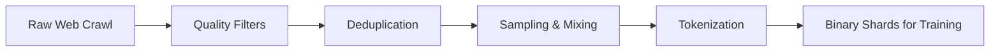

# Dataset Preparation: The Fuel for LLMs

## 1. Beginner-friendly Hinglish Explanation 🇮🇳
Bhai, socho tum ek super-intelligent robot bana rahe ho. Agar tum use sirf "Gali-Gloch" aur "Galat News" wali books padhaoge, toh woh robot waisa hi banega. 

**Dataset Preparation** wahi "Curriculum" set karne ka kaam hai. Internet par bohot "Kachra" data hai. Humein "The Pile", "Common Crawl" jaise massive datasets se sirf best quality text (Code, Research papers, Wikipedia, Books) nikalna padta hai. Jitna saaf aur diverse tumhara dataset hoga, utna hi smart aur unbiased tumhara model banega. Yaad rakhna: **"Garbage In, Garbage Out"**.

---

## 2. Deep Technical Explanation
Pre-training datasets are measured in **Trillions of Tokens**.
- **Data Sourcing**: Common Crawl (web), GitHub (code), arXiv (research), Project Gutenberg (books).
- **Filtering**: Using classifiers to remove low-quality text, adult content, or gibberish.
- **Deduplication**: Removing near-duplicate documents using MinHash/LSH to prevent the model from memorizing.
- **Mixing**: Deciding the ratio of Code vs. English vs. Math (e.g., 20% Code, 10% Math, 70% Text).

---

## 3. Mathematical Intuition
The **Chinchilla Scaling Law** suggests that for a given compute budget, the model size $N$ and the number of training tokens $D$ should be scaled equally.
$$D \propto N$$
Most modern models are "Over-trained" (using more tokens than Chinchilla optimal) to reduce inference cost.

---

## 4. Architecture Diagrams


---

## 5. Production-ready Examples
Using `datatrove` (from HuggingFace) for large scale processing:

```python
from datatrove.pipeline.readers import JsonlReader
from datatrove.pipeline.filters import LanguageFilter, GopherQualityFilter
from datatrove.executor import LocalPipelineExecutor

pipeline = [
    JsonlReader("data/raw/"),
    LanguageFilter(languages=["en"]),
    GopherQualityFilter(), # Removes low quality web text
    # ... more filters
]

executor = LocalPipelineExecutor(pipeline=pipeline, tasks=10)
executor.run()
```

---

## 6. Real-world Use Cases
- **Domain Specific Pre-training**: Creating a "Medical LLM" by weighting medical journals higher in the mix.
- **Continual Pre-training**: Adding new 2024-2025 data to an existing model.

---

## 7. Failure Cases
- **Data Contamination**: Accidentally including test sets (like GSM8K) in the training data, leading to fake high scores.
- **Bias Amplification**: If the dataset has 80% male-centric text, the model will struggle with gender neutrality.

---

## 8. Debugging Guide
1. **PPL Analysis**: Check the perplexity of the model on different data "Slices" (Code vs. Books). If Code PPL is 100x higher, your code mix is too low.
2. **N-gram Overlap**: Check if the model is just repeating training sentences.

---

## 9. Tradeoffs
| Feature | High Volume (Web) | High Quality (Textbooks)|
|---|---|---|
| Knowledge Breadth | High | Low |
| Reasoning Depth | Low | High |
| Cost | Cheap | Expensive |

---

## 10. Security Concerns
- **PII Leakage**: Failing to scrub Social Security numbers or private names from the trillions of tokens.

---

## 11. Scaling Challenges
- **Storage**: Storing and streaming 10TB+ of data to thousands of GPUs without bottlenecking.

---

## 12. Cost Considerations
- **Human Curation**: Manually labeling or "Rating" data quality is the most expensive part of modern LLM pipelines.

---

## 13. Best Practices
- Use **MinHash deduplication** at the document level.
- Always include **Code** (Python/C++) even for non-coding models, as it improves reasoning.

---

## 14. Interview Questions
1. Why is deduplication critical for LLM pre-training?
2. What are the Chinchilla scaling laws?

---

## 15. Latest 2026 Patterns
- **Synthetic Data Mixing**: Training models on 50% human data and 50% high-quality synthetic data generated by stronger models.
- **Online Data Selection**: Dynamically choosing which tokens the model should learn next based on its current weaknesses.
