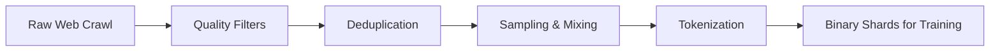

# Dataset Preparation: LLMs ke liye Fuel

## 1. Shuruwat ke liye Hinglish Explanation 🇮🇳
Bhai, socho tum ek super-intelligent robot bana rahe ho. Agar tum use sirf "Gali-Gloch" aur "Galat News" wali books padhaoge, toh woh robot waisa hi banega. 

**Dataset Preparation** wahi "Curriculum" set karne ka kaam hai. Internet par bohot "Kachra" data hai. Humein "The Pile", "Common Crawl" jaise massive datasets se sirf best quality text (Code, Research papers, Wikipedia, Books) nikalna padta hai. Jitna saaf aur diverse tumhara dataset hoga, utna hi smart aur unbiased tumhara model banega. Yaad rakhna: **"Garbage In, Garbage Out"**.

---

## 2. Gehra Technical Explanation
Pre-training datasets **Trillions of Tokens** mein measure hote hain.
- **Data Sourcing**: Common Crawl (web), GitHub (code), arXiv (research), Project Gutenberg (books).
- **Filtering**: Low-quality text, adult content, ya gibberish ko remove karne ke liye classifiers ka upyog.
- **Deduplication**: Model ko memorizing se roknE ke liye MinHash/LSH use karke near-duplicate documents ko remove karna.
- **Mixing**: Code, English, aur Math ka ratio decide karna (e.g., 20% Code, 10% Math, 70% Text).

---

## 3. Ganitik Intuition
The **Chinchilla Scaling Law** suggest karta hai ki ek diye gaye compute budget ke liye, model size $N$ aur training tokens $D$ ki sankhya ko equally scale karna chahiye.
$$D \propto N$$
Most modern models "Over-trained" hote hain (Chinchilla optimal se zyada tokens use karke) inference cost kam karne ke liye.

---

## 4. Sanrachna Diagram

```mermaid
graph LR
    Source[Raw Web Crawl] --> Filter[Quality Filters]
    Filter --> Dedup[Deduplication]
    Dedup --> Mix[Sampling & Mixing]
    Mix --> Tok[Tokenization]
    Tok --> Final[Binary Shards for Training]
```

---

## 5. Production-ready Udaharan
Using `datatrove` (from HuggingFace) for large scale processing:

```python
from datatrove.pipeline.readers import JsonlReader
from datatrove.pipeline.filters import LanguageFilter, GopherQualityFilter
from datatrove.executor import LocalPipelineExecutor

pipeline = [
    JsonlReader("data/raw/"),
    LanguageFilter(languages=["en"]),
    GopherQualityFilter(), # Removes low quality web text
    # ... more filters
]

executor = LocalPipelineExecutor(pipeline=pipeline, tasks=10)
executor.run()
```

---

## 6. Vastavik Duniya ke Use Cases
- **Domain Specific Pre-training**: Mix mein medical journals ko zyada weight dekar "Medical LLM" banana.
- **Continual Pre-training**: Existing model mein naya 2024-2025 data add karna.

---

## 7. Asafalta ke Case
- **Data Contamination**: Galati se training data mein test sets (jaise GSM8K) shamil ho jana, jisse fake high scores aate hain.
- **Bias Amplification**: Agar dataset mein 80% male-centric text hai, toh model gender neutrality mein problem karega.

---

## 8. Debugging Guide
1. **PPL Analysis**: Different data "Slices" (Code vs. Books) par model ki perplexity check karo. Agar Code PPL 100x higher hai, toh aapka code mix bahut low hai.
2. **N-gram Overlap**: Check karo ki model sirf training sentences ko repeat toh nahi kar raha.

---

## 9. Tradeoffs (Samjhauta)
| Visheshata | Uchch Matra (Web) | Uchch Guna (Textbooks)|
|---|---|---|
| Gyan ka Vistaar | Uchch | Kam |
| Tark ki Gehrai | Kam | Uchch |
| LAGAT | Sasta | Mehnga |

---

## 10. Security Concerns (Suraksha Chinta)
- **PII Leakage**: Trillions of tokens se Social Security numbers ya private names ko scrub karne mein asafalta.

---

## 11. Scaling ki Chunautiyan
- **Storage**: Bina bottleneck ke hazaaron GPUs tak 10TB+ data ko store aur stream karna.

---

## 12. LAGAT ke Vichar
- **Human Curation**: Manual tareeke se data quality ko label ya "Rating" karna modern LLM pipelines ka sabse mehnga hissa hai.

---

## 13. Behtareen Practices
- Document level par **MinHash deduplication** ka upyog karein.
- Hamesha **Code** (Python/C++) shamil karein, bhale hi model non-coding ho, kyunki isse reasoning behtar hoti hai.

---

## 14. Interview ke Prashn
1. Deduplication LLM pre-training ke liye kyun mahatvapurna hai?
2. Chinchilla scaling laws kya hain?

---

## 15. 2026 ke Latests Patterns
- **Synthetic Data Mixing**: Models ko 50% human data aur 50% high-quality synthetic data (jo stronger models ne generate kiya) par train karna.
- **Online Data Selection**: Model ki current weaknesses ke based par dynamically yeh choose karna ki aage kaun se tokens learn karne chahiye.
```