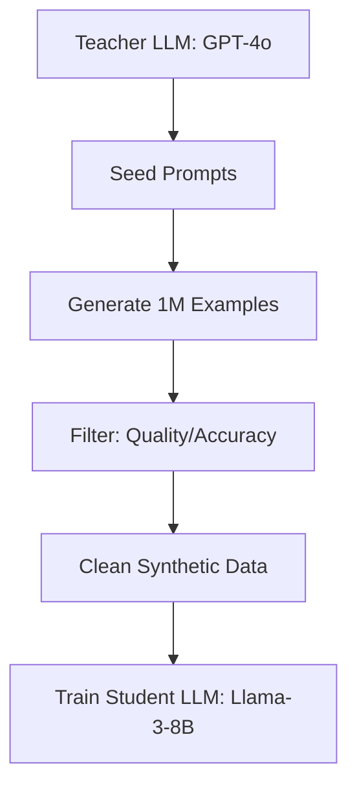

# Synthetic Data Generation: AI Training AI

## 1. Beginner-friendly Hinglish Explanation 🇮🇳
Bhai, socho tumhe ek student ko maths sikhana hai par market mein maths ki books khatam ho gayi hain. Toh tumne kya kiya? Ek "Maths Professor" ko bulaya aur use bola ki naye-naye problems aur solutions likho. 

**Synthetic Data Generation** wahi hai. Jab humare paas real human-written data khatam ho jata hai, toh hum ek bade "Teacher" model (jaise GPT-4o) ko bolte hain ki "Naya training data generate karo". Yeh data phir chote models ko train karne ke kaam aata hai. Isse hum "Data Scarcity" (data ki kami) ki problem solve karte hain. Lekin dhyan rahe, agar teacher galat padhayega, toh student bhi galat seekhega!

---

## 2. Deep Technical Explanation
Synthetic data is model-generated content used for training other models.
- **Self-Correction**: Model generates multiple answers and selects the best one (using a reward model or code interpreter).
- **Knowledge Distillation**: A small model (Student) learns from the outputs of a large model (Teacher).
- **Instruction Evolution**: Taking a simple prompt and "Evolving" it into a complex one using an LLM.
- **Math/Code Verification**: Generating data that can be objectively verified by a compiler or calculator.

---

## 3. Mathematical Intuition
Synthetic data aims to expand the **Support** of the training distribution $P_{data}$.
If $P_{model}$ is a good approximation of $P_{data}$, we can sample from $P_{model}$ to get new examples $(x, y)$. 
However, there is a risk of **Model Collapse** if the model's errors are reinforced:
$$P_{n+1} \approx P_n \to \text{Density shift towards mode}$$
This results in a loss of diversity.

---

## 4. Architecture Diagrams


---

## 5. Production-ready Examples
Generating "Evolved" instructions (Simple $\to$ Complex):

```python
def evolve_instruction(simple_prompt):
    evolution_prompt = f"Make this instruction 5x more complex and detailed: {simple_prompt}"
    complex_prompt = teacher_llm.call(evolution_prompt)
    return complex_prompt

# Input: "Write a python script to sort a list."
# Output: "Implement a thread-safe, memory-efficient merge sort in Python with custom comparators..."
```

---

## 6. Real-world Use Cases
- **Phi Models (Microsoft)**: Trained heavily on "Textbook-quality" synthetic data.
- **AlphaGeometry**: Google DeepMind used synthetic geometric proofs to reach human-gold-medal performance.
- **Privacy**: Generating synthetic patient records for medical AI research.

---

## 7. Failure Cases
- **The Ouroboros Effect**: AI learning from AI learning from AI leads to nonsensical "Ghost" patterns.
- **Lack of Nuance**: Synthetic data often lacks the messiness and edge cases of real human language.

---

## 8. Debugging Guide
1. **Diversity Check**: Run a clustering algorithm on your synthetic data. If all 1 million examples are about "The cat sat on the mat", your generation is too repetitive.
2. **Fact Check**: Randomly sample 100 rows and verify them manually. If >5% are wrong, your Teacher model is hallucinating.

---

## 9. Tradeoffs
| Feature | Human Data | Synthetic Data |
|---|---|---|
| Quality | High (Authentic) | Variable (Filtered) |
| Scalability | Low (Expensive) | Infinite (Cheap) |
| Privacy | Risky | Safe |

---

## 10. Security Concerns
- **Data Poisoning**: An attacker could trick the Teacher model into generating subtle "Backdoors" in the synthetic training set.

---

## 11. Scaling Challenges
- **Compute for Generation**: Generating trillions of synthetic tokens can be as expensive as the actual training itself.

---

## 12. Cost Considerations
- **Teacher API Costs**: Using GPT-4o to generate 100B tokens can cost millions. Hosting an open-source teacher (Llama-3-70B) is usually cheaper.

---

## 13. Best Practices
- **Mix with Real Data**: Never use 100% synthetic data. A 50/50 mix is usually safer.
- **Filter Heavily**: Use a second LLM or a Reward Model to grade the synthetic data.
- **Verify Logic**: If generating code/math, run it through an interpreter.

---

## 14. Interview Questions
1. What is "Model Collapse" and how can it be prevented?
2. Explain how Microsoft's "Phi" models used synthetic data.

---

## 15. Latest 2026 Patterns
- **STaR (Self-Taught Reasoner)**: A model that generates its own reasoning, verifies the answer, and then fine-tunes on the successful reasoning paths.
- **Multi-Agent Debate for Data**: Using two models to argue over a topic and using the transcript as high-quality training data.
