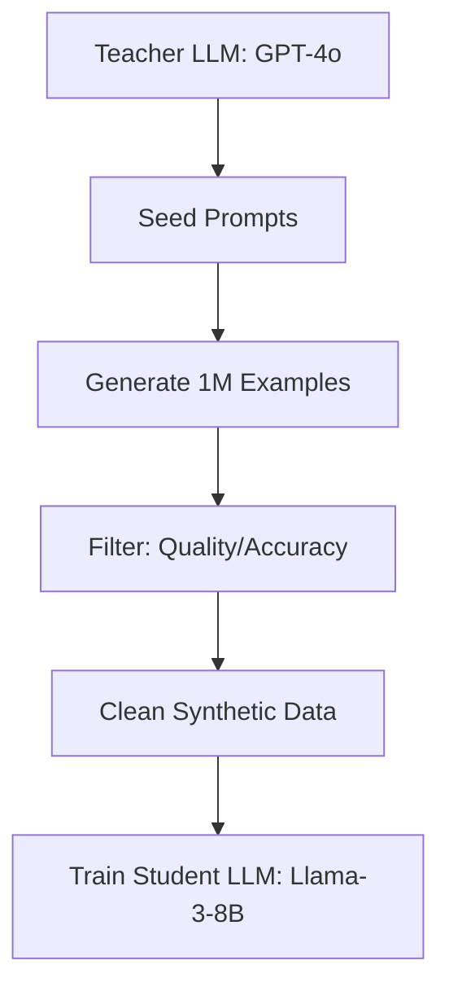

# Synthetic Data Generation: AI, AI ko Train Karna

## 1. Beginner-friendly Hinglish Explanation 🇮🇳
Bhai, socho tumhe ek student ko maths sikhana hai par market mein maths ki books khatam ho gayi hain. Toh tumne kya kiya? Ek "Maths Professor" ko bulaya aur use bola ki naye-naye problems aur solutions likho. 

**Synthetic Data Generation** wahi hai. Jab humare paas real human-written data khatam ho jata hai, toh hum ek bade "Teacher" model (jaise GPT-4o) ko bolte hain ki "Naya training data generate karo". Yeh data phir chote models ko train karne ke kaam aata hai. Isse hum "Data Scarcity" (data ki kami) ki problem solve karte hain. Lekin dhyan rahe, agar teacher galat padhayega, toh student bhi galat seekhega!

---

## 2. Gehri Technical Vyakhya
Synthetic data model-generated content hota hai jo doosre models ko train karne ke liye use hota hai.
- **Self-Correction**: Model multiple answers generate karta hai aur best one select karta hai (reward model ya code interpreter ka use karke).
- **Knowledge Distillation**: Ek chhota model (Student) bade model (Teacher) ke outputs se seekhta hai.
- **Instruction Evolution**: Ek simple prompt ko le kar usse LLM ke through "Evolve" karke complex prompt banana.
- **Math/Code Verification**: Aisa data generate karna jo compiler ya calculator se objectively verify kiya ja sake.

---

## 3. Ganitiya Intuition
Synthetic data ka maksad hai training distribution $P_{data}$ ke **Support** ko expand karna.
Agar $P_{model}$, $P_{data}$ ka achha approximation hai, toh hum $P_{model}$ se sample le kar naye examples $(x, y)$ le sakte hain.
Lekin **Model Collapse** ka risk rehta hai agar model ki errors reinforce hoti hain:
$$P_{n+1} \approx P_n \to \text{Density shift towards mode}$$
Isse diversity loss hoti hai.

---

## 4. Sthaptya Diagram

```mermaid
graph TD
    Teacher[Teacher LLM: GPT-4o] --> Seed[Seed Prompts]
    Seed --> Gen[Generate 1M Examples]
    Gen --> Filter[Filter: Quality/Accuracy]
    Filter --> Clean[Clean Synthetic Data]
    Clean --> Student[Train Student LLM: Llama-3-8B]
```

---

## 5. Production-ready Udaharan
"Evolved" instructions generate karna (Simple $\to$ Complex):

```python
def evolve_instruction(simple_prompt):
    evolution_prompt = f"Make this instruction 5x more complex and detailed: {simple_prompt}"
    complex_prompt = teacher_llm.call(evolution_prompt)
    return complex_prompt

# Input: "Write a python script to sort a list."
# Output: "Implement a thread-safe, memory-efficient merge sort in Python with custom comparators..."
```

---

## 6. Vastavik Duniya ke Use Cases
- **Phi Models (Microsoft)**: Inhe heavily train kiya gaya "Textbook-quality" synthetic data par.
- **AlphaGeometry**: Google DeepMind ne synthetic geometric proofs ka use karke human-gold-medal performance hasil ki.
- **Privacy**: Medical AI research ke liye synthetic patient records generate karna.

---

## 7. Asafalta ke Case
- **The Ouroboros Effect**: AI ka AI se aur AI se seekhne se bekaar "Ghost" patterns bante hain.
- **Lack of Nuance**: Synthetic data mein real human language ki messiness aur edge cases nahi hote.

---

## 8. Samasya Nivaran Guide
1. **Diversity Check**: Apne synthetic data par clustering algorithm run karein. Agar saare 1 million examples "The cat sat on the mat" ke baare mein hain, toh generation bahut repetitive hai.
2. **Fact Check**: 100 rows randomly sample karein aur manually verify karein. Agar >5% galat hain, toh aapka Teacher model hallucinate kar raha hai.

---

## 9. Tradeoffs (Samjhauta)
| Feature | Human Data | Synthetic Data |
|---|---|---|
| Quality | High (Asli) | Variable (Filtered) |
| Scalability | Low (Mehnga) | Infinite (Sasta) |
| Privacy | Khatarnak | Surakshit |

---

## 10. Security Concerns (Suraksha Chintaein)
- **Data Poisoning**: Ek attacker Teacher model ko trick kar ke synthetic training set mein subtle "Backdoors" generate kara sakta hai.

---

## 11. Scaling Challenges (Skeling Chunautiyan)
- **Compute for Generation**: Trillions synthetic tokens generate karna actual training jitna hi expensive ho sakta hai.

---

## 12. Cost Considerations (Lagat Sambandhi Vichar)
- **Teacher API Costs**: GPT-4o se 100B tokens generate karne ka cost millions mein ho sakta hai. Open-source teacher (Llama-3-70B) host karna aam taur par sasta hota hai.

---

## 13. Best Practices (Sarvottam Abhyas)
- **Mix with Real Data**: Kabhi bhi 100% synthetic data use na karein. 50/50 mix aam taur par safe rehta hai.
- **Filter Heavily**: Synthetic data ko grade karne ke liye doosra LLM ya Reward Model use karein.
- **Verify Logic**: Agar code/math generate kar rahe hain, toh interpreter mein run karein.

---

## 14. Interview Prashn
1. "Model Collapse" kya hai aur ise kaise roka ja sakta hai?
2. Samjhao ki Microsoft ke "Phi" models ne synthetic data kaise use kiya.

---

## 15. 2026 ke Latest Patterns
- **STaR (Self-Taught Reasoner)**: Ek model jo apna reasoning generate karta hai, answer verify karta hai, aur successful reasoning paths par fine-tune karta hai.
- **Multi-Agent Debate for Data**: Do models ko topic par debate karne ke liye use karna aur transcript ko high-quality training data ke roop mein use karna.