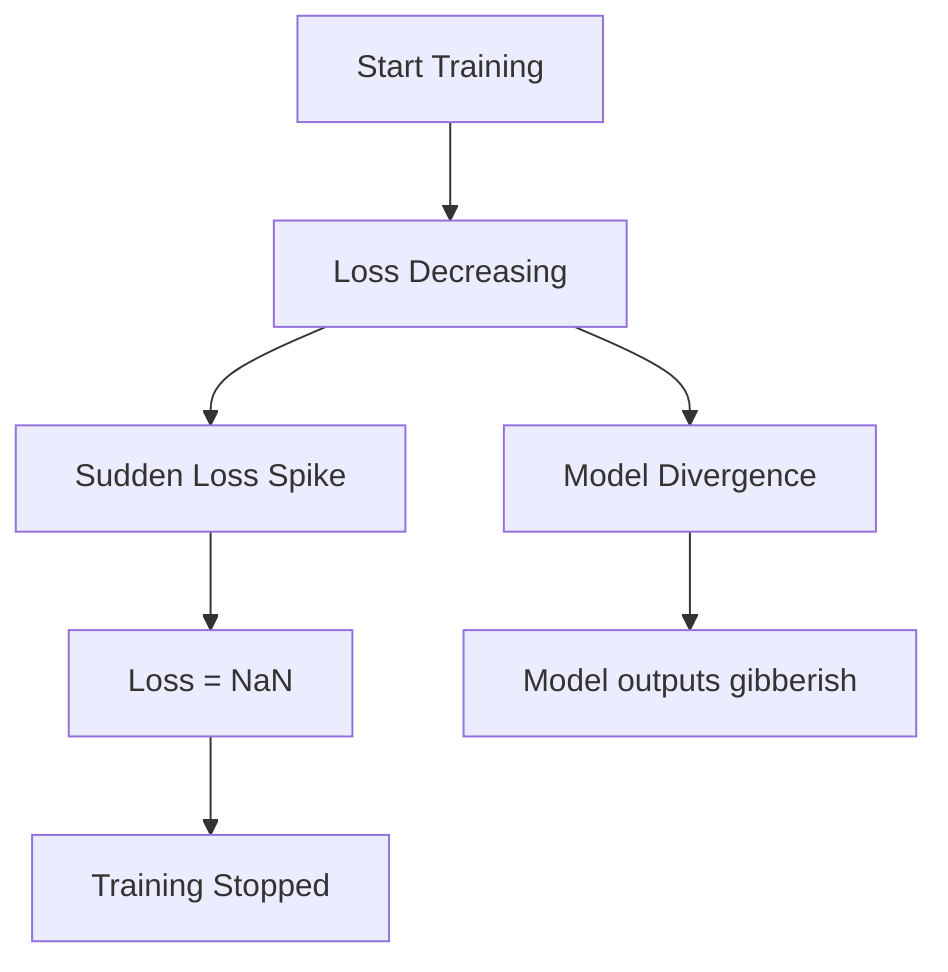

# Training Failure Modes: When LLMs Go Wrong

## 1. Beginner-friendly Hinglish Explanation 🇮🇳
Bhai, LLM train karna ek "Mission Impossible" movie ki tarah hai—har step par kuch na kuch phatne (explode) ke chances hote hain. 

Kabhi tumhara loss achanak se **NaN** (Not a Number) ho jayega, kabhi model "Pagal" hokar ek hi word repeat karne lagega, aur kabhi GPUs aapas mein baat karna band kar denge. In failures ko pehchanna aur fix karna hi ek "Junior" aur "Expert" AI Engineer ke beech ka farak hai. Agar tumne training failure handle karna nahi seekha, toh tumhari company ka lakho dollar ka compute dhuan ho jayega.

---

## 2. Deep Technical Explanation
Training failures fall into three categories:
- **Numerical Instability**: Loss exploding ($Inf$) or vanishing ($0$). Often caused by bad initialization or high learning rates.
- **Hardware Failures**: GPU hardware errors (XID errors), InfiniBand timeouts, or silent data corruption.
- **Algorithmic Failures**: Posterior collapse, catastrophic forgetting, or "Grokking" taking too long.

---

## 3. Mathematical Intuition
**Loss Explosion**:
If $\frac{\partial L}{\partial w}$ is too large, $w_{new} = w - \eta \cdot \text{Grad}$ can jump to a region of the loss landscape where the output becomes $Inf$.
This usually happens because of:
1. High Learning Rate $\eta$.
2. Lack of Gradient Clipping.
3. Unstable Activation functions.

---

## 4. Architecture Diagrams


---

## 5. Production-ready Examples
Automatic detection of NaN and Restart:

```python
import torch

def train_step(batch):
    output = model(batch)
    loss = criterion(output, target)
    
    if torch.isnan(loss) or torch.isinf(loss):
        print("CRITICAL: Loss is NaN! Reverting to last checkpoint.")
        load_last_checkpoint()
        reduce_learning_rate()
        return
        
    loss.backward()
    optimizer.step()
```

---

## 6. Real-world Use Cases
- **Monitoring Dashboards**: Using Weights & Biases (W&B) to trigger alerts when loss spikes.
- **Auto-remediation**: Systems that automatically restart a failed node and resume from S3.

---

## 7. Failure Cases
- **Silent Gradient Vanishing**: The loss is "fine" but the model stops improving. Hard to detect without monitoring gradient norms.
- **Data Contamination**: The model starts "cheating" by memorizing test answers included in the training set.

---

## 8. Debugging Guide
1. **Log Gradient Norms**: If norm > 10.0, use gradient clipping.
2. **Layer-wise Analysis**: Check which layer's weights are growing the fastest.
3. **Hardware Check**: Run `nvidia-smi -q -d PAGE_RETIREMENT` to check for dying GPUs.

---

## 9. Tradeoffs
| Action | Benefit | Drawback |
|---|---|---|
| Reduce LR | Stability | Slower Training |
| Grad Clipping | Prevents NaN | Might bias learning |
| FP32 Training | Precision | 2x Memory/Slow |

---

## 10. Security Concerns
- **Model Collapse**: Adversaries injecting "poison" data that causes the model to gradually lose its intelligence over time.

---

## 11. Scaling Challenges
- **The "Butterfly Effect"**: In 10,000 GPU runs, a single bit-flip on one GPU can propagate and ruin the whole model.

---

## 12. Cost Considerations
- **Resumption Cost**: Every time the model crashes, you lose the time between the last checkpoint and the crash.

---

## 13. Best Practices
- **Always monitor Loss, Grad Norm, and Learning Rate**.
- Use **BF16** instead of FP16 for better numerical range.
- Implement **Health Checks** before every epoch.

---

## 14. Interview Questions
1. How do you debug a training run where the loss suddenly becomes NaN?
2. What is the "Straggler" problem in distributed training?

---

## 15. Latest 2026 Patterns
- **Automatic Loss Scaling**: Dynamically adjusting the precision and scale to prevent underflow/overflow.
- **Predictive Maintenance**: Using AI to predict which GPU will fail next based on temperature and voltage patterns.
