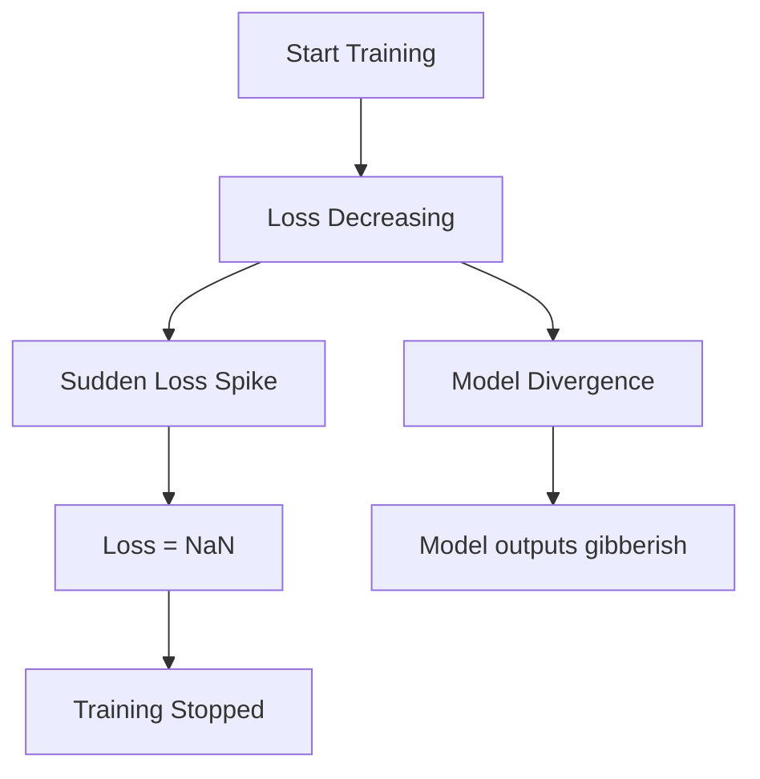

# Training Failure Modes: Jab LLMs Galat Ho Jaate Hain

## 1. Shuruaati Hinglish Explanation 🇮🇳
Bhai, LLM train karna ek "Mission Impossible" movie ki tarah hai—har step par kuch na kuch phatne (explode) ke chances hote hain. 

Kabhi tumhara loss achanak se **NaN** (Not a Number) ho jayega, kabhi model "Pagal" hokar ek hi word repeat karne lagega, aur kabhi GPUs aapas mein baat karna band kar denge. In failures ko pehchanna aur fix karna hi ek "Junior" aur "Expert" AI Engineer ke beech ka farak hai. Agar tumne training failure handle karna nahi seekha, toh tumhari company ka lakho dollar ka compute dhuan ho jayega.

---

## 2. Gehri Technical Explanation
Training failures teen categories mein aate hain:
- **Numerical Instability**: Loss exploding ($Inf$) ya vanishing ($0$). Aksar aisa hota hai kyunki initialization kharab hai ya learning rate high hai.
- **Hardware Failures**: GPU hardware errors (XID errors), InfiniBand timeouts, ya silent data corruption.
- **Algorithmic Failures**: Posterior collapse, catastrophic forgetting, ya "Grokking" bahut time le raha hai.

---

## 3. Ganitik Intuition
**Loss Explosion**:
Agar $\frac{\partial L}{\partial w}$ bahut bada hai, toh $w_{new} = w - \eta \cdot \text{Grad}$ loss landscape ke aise region mein jump kar sakta hai jahan output $Inf$ ho jata hai.
Yeh aam taur par in vajah se hota hai:
1. High Learning Rate $\eta$.
2. Gradient Clipping ki kami.
3. Unstable Activation functions.

---

## 4. Architecture Diagrams

```mermaid
graph TD
    Start[Start Training] --> Normal[Loss Decreasing]
    Normal --> Spike[Sudden Loss Spike]
    Spike --> NaN[Loss = NaN]
    NaN --> Crash[Training Stopped]
    
    Normal --> Div[Model Divergence]
    Div --> Junk[Model outputs gibberish]
```

---

## 5. Production-ready Examples
NaN aur Restart ki automatic detection:

```python
import torch

def train_step(batch):
    output = model(batch)
    loss = criterion(output, target)
    
    if torch.isnan(loss) or torch.isinf(loss):
        print("CRITICAL: Loss is NaN! Reverting to last checkpoint.")
        load_last_checkpoint()
        reduce_learning_rate()
        return
        
    loss.backward()
    optimizer.step()
```

---

## 6. Real-world Use Cases
- **Monitoring Dashboards**: Loss spike hone par alerts trigger karne ke liye Weights & Biases (W&B) ka upyog.
- **Auto-remediation**: Aise systems jo automatically failed node ko restart karte hain aur S3 se resume karte hain.

---

## 7. Failure Cases
- **Silent Gradient Vanishing**: Loss "theek" hai lekin model improve karna band kar deta hai. Gradient norms monitor kiye bina detect karna mushkil.
- **Data Contamination**: Model training set mein shamil test answers ko memorize karke "cheating" karne lagta hai.

---

## 8. Debugging Guide
1. **Log Gradient Norms**: Agar norm > 10.0 hai, toh gradient clipping ka upyog karein.
2. **Layer-wise Analysis**: Check karein ki kaun si layer ke weights sabse tezi se badh rahe hain.
3. **Hardware Check**: `nvidia-smi -q -d PAGE_RETIREMENT` run karein dying GPUs check karne ke liye.

---

## 9. Tradeoffs
| Action | Benefit | Drawback |
|---|---|---|
| Reduce LR | Stability (Sthirta) | Training Dheemi |
| Grad Clipping | NaN Prevent karta hai | Learning bias ho sakti hai |
| FP32 Training | Precision (Shuddhata) | Double Memory / Dheemi |

---

## 10. Security Concerns
- **Model Collapse**: Adversaries "poison" data inject karte hain jisse model dheere-dheere apni intelligence kho deta hai.

---

## 11. Scaling Challenges
- **The "Butterfly Effect"**: 10,000 GPU runs mein, ek GPU par ek single bit-flip poori model ko bigaad sakta hai.

---

## 12. Cost Considerations
- **Resumption Cost**: Har baar jab model crash hota hai, aap last checkpoint aur crash ke beech ka time kho dete hain.

---

## 13. Best Practices
- **Hamesha Loss, Grad Norm, aur Learning Rate monitor karein**.
- **BF16** ka upyog karein FP16 ki jagah behtar numerical range ke liye.
- Har epoch se pehle **Health Checks** implement karein.

---

## 14. Interview Questions
1. Aap training run mein suddenly loss NaN hone par kaise debug karte hain?
2. Distributed training mein "Straggler" problem kya hoti hai?

---

## 15. Latest 2026 Patterns
- **Automatic Loss Scaling**: Underflow/overflow rokne ke liye precision aur scale ko dynamically adjust karna.
- **Predictive Maintenance**: Temperature aur voltage patterns ke aadhaar par predict karne ke liye AI ka upyog ki kaun si GPU next fail hogi.