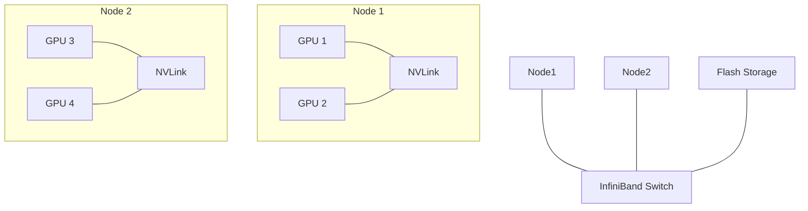

# Training Infrastructure: The GPU Supercomputer

## 1. Beginner-friendly Hinglish Explanation 🇮🇳
Bhai, LLM train karna ek chote laptop ka kaam nahi hai. Iske liye tumhe ek poora **"GPU Cluster"** chahiye—socho hazaron NVIDIA H100 GPUs jo ek dusre se super-fast speed par Jude hue hain. 

Training infrastructure ka matlab hai woh hardware aur network jo trillions of calculations ko handle kar sake. Agar ek GPU fail ho jaye (jo ki aksar hota hai), toh system ko rukna nahi chahiye. Yeh bilkul waise hi hai jaise ek badi fauj ko lead karna—tumhe unka khana (Data), weapons (Compute), aur communication (Networking) perfect rakhna padega. Bina sahi infrastructure ke, tum sirf electricity waste karoge.

---

## 2. Deep Technical Explanation
LLM training happens on specialized AI clusters.
- **Compute**: NVIDIA A100/H100/B200 GPUs or Google TPUs.
- **Interconnect**: NVLink (inside a node) and InfiniBand/RoCE (between nodes) for ultra-low latency.
- **Parallelism**: Data Parallelism (DP), Tensor Parallelism (TP), and Pipeline Parallelism (PP) - collectively known as **3D Parallelism**.
- **Cluster Management**: Slurm or Kubernetes (K8s) for scheduling jobs.

---

## 3. Mathematical Intuition
Training throughput is measured in **TFLOPS (Tera Floating Point Operations Per Second)**.
Total training time $T$:
$$T \approx \frac{6 \times P \times D}{n \times \text{TFLOPS}_{peak} \times \text{MFU}}$$
Where:
- $P$: Parameters
- $D$: Tokens
- $n$: Number of GPUs
- $MFU$: Model Flops Utilization (usually 40-50% for good infra).

---

## 4. Architecture Diagrams


---

## 5. Production-ready Examples
Checking GPU health before starting a run:

```bash
# Basic check
nvidia-smi

# Check p2p connectivity (Crucial for TP/PP)
nvidia-smi topo -m

# Using PyTorch to check distributed environment
import torch.distributed as dist
if dist.is_initialized():
    print(f"Rank: {dist.get_rank()}, World Size: {dist.get_size()}")
```

---

## 6. Real-world Use Cases
- **Frontier Training**: Training GPT-5 level models on 50,000+ H100s.
- **Private Clusters**: Large banks building their own air-gapped GPU clusters for security.

---

## 7. Failure Cases
- **Zombies**: A GPU that looks "On" but isn't actually computing, slowing down the whole cluster (The "Straggler" problem).
- **Network Congestion**: If InfiniBand switches are misconfigured, GPU synchronization becomes a bottleneck.

---

## 8. Debugging Guide
1. **MFU Monitoring**: If your MFU is < 30%, you have an infrastructure bottleneck (likely IO or Network).
2. **NCCL Timeout**: Common error when nodes can't talk to each other. Increase `NCCL_TIMEOUT` or check firewalls.

---

## 9. Tradeoffs
| Feature | Public Cloud (AWS/Azure) | On-Premise Cluster |
|---|---|---|
| Cost | High (per hour) | High (CapEx) |
| Speed to Start | Instant | Months (Hardware lead time) |
| Control | Limited | Full |

---

## 10. Security Concerns
- **Side-channel attacks**: Analyzing power consumption of a cluster to reverse-engineer model weights.
- **Tenant Isolation**: Ensuring your training data isn't visible to other users on a shared cluster.

---

## 11. Scaling Challenges
- **The 100k GPU Wall**: Networking becomes exponentially harder as the number of nodes increases.
- **Power & Cooling**: A large cluster consumes Megawatts of power—as much as a small city.

---

## 12. Cost Considerations
- **Egress Costs**: Moving 10TB of data from S3 to a GPU cluster can cost thousands of dollars.
- **Idle Costs**: Paying for 1000 GPUs while your code is crashing is the fastest way to burn VC money.

---

## 13. Best Practices
- Use **Checkpointing** frequently (every 100 steps).
- Monitor **GPU Temperatures**—throttling can cause non-deterministic training.
- Use **PyTorch Distributed (FSDP)** for efficient memory usage.

---

## 14. Interview Questions
1. What is the difference between NVLink and InfiniBand?
2. Explain the "3D Parallelism" strategy.

---

## 15. Latest 2026 Patterns
- **Optical Interconnects**: Using light instead of electricity for even faster GPU-to-GPU communication.
- **Liquid Cooling**: Moving away from fans to liquid cooling to support the 1000W+ power draw of future GPUs.
