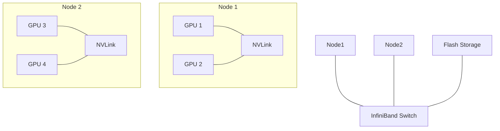

# Training Infrastructure: The GPU Supercomputer

## 1. Beginner-friendly Hinglish Explanation 🇮🇳
Bhai, LLM train karna ek chote laptop ka kaam nahi hai. Iske liye tumhe ek poora **"GPU Cluster"** chahiye—socho hazaron NVIDIA H100 GPUs jo ek dusre se super-fast speed par Jude hue hain. 

Training infrastructure ka matlab hai woh hardware aur network jo trillions of calculations ko handle kar sake. Agar ek GPU fail ho jaye (jo ki aksar hota hai), toh system ko rukna nahi chahiye. Yeh bilkul waise hi hai jaise ek badi fauj ko lead karna—tumhe unka khana (Data), weapons (Compute), aur communication (Networking) perfect rakhna padega. Bina sahi infrastructure ke, tum sirf electricity waste karoge.

---

## 2. Deep Technical Explanation
LLM training specialized AI clusters par hoti hai.
- **Compute**: NVIDIA A100/H100/B200 GPUs ya Google TPUs.
- **Interconnect**: NVLink (node ke andar) aur InfiniBand/RoCE (nodes ke beech) ultra-low latency ke liye.
- **Parallelism**: Data Parallelism (DP), Tensor Parallelism (TP), aur Pipeline Parallelism (PP) - collectively **3D Parallelism** ke naam se jana jata hai.
- **Cluster Management**: Slurm ya Kubernetes (K8s) jobs scheduling ke liye.

## 3. Mathematical Intuition
Training throughput **TFLOPS (Tera Floating Point Operations Per Second)** mein measure kiya jata hai.
Total training time $T$:
$$T \approx \frac{6 \times P \times D}{n \times \text{TFLOPS}_{peak} \times \text{MFU}}$$
Jahan:
- $P$: Parameters
- $D$: Tokens
- $n$: Number of GPUs
- $MFU$: Model Flops Utilization (aam taur par 40-50% achhe infra ke liye).

## 4. Architecture Diagrams

```mermaid
graph TD
    subgraph "Node 1"
        G1[GPU 1] --- NV[NVLink]
        G2[GPU 2] --- NV
    end
    subgraph "Node 2"
        G3[GPU 3] --- NV2[NVLink]
        G4[GPU 4] --- NV2
    end
    Node1 --- IB[InfiniBand Switch]
    Node2 --- IB
    Storage[Flash Storage] --- IB
```

## 5. Production-ready Examples
Run start karne se pehle GPU health check karein:

```bash
# Basic check
nvidia-smi

# Check p2p connectivity (Crucial for TP/PP)
nvidia-smi topo -m

# Using PyTorch to check distributed environment
import torch.distributed as dist
if dist.is_initialized():
    print(f"Rank: {dist.get_rank()}, World Size: {dist.get_size()}")
```

## 6. Real-world Use Cases
- **Frontier Training**: GPT-5 level models ko 50,000+ H100s par train karna.
- **Private Clusters**: Large banks apne air-gapped GPU clusters bana rahe hain security ke liye.

## 7. Failure Cases
- **Zombies**: Ek GPU jo "On" dikhta hai lekin actually compute nahi kar raha, poora cluster slow kar deta hai (The "Straggler" problem).
- **Network Congestion**: Agar InfiniBand switches misconfigured hain, to GPU synchronization bottleneck ban jata hai.

## 8. Debugging Guide
1. **MFU Monitoring**: Agar aapka MFU < 30% hai, to infrastructure bottleneck hai (likely IO ya Network).
2. **NCCL Timeout**: Common error jab nodes ek dusre se baat nahi kar sakte. `NCCL_TIMEOUT` badhayein ya firewalls check karein.

## 9. Tradeoffs
| Feature | Public Cloud (AWS/Azure) | On-Premise Cluster |
|---|---|---|
| Cost | High (per hour) | High (CapEx) |
| Speed to Start | Instant | Months (Hardware lead time) |
| Control | Limited | Full |

## 10. Security Concerns
- **Side-channel attacks**: Cluster ki power consumption analyze karke model weights reverse-engineer karna.
- **Tenant Isolation**: Ensure karna ki aapka training data shared cluster par doosre users ko visible na ho.

## 11. Scaling Challenges
- **The 100k GPU Wall**: Nodes ki sankhya badhne ke saath networking exponentially harder ho jata hai.
- **Power & Cooling**: Ek bada cluster Megawatts power consume karta hai—jitna ek chhota town leta hai.

## 12. Cost Considerations
- **Egress Costs**: 10TB data S3 se GPU cluster par move karne par thousands of dollars ka kharcha ho sakta hai.
- **Idle Costs**: 1000 GPUs ke liye pay karna jab aapka code crash raha hai, yeh VC money burn karne ka fastest way hai.

## 13. Best Practices
- **Checkpointing** ka use karein frequently (har 100 steps par).
- **GPU Temperatures** monitor karein—throttling se non-deterministic training ho sakti hai.
- **PyTorch Distributed (FSDP)** use karein efficient memory usage ke liye.

## 14. Interview Questions
1. NVLink aur InfiniBand mein kya difference hai?
2. "3D Parallelism" strategy ko explain karein.

## 15. Latest 2026 Patterns
- **Optical Interconnects**: Electricity ki jagah light use karna aur bhi faster GPU-to-GPU communication ke liye.
- **Liquid Cooling**: Fans se hata kar liquid cooling ki taraf move karna future GPUs ke 1000W+ power draw ko support karne ke liye.