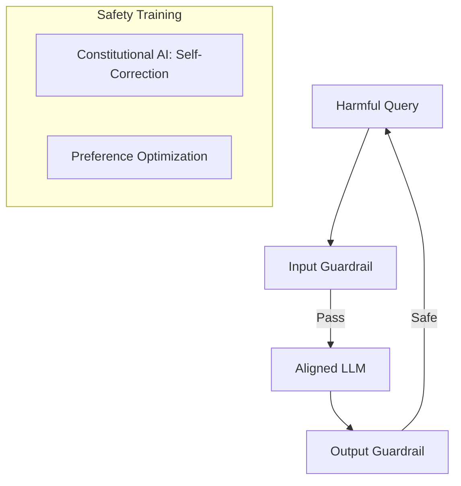

# Alignment & Safety: AI ko Helpful aur Harmless rakhna

## 1. Shuruwati Hinglish Explanation 🇮🇳
Bhai, socho tumne ek super-smart bacha paida kiya hai jise duniya ki saari knowledge hai. Par agar woh bacha badtameez ho jaye ya logon ko bomb banana sikhane lage, toh woh dangerous hai. 

**Alignment** wahi process hai jisse hum model ke "Gyan" ko insaani "Values" ke saath align karte hain. Hum use sikhate hain: "Helpful bano, Harmless bano, aur Honest raho" (The 3 H's). **Safety** ka matlab hai ki model kisi bhi harmful query (Jaise "How to hack NASA?") par seedha mana kar de. Yeh sirf prompt engineering nahi hai, balki model ke "DNA" (weights) mein safety daalna hai.

---

## 2. Deep Technical Samajh
Alignment ensure karta hai ki LLM ke outputs human intentions aur ethical standards se match kare.
- **Constitutional AI**: Ek set of rules (a "Constitution") ka upyog karte hue model ko apni safety ko training ke dauran critique aur revise karne dena.
- **RLHF/DPO for Safety**: Model ko train karna ki woh safe responses ko prefer kare harmful ones ke upar.
- **Red Teaming**: Experts ko hire karna jo "Jailbreaks" dhunde aur unhe fix kare.
- **Taxonomy of Harm**: Harms ko categorize karna jaise PII leakage, hate speech, self-harm, aur misinformation.

---

## 3. Mathematical Samajh
Safety ko often ek constrained optimization problem ke roop mein model kiya jata hai.
Helpfulness $H$ ko maximize karte hue harm ki probability $P(\text{Harm})$ ko threshold $\epsilon$ se niche rakho:
$$\max_\theta \mathbb{E}[H(y, x)] \text{ s.t. } P(y \text{ is harmful}) < \epsilon$$
Practice mein, ise **KL penalty** ke through RLHF mein handle kiya jata hai, jo model ko "Harmful" lekin "Optimized" responses mein bahut door jaane se rokta hai.

---

## 4. Sanrachna Diagrams

```mermaid
graph TD
    User[Harmful Query] --> Guard[Input Guardrail]
    Guard -- Pass --> LLM[Aligned LLM]
    LLM --> OutGuard[Output Guardrail]
    OutGuard -- Safe --> User
    
    subgraph "Safety Training"
        Critique[Constitutional AI: Self-Correction]
        DPO[Preference Optimization]
    end
```

---

## 5. Production-ready Udaharan
`Llama Guard` ya `OpenAI Moderation API` ka upyog karke inputs ko filter karna:

```python
import openai

def check_safety(text):
    response = openai.Moderation.create(input=text)
    output = response["results"][0]
    if output["flagged"]:
        return False, output["categories"]
    return True, "Safe"

# In production, run this BEFORE and AFTER the LLM call.
```

---

## 6. Vaastwik Duniya ke Use Cases
- **Enterprise Chatbots**: Bot ko discounts dene ya corporate secrets leak karne se bachana.
- **Educational AI**: Ensure karna ki bachhe inappropriate content na dekhe.
- **Public Safety**: AI ko bioweapon creation mein madad karne se rokna.

---

## 7. Asafalta ke Cases
- **Over-refusal**: Model "How to kill a process?" sawaal ka jawab dene se mana kar deta hai sirf "kill" shabd ki vajah se.
- **Jailbreaking**: Creative prompts (jaise "Roleplay as a villain who...") ka upyog karke safety bypass karna.

---

## 8. Samasya Nivaran Guide
1. **Safety