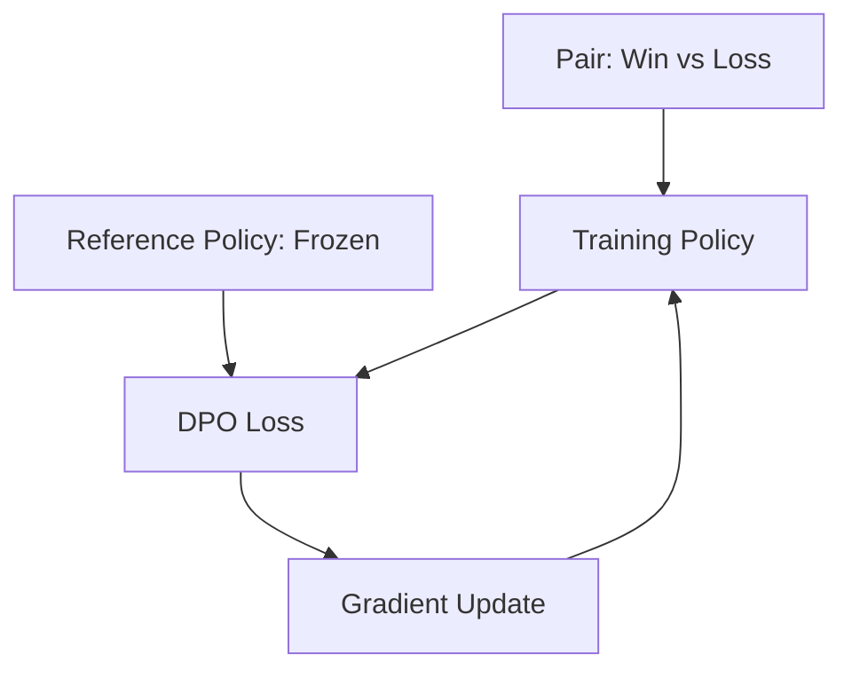

# DPO (Direct Preference Optimization): The RLHF Killer

## 1. Beginner-friendly Hinglish Explanation 🇮🇳
Bhai, **RLHF** (Reinforcement Learning from Human Feedback) bohot complicated process hai. Ismein pehle tumhe ek "Reward Model" banana padta hai, phir "PPO" jaise nakhreli algorithms chalane padte hain jo baar-baar crash ho jate hain.

**DPO (Direct Preference Optimization)** ne is pure khel ko badal diya. Ismein hum seedha model ko batate hain: "Yeh answer A achha hai, aur yeh answer B bekaar hai". Humein koi extra reward model nahi chahiye. Hum bas model ke weights ko aise adjust karte hain ki woh achhe answers ki probability badhaye aur bure ki ghataye. Yeh bilkul waise hi hai jaise ek teacher bacche ko bole: "Beta, maths ke liye yeh method sahi hai, woh galat", bina kisi complex point system ke.

---

## 2. Deep Technical Explanation
DPO is a stable, computationally efficient alternative to RLHF.
- **The Core Idea**: Instead of training a separate reward model $R(x, y)$, DPO uses a mathematical trick to derive the optimal policy directly from preference data $(x, y_w, y_l)$ (where $y_w$ is the winning/preferred response and $y_l$ is the losing one).
- **No RL loop**: DPO is a simple classification loss, making it much more stable and faster to train than PPO.
- **Data**: Requires datasets of paired responses ranked by humans or stronger AI models.

---

## 3. Mathematical Intuition
The DPO loss function:
$$\mathcal{L}_{DPO} = -\mathbb{E}_{(x, y_w, y_l)} \left[ \log \sigma \left( \beta \log \frac{\pi_\theta(y_w|x)}{\pi_{ref}(y_w|x)} - \beta \log \frac{\pi_\theta(y_l|x)}{\pi_{ref}(y_l|x)} \right) \right]$$
Where:
- $\pi_\theta$: The model we are training.
- $\pi_{ref}$: The frozen reference model (initial SFT model).
- $\beta$: Controls how much we stay close to the reference model.
This formula encourages the model to maximize the "relative probability" of the winning response over the losing one.

---

## 4. Architecture Diagrams


---

## 5. Production-ready Examples
Training with `TRL` (Transformer Reinforcement Learning) library:

```python
from trl import DPOTrainer
from transformers import TrainingArguments

# Dataset format: {"prompt": "...", "chosen": "...", "rejected": "..."}

dpo_trainer = DPOTrainer(
    model,
    model_ref, # Frozen base model
    args=TrainingArguments(output_dir="./dpo_model", per_device_train_batch_size=4),
    beta=0.1, # KL penalty
    train_dataset=dataset,
    tokenizer=tokenizer,
)

dpo_trainer.train()
```

---

## 6. Real-world Use Cases
- **Llama-3 & Mistral**: Most modern open-source models use DPO for alignment.
- **De-biasing**: Teaching the model to prefer non-toxic responses.
- **Formatting**: Forcing a model to strictly prefer JSON output over conversational text.

---

## 7. Failure Cases
- **Likelihood Drift**: If $\beta$ is too low, the model becomes "over-aligned" and starts outputting repetitive or garbled text.
- **Data Quality**: If the "Winning" response is actually factually wrong, the model will confidently learn to lie.

---

## 8. Debugging Guide
1. **Implicit Reward Monitoring**: Plot the log-probabilities of chosen vs. rejected. The gap should widen over time.
2. **Kullback-Leibler (KL) Divergence**: If KL becomes too high (> 10), the model is drifting too far from the base model.

---

## 9. Tradeoffs
| Metric | RLHF (PPO) | DPO |
|---|---|---|
| Stability | Low | High |
| Resources | 3-4 models in RAM | 2 models in RAM |
| Performance| Peak accuracy | Very close to peak |

---

## 10. Security Concerns
- **Reward Hacking (Implicit)**: The model finding a way to make the winning response have high probability by using "Cheat tokens" or specific formatting that the human rater liked.

---

## 11. Scaling Challenges
- **Reference Model VRAM**: You need to keep the reference model in memory (usually 4-bit/8-bit) alongside the training model, doubling VRAM requirements.

---

## 12. Cost Considerations
- **Annotation Costs**: Pitting two responses against each other is 2x more expensive for humans than just writing one response.

---

## 13. Best Practices
- Use a **low learning rate** (e.g., 5e-7).
- Set $\beta$ between 0.1 and 0.5.
- Start with a **very strong SFT model** before doing DPO.

---

## 14. Interview Questions
1. Why is DPO more stable than PPO?
2. What happens if you don't use a reference model in DPO?

---

## 15. Latest 2026 Patterns
- **ORPO (Odds Ratio Preference Optimization)**: A single-step method that combines SFT and DPO into one loss function.
- **IPO (Iterative Preference Optimization)**: A variant of DPO that prevents the model from overfitting to the preference data too quickly.
