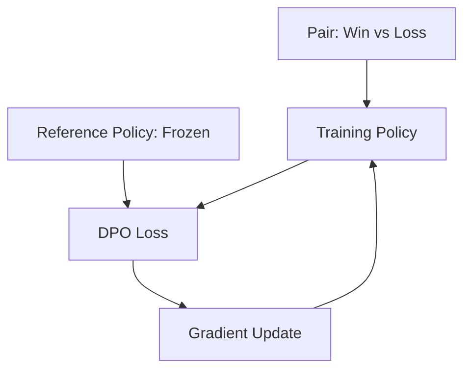

# DPO (Direct Preference Optimization): RLHF ka Killer

## 1. Shuruwat ke liye Hinglish Samjhaai 🇮🇳
Bhai, **RLHF** (Reinforcement Learning from Human Feedback) bohot complicated process hai. Ismein pehle tumhe ek "Reward Model" banana padta hai, phir "PPO" jaise nakhreli algorithms chalane padte hain jo baar-baar crash ho jate hain.

**DPO (Direct Preference Optimization)** ne is pure khel ko badal diya. Ismein hum seedha model ko batate hain: "Yeh answer A achha hai, aur yeh answer B bekaar hai". Humein koi extra reward model nahi chahiye. Hum bas model ke weights ko aise adjust karte hain ki woh achhe answers ki probability badhaye aur bure ki ghataye. Yeh bilkul waise hi hai jaise ek teacher bacche ko bole: "Beta, maths ke liye yeh method sahi hai, woh galat", bina kisi complex point system ke.

---

## 2. Gehri Technical Explanation
DPO ek stable aur computationally efficient alternative hai RLHF ka.
- **Core Idea**: Ek alag reward model $R(x, y)$ train karne ki jagah, DPO ek mathematical trick use karta hai optimal policy directly derive karne ke liye preference data $(x, y_w, y_l)$ se (jahan $y_w$ winning/preferred response hai aur $y_l$ losing response).
- **No RL loop**: DPO ek simple classification loss hai, jo isse zyada stable aur train karne mein faster banata hai compared to PPO.
- **Data**: Ismein paired responses ke datasets chahiye jo humans ya stronger AI models ne rank kiye hain.

---

## 3. Ganitik Intuition
DPO loss function:
$$\mathcal{L}_{DPO} = -\mathbb{E}_{(x, y_w, y_l)} \left[ \log \sigma \left( \beta \log \frac{\pi_\theta(y_w|x)}{\pi_{ref}(y_w|x)} - \beta \log \frac{\pi_\theta(y_l|x)}{\pi_{ref}(y_l|x)} \right) \right]$$
Jahaan:
- $\pi_\theta$: Ye woh model hai jo hum train kar rahe hain.
- $\pi_{ref}$: Ye frozen reference model hai (initial SFT model).
- $\beta$: Ye control karta hai ki hum reference model ke kitne close rahen.
Yeh formula model ko encourage karta hai ki woh winning response ki "relative probability" ko maximize kare losing response ke comparison mein.

---

## 4. Architecture ke Diagrams

```mermaid
graph TD
    Data[Pair: Win vs Loss] --> Model[Training Policy]
    Ref[Reference Policy: Frozen] --> Loss[DPO Loss]
    Model --> Loss
    Loss --> Grad[Gradient Update]
    Grad --> Model
```

---

## 5. Production-ready Udaharan
Training `TRL` (Transformer Reinforcement Learning) library ke saath:

```python
from trl import DPOTrainer
from transformers import TrainingArguments

# Dataset format: {"prompt": "...", "chosen": "...", "rejected": "..."}

dpo_trainer = DPOTrainer(
    model,
    model_ref, # Frozen base model
    args=TrainingArguments(output_dir="./dpo_model", per_device_train_batch_size=4),
    beta=0.1, # KL penalty
    train_dataset=dataset,
    tokenizer=tokenizer,
)

dpo_trainer.train()
```

---

## 6. Vastavik Use Cases
- **Llama-3 & Mistral**: Aaj ke most modern open-source models DPO ka use karte hain alignment ke liye.
- **De-biasing**: Model ko non-toxic responses prefer karne sikhana.
- **Formatting**: Model ko strictly JSON output prefer karne ke liye force karna, conversational text ke bajaye.

---

## 7. Failure Cases (Nakami ke Mamle)
- **Likelihood Drift**: Agar $\beta$ bahut low hai, toh model "over-aligned" ho jata hai aur repetitive ya garbled text output karna shuru kar deta hai.
- **Data Quality**: Agar "Winning" response actually factually galat hai, toh model confidently jhooth bolna seekh jayega.

---

## 8. Debugging Guide (Debugging Ke Nirdesh)
1. **Implicit Reward Monitoring**: Chosen aur rejected ki log-probabilities ka plot banayein. Gap time ke saath widen hona chahiye.
2. **Kullback-Leibler (KL) Divergence**: Agar KL bahut high ho jaye (> 10), toh model base model se bahut door drift kar raha hai.

---

## 9. Tradeoffs (Tulnatmak Labh-Hani)
| Metric | RLHF (PPO) | DPO |
|---|---|---|
| Stability | Low | High |
| Resources | 3-4 models in RAM | 2 models in RAM |
| Performance| Peak accuracy | Very close to peak |

---

## 10. Security Concerns (Suraksha ke Masle)
- **Reward Hacking (Implicit)**: Model ek aisa rasta nikaalta hai ki winning response ki probability high ho jaye "Cheat tokens" ya specific formatting use karke jo human rater ko pasand thi.

---

## 11. Scaling Challenges (Bada Khelne Mein Samasya)
- **Reference Model VRAM**: Aapko reference model memory mein rakhna padta hai (usually 4-bit/8-bit) saath mein training model ke, jo VRAM requirements double kar deta hai.

---

## 12. Cost Considerations (Kharch ke Pahlu)
- **Annotation Costs**: Do responses ko aapas mein ladana humans ke liye 2x zyada mehnga hai sirf ek response likhne se.

---

## 13. Best Practices (Achhe Tareeke)
- Ek **low learning rate** use karein (e.g., 5e-7).
- $\beta$ 0.1 aur 0.5 ke beech set karein.
- DPO karne se pehle ek **very strong SFT model** se start karein.

---

## 14. Interview Questions (Interview Ke Sawal)
1. DPO PPO se zyada stable kyun hai?
2. Agar aap DPO mein reference model use nahi karte toh kya hota hai?

---

## 15. Latest 2026 Patterns (2026 Ke Sabse Naye Patterns)
- **ORPO (Odds Ratio Preference Optimization)**: Ek single-step method jo SFT aur DPO ko ek hi loss function mein combine karta hai.
- **IPO (Iterative Preference Optimization)**: DPO ka ek variant jo model ko preference data par jald se overfit hone se rokta hai.