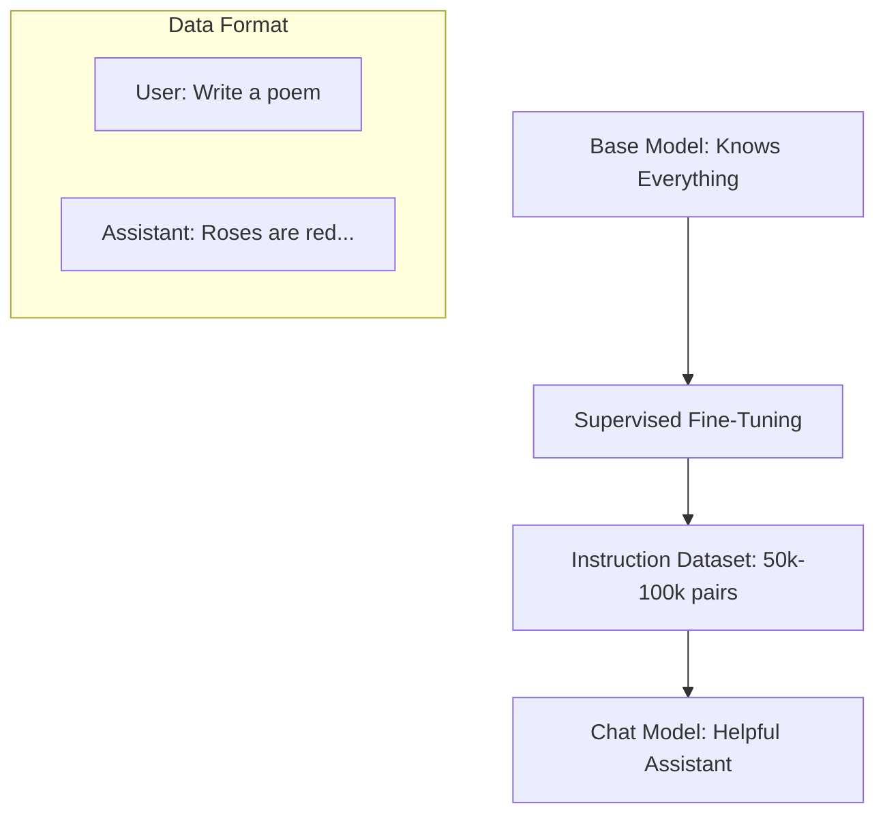

# Instruction Tuning: From Completion to Conversation

## 1. Beginner-friendly Hinglish Explanation 🇮🇳
Bhai, socho tumne ek bache ko duniya ki saari books padha di hain. Woh bohot smart hai, lekin agar tum use bolo "Ek cup chai banao", toh woh chai nahi banayega, balki woh chai ke baare mein essay likhna shuru kar dega kyunki use lagta hai ki tum sentence "Complete" kar rahe ho. 

**Instruction Tuning** wahi step hai jo ek raw model ko ek "Helpful Assistant" mein badalta hai. Hum model ko (Instruction, Output) ke pairs dete hain: "Question: Who is King? Answer: A ruler...". Isse model ko samajh aata hai ki ab use "Next word predict" nahi karna, balki "Hukm (Command) manna" hai. Iske bina, ChatGPT sirf ek mahir writer hota, assistant nahi.

---

## 2. Deep Technical Explanation
Instruction tuning is the process of fine-tuning a pre-trained base model on a dataset of (Instruction, Context, Response) triplets.
- **SFT (Supervised Fine-Tuning)**: The first stage of instruction tuning. The model is trained using the same cross-entropy loss but only on the "Response" tokens.
- **Datasets**: Alpaca, ShareGPT, Dolly. These contain diverse tasks like summarization, creative writing, and coding.
- **Formatting**: Using special tokens to distinguish roles: `<|user|>\n...\n<|assistant|>\n...`.

---

## 3. Mathematical Intuition
In pre-training, the model learns $P(\text{Token} | \text{Past Tokens})$.
In instruction tuning, we optimize for $P(\text{Response} | \text{Instruction})$.
We maximize the log-likelihood of the gold-standard response $Y$ given instruction $I$:
$$\mathcal{L} = -\sum_{t=1}^{|Y|} \log P(y_t | y_{<t}, I)$$
This "Shifts" the model's distribution away from general text completion towards task-following behavior.

---

## 4. Architecture Diagrams


---

## 5. Production-ready Examples
Preparing data for SFT with `HuggingFace`:

```python
# Format: {"instruction": "...", "input": "", "output": "..."}
dataset = [
    {
        "instruction": "Summarize this article.",
        "input": "AI is changing the world...",
        "output": "AI has a global impact."
    }
]

# Formatting function for training
def format_instruction(example):
    return f"### Instruction:\n{example['instruction']}\n\n### Input:\n{example['input']}\n\n### Response:\n{example['output']}"

# Now use this with SFTTrainer from TRL library.
```

---

## 6. Real-world Use Cases
- **Customer Support**: Training a model on your company's support tickets.
- **Coding**: Fine-tuning on Python/Javascript repositories to follow coding standards.
- **Safety**: Training the model to refuse harmful instructions.

---

## 7. Failure Cases
- **Over-refusal**: The model becomes "too safe" and refuses to answer harmless questions (e.g., "How to kill a process in Linux?").
- **Style Over Substance**: The model sounds helpful and confident but gives wrong facts (Hallucination).

---

## 8. Debugging Guide
1. **Perplexity on Response**: If PPL is very high, the model is struggling to learn the assistant style.
2. **Evaluation Benchmarks**: Use **IFEval** (Instruction Following Evaluation) to see if the model actually follows constraints (e.g., "Write in exactly 50 words").

---

## 9. Tradeoffs
| Feature | Base Model | Instruction Model |
|---|---|---|
| Creativity | Very High | Medium |
| Task Accuracy| Low | High |
| Hallucination| High | Medium |

---

## 10. Security Concerns
- **Indirect Injection**: A model trained on instructions might follow a command hidden in an email it's summarizing.

---

## 11. Scaling Challenges
- **Data Quality**: 1,000 high-quality instructions are better than 1,000,000 low-quality ones (The LIMA paper).

---

## 12. Cost Considerations
- **Annotation Costs**: Writing 10,000 expert-level instructions is expensive ($10-$50 per example).

---

## 13. Best Practices
- Use **Masking**: Only calculate loss on the Assistant's response tokens, not the User's prompt.
- **Mix Data**: Include some pre-training data during SFT to prevent the model from forgetting facts.

---

## 14. Interview Questions
1. What is the "LIMA" hypothesis in instruction tuning?
2. Why is loss masking important during SFT?

---

## 15. Latest 2026 Patterns
- **Multi-Turn SFT**: Training on entire conversation histories instead of single Q&A pairs.
- **Self-Instruct**: Using the model to generate its own instruction tuning data (Synthetic data).
