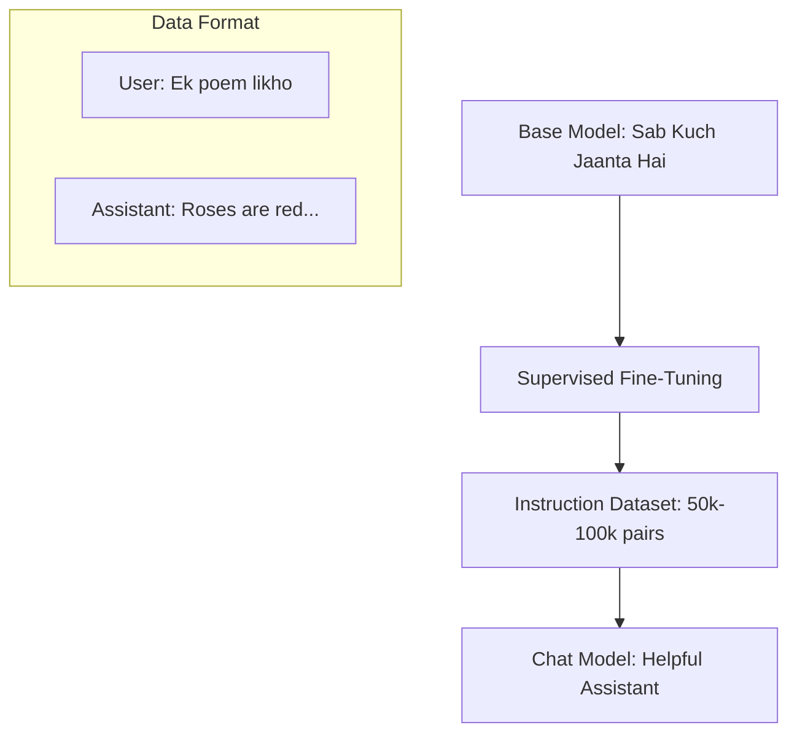

# Instruction Tuning: Completion se Conversation tak

## 1. Beginner-friendly Hinglish Explanation 🇮🇳
Bhai, socho tumne ek bache ko duniya ki saari books padha di hain. Woh bohot smart hai, lekin agar tum use bolo "Ek cup chai banao", toh woh chai nahi banayega, balki woh chai ke baare mein essay likhna shuru kar dega kyunki use lagta hai ki tum sentence "Complete" kar rahe ho.

**Instruction Tuning** wahi step hai jo ek raw model ko ek "Helpful Assistant" mein badalta hai. Hum model ko (Instruction, Output) ke pairs dete hain: "Question: Who is King? Answer: A ruler...". Isse model ko samajh aata hai ki ab use "Next word predict" nahi karna, balki "Hukm (Command) manna" hai. Iske bina, ChatGPT sirf ek mahir writer hota, assistant nahi.

---

## 2. Deep Technical Explanation
Instruction tuning ek process hai jisme hum ek pre-trained base model ko (Instruction, Context, Response) triplets ke dataset par fine-tune karte hain.
- **SFT (Supervised Fine-Tuning)**: Instruction tuning ka pehla stage. Model ko same cross-entropy loss se train kiya jaata hai, lekin sirf "Response" tokens par.
- **Datasets**: Alpaca, ShareGPT, Dolly. Inme diverse tasks hote hain jaise summarization, creative writing, aur coding.
- **Formatting**: Roles ko distinguish karne ke liye special tokens ka use karte hain: `<|user|>\n...\n<|assistant|>\n...`.

---

## 3. Mathematical Intuition
Pre-training mein, model $P(\text{Token} | \text{Past Tokens})$ seekhta hai.
Instruction tuning mein, hum $P(\text{Response} | \text{Instruction})$ ko optimize karte hain.
Hum gold-standard response $Y$ ki log-likelihood ko maximize karte hain instruction $I$ ke hisaab se:
$$\mathcal{L} = -\sum_{t=1}^{|Y|} \log P(y_t | y_{<t}, I)$$
Yeh model ki distribution ko general text completion se hata kar task-following behavior ki taraf "Shift" kar deta hai.

---

## 4. Architecture Diagrams

```mermaid
graph TD
    Base[Base Model: Sab Kuch Jaanta Hai] --> SFT[Supervised Fine-Tuning]
    SFT --> Dataset[Instruction Dataset: 50k-100k pairs]
    Dataset --> Chat[Chat Model: Helpful Assistant]
    
    subgraph "Data Format"
        User[User: Ek poem likho]
        Assistant[Assistant: Roses are red...]
    end
```

---

## 5. Production-ready Examples
SFT ke liye data `HuggingFace` ke saath prepare karna:

```python
# Formatting: {"instruction": "...", "input": "", "output": "..."}
dataset = [
    {
        "instruction": "Summarize this article.",
        "input": "AI is changing the world...",
        "output": "AI has a global impact."
    }
]

# Training ke liye formatting function
def format_instruction(example):
    return f"### Instruction:\n{example['instruction']}\n\n### Input:\n{example['input']}\n\n### Response:\n{example['output']}"

# Ab ise TRL library ke SFTTrainer ke saath use karo.
```

---

## 6. Real-world Use Cases
- **Customer Support**: Apni company ke support tickets par model ko train karna.
- **Coding**: Python/Javascript repositories par fine-tuning karna taki coding standards follow ho.
- **Safety**: Model ko harmful instructions ko refuse karne ke liye train karna.

---

## 7. Failure Cases
- **Over-refusal**: Model "too safe" ban jaata hai aur harmless questions ko bhi refuse kar deta hai (jaise, "How to kill a process in Linux?").
- **Style Over Substance**: Model helpful aur confident lagta hai lekin galat facts de deta hai (Hallucination).

---

## 8. Debugging Guide
1. **Perplexity on Response**: Agar PPL bahut high hai, toh model ko assistant style seekhne mein problem ho rahi hai.
2. **Evaluation Benchmarks**: **IFEval** (Instruction Following Evaluation) ka use karo yeh dekhne ke liye ki model constraints follow kar raha hai ya nahi (e.g., "Exactly 50 words mein likho").

---

## 9. Tradeoffs
| Feature | Base Model | Instruction Model |
|---|---|---|
| Creativity | Bohot High | Medium |
| Task Accuracy | Kam | Zyada |
| Hallucination | Zyada | Medium |

---

## 10. Security Concerns
- **Indirect Injection**: Jo model instructions par train hai, woh us email mein chhupa hua command follow kar sakta hai jise woh summarize kar raha hai.

---

## 11. Scaling Challenges
- **Data Quality**: 1,000 high-quality instructions, 1,000,000 low-quality ones se better hote hain (The LIMA paper).

---

## 12. Cost Considerations
- **Annotation Costs**: 10,000 expert-level instructions likhna expensive hai ($10-$50 per example).

---

## 13. Best Practices
- **Masking** ka use karo: Sirf Assistant ke response tokens par loss calculate karo, User ke prompt par nahi.
- **Mix Data**: SFT ke dauran kuch pre-training data bhi include karo taaki model facts ko na bhule.

---

## 14. Interview Questions
1. Instruction tuning mein "LIMA" hypothesis kya hai?
2. SFT ke dauran loss masking kyun important hai?

---

## 15. Latest 2026 Patterns
- **Multi-Turn SFT**: Sirf single Q&A pairs ke bajaye poori conversation histories par training karna.
- **Self-Instruct**: Model ko use karke uski apni instruction tuning data generate karna (Synthetic data).