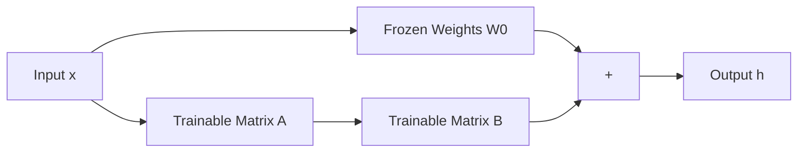

# LoRA & QLoRA: Efficiency is Everything

## 1. Beginner-friendly Hinglish Explanation 🇮🇳
Bhai, socho tumhe ek 500-page ki book mein sirf 2-3 line sudharni hain. Kya tum puri book wapas likhoge? Nahi na. 

**LoRA (Low-Rank Adaptation)** wahi "Post-it Note" hai. Full Fine-tuning mein hum trillions of weights badalte hain (bohot expensive!). LoRA mein hum main weights ko "Freeze" kar dete hain aur side mein 2 chote-chote matrices add karte hain. Hum sirf un chote matrices ko train karte hain. **QLoRA** iska bada bhai hai jo model ko "Compress" (Quantize) karke ek chote GPU par bhi train kar deta hai. Ab tum apne ghar ke computer par bhi "Llama-3" fine-tune kar sakte ho!

---

## 2. Deep Technical Explanation
PEFT (Parameter-Efficient Fine-Tuning) allows adapting large models with minimal compute.
- **LoRA**: Instead of updating $W \in \mathbb{R}^{d \times k}$, we represent the update $\Delta W$ as a product of two low-rank matrices $A \in \mathbb{R}^{d \times r}$ and $B \in \mathbb{R}^{r \times k}$, where $r \ll d, k$.
- **Rank ($r$)**: Usually 8, 16, or 64. A smaller $r$ means fewer parameters to train.
- **QLoRA**: Quantized LoRA. It quantizes the pre-trained weights to 4-bit (NF4) and uses "Double Quantization" to fit 70B models into consumer GPUs like RTX 3090/4090.

---

## 3. Mathematical Intuition
The forward pass with LoRA:
$$h = W_0 x + \Delta W x = W_0 x + B(Ax)$$
where $W_0$ is frozen.
Training only $A$ and $B$ reduces the number of trainable parameters by **99.9%**.
For a 7B model, we train ~20M parameters instead of 7B.

---

## 4. Architecture Diagrams


---

## 5. Production-ready Examples
Fine-tuning with `PEFT` library:

```python
from peft import LoraConfig, get_peft_model
from transformers import AutoModelForCausalLM

# 1. Load 4-bit model (QLoRA)
model = AutoModelForCausalLM.from_pretrained(
    "meta-llama/Llama-3-8B", 
    load_in_4bit=True, 
    device_map="auto"
)

# 2. Configure LoRA
config = LoraConfig(
    r=16, 
    lora_alpha=32, 
    target_modules=["q_proj", "v_proj"], # Which layers to adapt
    lora_dropout=0.05,
    bias="none",
    task_type="CAUSAL_LM"
)

# 3. Create PEFT model
model = get_peft_model(model, config)
model.print_trainable_parameters()
# Output: trainable params: 20,000,000 || all params: 8,000,000,000
```

---

## 6. Real-world Use Cases
- **Personalized AI**: Creating a "Style adapter" for your own writing.
- **Enterprise AI**: Adapting a model to a private internal codebase without sharing the full weights.
- **Quick Prototyping**: Testing a new dataset in 30 minutes instead of 10 hours.

---

## 7. Failure Cases
- **Low Rank Issues**: If $r$ is too small (e.g., $r=1$), the model might not learn complex new tasks.
- **Catastrophic Forgetting**: Even with LoRA, training too hard on one task can make the model lose its general knowledge.

---

## 8. Debugging Guide
1. **Check Trainable Params**: If it says 100%, you forgot to freeze the base model.
2. **LoRA Alpha**: Ensure `lora_alpha` is usually $2 \times r$ for stability.

---

## 9. Tradeoffs
| Feature | Full Fine-Tuning | LoRA |
|---|---|---|
| GPU Memory | Extremely High | Low |
| Performance| 100% | 95-99% |
| Storage | Huge (Full Model) | Tiny (Adapters: 50MB)|

---

## 10. Security Concerns
- **Adapter Hijacking**: Swapping a legitimate LoRA adapter for a malicious one in a production environment.

---

## 11. Scaling Challenges
- **Merging**: Merging 10 different LoRA adapters (e.g., one for Math, one for Code) can lead to "Weight interference".

---

## 12. Cost Considerations
- **Training Cost**: LoRA reduces the cost from $1000s to $1s using platforms like Lambda Labs or RunPod.

---

## 13. Best Practices
- Use **Rank 16 or 32** for most tasks.
- Always use **target_modules=["all-linear"]** in 2026 for best performance.
- Use **QLoRA** if you have less than 40GB VRAM.

---

## 14. Interview Questions
1. How does LoRA differ from standard fine-tuning?
2. What is "Rank" in LoRA and how does it affect the model?

---

## 15. Latest 2026 Patterns
- **DoRA (Weight-Decomposed Low-Rank Adaptation)**: Separating magnitude and direction to improve LoRA's accuracy to match full fine-tuning.
- **Unsloth**: An optimized framework that makes LoRA training 2x faster and 70% more memory efficient.
