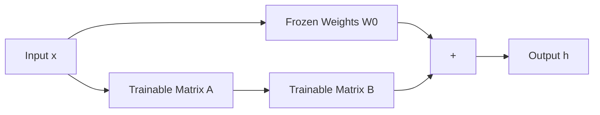

# LoRA & QLoRA: Efficiency hi sab kuch hai

## 1. Beginner-friendly Hinglish Explanation 🇮🇳
Bhai, socho tumhe ek 500-page ki book mein sirf 2-3 line sudharni hain. Kya tum puri book wapas likhoge? Nahi na. 

**LoRA (Low-Rank Adaptation)** wahi "Post-it Note" hai. Full Fine-tuning mein hum trillions of weights badalte hain (bohot expensive!). LoRA mein hum main weights ko "Freeze" kar dete hain aur side mein 2 chote-chote matrices add karte hain. Hum sirf un chote matrices ko train karte hain. **QLoRA** iska bada bhai hai jo model ko "Compress" (Quantize) karke ek chote GPU par bhi train kar deta hai. Ab tum apne ghar ke computer par bhi "Llama-3" fine-tune kar sakte ho!

---

## 2. Gehri Technical Explanation
PEFT (Parameter-Efficient Fine-Tuning) bade models ko minimal compute mein adapt karne deta hai.
- **LoRA**: Balke $W \in \mathbb{R}^{d \times k}$ ko update karne ke bajaye, hum $\Delta W$ update ko do low-rank matrices $A \in \mathbb{R}^{d \times r}$ aur $B \in \mathbb{R}^{r \times k}$ ke product se represent karte hain, jahan $r \ll d, k$.
- **Rank ($r$)**: Usually 8, 16, ya 64 hota hai. Chota $r$ matlab kam parameters train karne hote hain.
- **QLoRA**: Quantized LoRA. Ye pre-trained weights ko 4-bit (NF4) mein quantize karta hai aur "Double Quantization" use karta hai taaki 70B models consumer GPUs (jaise RTX 3090/4090) mein fit ho jayein.

---

## 3. Ganitiya Intuition
LoRA ke saath forward pass:
$$h = W_0 x + \Delta W x = W_0 x + B(Ax)$$
jahan $W_0$ frozen (jama) hota hai.
Sirf $A$ aur $B$ ko train karne se trainable parameters ki sankhya **99.9%** tak kam ho jaati hai.
7B model ke liye, hum 7B ke bajaye ~20M parameters train karte hain.

---

## 4. Architecture Diagrams (Sanrachna Chitra)

```mermaid
graph LR
    Input[Input x] --> Base[Frozen Weights W0]
    Input --> A[Trainable Matrix A]
    A --> B[Trainable Matrix B]
    Base --> Add[+]
    B --> Add
    Add --> Output[Output h]
```

---

## 5. Production-ready Udaaharan
`PEFT` library ke saath Fine-tuning:

```python
from peft import LoraConfig, get_peft_model
from transformers import AutoModelForCausalLM

# 1. Load 4-bit model (QLoRA)
model = AutoModelForCausalLM.from_pretrained(
    "meta-llama/Llama-3-8B", 
    load_in_4bit=True, 
    device_map="auto"
)

# 2. Configure LoRA
config = LoraConfig(
    r=16, 
    lora_alpha=32, 
    target_modules=["q_proj", "v_proj"], # Which layers to adapt
    lora_dropout=0.05,
    bias="none",
    task_type="CAUSAL_LM"
)

# 3. Create PEFT model
model = get_peft_model(model, config)
model.print_trainable_parameters()
# Output: trainable params: 20,000,000 || all params: 8,000,000,000
```

---

## 6. Asli Duniya ke Upyog
- **Personalized AI**: Apni writing ke liye "Style adapter" banana.
- **Enterprise AI**: Pura weights share kiye bina model ko private internal codebase mein adapt karna.
- **Quick Prototyping**: 10 ghante ke bajaye 30 minute mein naya dataset test karna.

---

## 7. Viphalta Ke Mamle
- **Low Rank Issues**: Agar $r$ bohot chhota hai (jaise $r=1$), toh model complex naye tasks nahi seekh paayega.
- **Catastrophic Forgetting**: LoRA ke saath bhi, ek task par bahut zyada train karne se model apna general knowledge kho sakta hai.

---

## 8. Samashya Nivaran Guide
1. **Check Trainable Params**: Agar yeh 100% dikhata hai, toh aap base model ko freeze karna bhool gaye.
2. **LoRA Alpha**: Pakka karein ki `lora_alpha` aam taur par stability ke liye $2 \times r$ ho.

---

## 9. Fayde-Nuksaan
| Feature | Full Fine-Tuning | LoRA |
|---|---|---|
| GPU Memory | Bahut Zyada | Kam |
| Performance| 100% | 95-99% |
| Storage | Bada (Full Model) | Chhota (Adapters: 50MB)|

---

## 10. Suraksha Chintayein
- **Adapter Hijacking**: Production environment mein ek legitimate LoRA adapter ki jagah ek malicious adapter daal dena.

---

## 11. Vistar Ki Chunautiyan
- **Merging**: 10 alag-alag LoRA adapters (jaise ek Math ke liye, ek Code ke liye) ko merge karne se "Weight interference" ho sakta hai.

---

## 12. Laagat Sambandhi Batein
- **Training Cost**: LoRA cost ko $1000s se $1s tak reduce kar deta hai platforms jaise Lambda Labs ya RunPod ka upyog karke.

---

## 13. Sabse Achchi Practices
- Zyada tasks ke liye **Rank 16 ya 32** istemal karein.
- 2026 mein best performance ke liye hamesha **target_modules=["all-linear"]** istemal karein.
- Agar aapke paas 40GB se kam VRAM hai toh **QLoRA** istemal karein.

---

## 14. Interview Ke Sawal
1. LoRA standard fine-tuning se kaise alag hai?
2. LoRA mein "Rank" kya hai aur yeh model ko kaise prabhavit karta hai?

---

## 15. 2026 Ke Naye Patterns
- **DoRA (Weight-Decomposed Low-Rank Adaptation)**: Magnitude aur direction ko alag karke LoRA ki accuracy ko full fine-tuning ke barabar karne ki koshish.
- **Unsloth**: Ek optimized framework jo LoRA training ko 2x faster aur 70% zyada memory efficient banata hai.