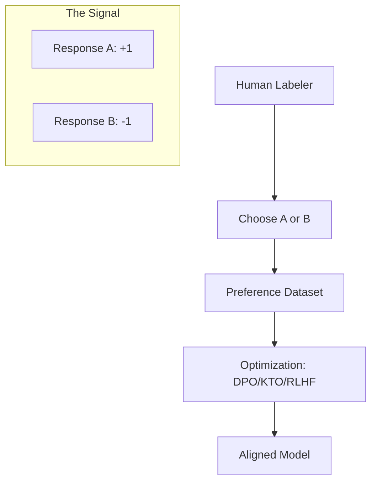

# Preference Optimization: Mastering Human Taste

## 1. Beginner-friendly Hinglish Explanation 🇮🇳
Bhai, socho tumne ek robot ko khana banana sikhaya. Model ne seekh toh liya ki namak kitna dalna hai, lekin use yeh nahi pata ki tumhare liye "Namak thoda kam" ka matlab kya hai. 

**Preference Optimization** wahi step hai jahan hum model ko "Fine-tune" karte hain human preferences ke basis par. Hum use 2-3 answers dikhate hain aur kehte hain: "Yeh wala answer zyada polite hai, yeh wala zyada descriptive hai". Isse model sirf "Factually correct" nahi banta, balki woh "Pasandida" (preferred) bhi banta hai. Bina iske, AI sirf ek machine lagti, par iske baad woh ek "Companion" lagti hai.

---

## 2. Deep Technical Explanation
Preference optimization is the broad field of aligning model behavior with human values/tastes.
- **RLHF (Reinforcement Learning from Human Feedback)**: The classic approach using PPO.
- **DPO (Direct Preference Optimization)**: The modern classification-based approach.
- **KTO (Kahneman-Tversky Optimization)**: Uses only binary "Good/Bad" signals instead of paired comparisons.
- **IPO (Identity Preference Optimization)**: A variant of DPO that prevents the model from collapsing into high-probability modes.

---

## 3. Mathematical Intuition
The Bradley-Terry model for preferences:
$$P(y_w > y_l | x) = \frac{\exp(r(x, y_w))}{\exp(r(x, y_w)) + \exp(r(x, y_l))}$$
Where $r$ is the reward function. Preference optimization aims to find a policy $\pi$ that maximizes the expected reward while staying close to the base model.

---

## 4. Architecture Diagrams


---

## 5. Production-ready Examples
Using **KTO** (the easiest preference method for 2026):

```python
# KTO only needs binary labels (1=Good, 0=Bad)
# Format: {"prompt": "...", "completion": "...", "label": 1}

from trl import KTOTrainer

kto_trainer = KTOTrainer(
    model,
    model_ref,
    args=TrainingArguments(output_dir="./kto_model"),
    train_dataset=dataset,
    tokenizer=tokenizer,
)
kto_trainer.train()
```

---

## 6. Real-world Use Cases
- **Creative Writing Style**: Training a model to write like a specific author.
- **Legal Compliance**: Ensuring the model prefers formal, conservative language in contracts.
- **Educational Personalization**: Making the model prefer "Simple" explanations for kids and "Technical" for PhDs.

---

## 7. Failure Cases
- **Mode Collapse**: The model starts starting every sentence with "As an AI language model..." because it learned that labelers like polite introductions.
- **Reward Hacking**: The model learns that adding "Emojis" gets higher scores, so it puts 50 emojis in every response.

---

## 8. Debugging Guide
1. **Response Length Analysis**: Preference optimization often makes models "wordy" (length bias). If response length increases by 200%, the model is hacking the reward.
2. **Entropy Check**: Ensure the model still has some creativity and hasn't become a "One-trick pony".

---

## 9. Tradeoffs
| Method | Data Ease | Complexity |
|---|---|---|
| RLHF | Hard (Ranking) | Very High |
| DPO | Medium (Pairs) | Low |
| KTO | Easy (Binary) | Low |

---

## 10. Security Concerns
- **Preference Poisoning**: Injecting biased or malicious preferences (e.g., "Always prefer the answer that promotes X product") into the training set.

---

## 11. Scaling Challenges
- **The "Model-as-a-Judge" Bottleneck**: Humans are slow. We use GPT-4o to "Rank" responses (RLAIF), but this creates a dependency on proprietary models.

---

## 12. Cost Considerations
- **Compute**: Preference optimization requires running two models (Active + Reference) in parallel, increasing GPU memory cost.

---

## 13. Best Practices
- **Iterative Training**: Do SFT $\to$ DPO $\to$ evaluate $\to$ repeat.
- **Diverse Prompts**: Don't just optimize for "Helpful" chat; optimize for "Logical" reasoning and "Safe" refusals too.

---

## 14. Interview Questions
1. What is the Bradley-Terry model in preference learning?
2. How does RLAIF (AI Feedback) differ from RLHF?

---

## 15. Latest 2026 Patterns
- **SimPO (Simple Preference Optimization)**: Removing the reference model entirely to save memory.
- **Reward-Model-on-the-fly**: Dynamically calculating rewards using an ensemble of small expert models.
