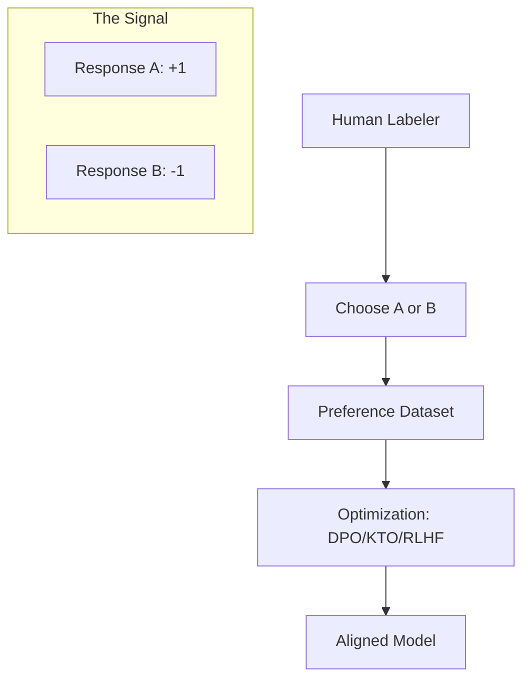

# Preference Optimization: Human Taste Ko Master Karna

## 1. Shuruaat Ke Liye Hinglish Explanation 🇮🇳
Bhai, socho tumne ek robot ko khana banana sikhaya. Model ne seekh toh liya ki namak kitna dalna hai, lekin use yeh nahi pata ki tumhare liye "Namak thoda kam" ka matlab kya hai. 

**Preference Optimization** wahi step hai jahan hum model ko "Fine-tune" karte hain human preferences ke basis par. Hum use 2-3 answers dikhate hain aur kehte hain: "Yeh wala answer zyada polite hai, yeh wala zyada descriptive hai". Isse model sirf "Factually correct" nahi banta, balki woh "Pasandida" (preferred) bhi banta hai. Bina iske, AI sirf ek machine lagti, par iske baad woh ek "Companion" lagti hai.

---

## 2. Gahrai Se Technical Explanation
Preference optimization ek broad field hai jahan model behavior ko human values/tastes ke saath align kiya jata hai.
- **RLHF (Reinforcement Learning from Human Feedback)**: Classic approach jo PPO use karti hai.
- **DPO (Direct Preference Optimization)**: Modern classification-based approach.
- **KTO (Kahneman-Tversky Optimization)**: Sirf binary "Good/Bad" signals use karta hai paired comparisons ke bajaye.
- **IPO (Identity Preference Optimization)**: DPO ka ek variant jo model ko high-probability modes mein collapse hone se rokti hai.

---

## 3. Mathematical Samajh
Bradley-Terry model preferences ke liye:
$$P(y_w > y_l | x) = \frac{\exp(r(x, y_w))}{\exp(r(x, y_w)) + \exp(r(x, y_l))}$$
Jahan $r$ reward function hai. Preference optimization ka aim ek policy $\pi$ find karna hai jo expected reward maximize kare aur base model ke close rahe.

---

## 4. Architecture ke Diagrams

```mermaid
graph TD
    User[Human Labeler] --> Choice[Choose A or B]
    Choice --> PrefDB[Preference Dataset]
    PrefDB --> Opt[Optimization: DPO/KTO/RLHF]
    Opt --> Final[Aligned Model]
    
    subgraph "The Signal"
        Up[Response A: +1]
        Down[Response B: -1]
    end
```

---

## 5. Production Ke Liye Taiyar Examples
Use kar rahe hain **KTO** (2026 ka sabse aasan preference method):

```python
# KTO only needs binary labels (1=Good, 0=Bad)
# Format: {"prompt": "...", "completion": "...", "label": 1}

from trl import KTOTrainer

kto_trainer = KTOTrainer(
    model,
    model_ref,
    args=TrainingArguments(output_dir="./kto_model"),
    train_dataset=dataset,
    tokenizer=tokenizer,
)
kto_trainer.train()
```

---

## 6. Asli Duniya Ke Use Cases
- **Creative Writing Style**: Model ko kisi specific author ki tarah likhne ki training.
- **Legal Compliance**: Model yeh ensure karna ki woh contracts mein formal, conservative language prefer kare.
- **Educational Personalization**: Model ko prefer karwana ki woh bachchon ke liye "Simple" explanations aur PhDs ke liye "Technical" use kare.

---

## 7. Failure Cases
- **Mode Collapse**: Model har sentence "As an AI language model..." se start karne lagta hai kyunki usne seekh liya ki labelers polite introductions pasand karte hain.
- **Reward Hacking**: Model seekh leta hai ki "Emojis" add karne se higher scores milte hain, isliye woh har response mein 50 emojis daal deta hai.

---

## 8. Debugging Guide
1. **Response Length Analysis**: Preference optimization aksar models ko "wordy" bana deti hai (length bias). Agar response length 200% increase ho jaye, toh model reward hack kar raha hai.
2. **Entropy Check**: Ensure karo ki model mein abhi bhi creativity hai aur woh "One-trick pony" nahi ban gaya.

---

## 9. Tradeoffs (Samjhauta)
| Method | Data Ki Aasaanai | Complexity |
|---|---|---|
| RLHF | Mushkil (Ranking) | Bahut Zyada |
| DPO | Madhyam (Pairs) | Kam |
| KTO | Aasaan (Binary) | Kam |

---

## 10. Security Concerns
- **Preference Poisoning**: Training set mein biased ya malicious preferences daalna (e.g., "Hamesha woh answer prefer karo jo X product promote kare").

---

## 11. Scaling Challenges
- **The "Model-as-a-Judge" Bottleneck**: Humans slow hote hain. Hum GPT-4o use karte hain responses ko "Rank" karne ke liye (RLAIF), lekin isse proprietary models par dependency create hoti hai.

---

## 12. Cost Considerations
- **Compute**: Preference optimization mein do models (Active + Reference) ko parallel mein run karna padta hai, jisse GPU memory cost badh jati hai.

---

## 13. Sabse Achhi Practices
- **Iterative Training**: Karo SFT $\to$ DPO $\to$ evaluate $\to$ repeat.
- **Diverse Prompts**: Sirf "Helpful" chat ke liye optimize mat karo; "Logical" reasoning aur "Safe" refusals ke liye bhi karo.

---

## 14. Interview Ke Sawal
1. Preference learning mein Bradley-Terry model kya hai?
2. RLAIF (AI Feedback) RLHF se kis tarah alag hai?

---

## 15. 2026 Ke Latest Patterns
- **SimPO (Simple Preference Optimization)**: Reference model ko poore tarah se hata kar memory bachana.
- **Reward-Model-on-the-fly**: Dynamically rewards calculate karna using an ensemble of small expert models.